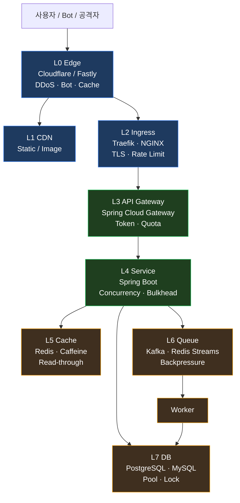

이커머스 SaaS 를 1 년 운영해보면 *알게 된다* — *기능 추가* 보다 *트래픽 폭주* 가 *더 자주 더 비싸게* 서비스를 망가뜨린다.

> *블랙프라이데이 라이브 커머스 첫 1 분*. 평균 RPS 의 *37 배*가 들어왔다. 컨테이너가 *전부 OOMKilled* 됐다.
>
> 같은 사고가 다음 주에 *다시* 났다.

이런 사고가 *기능 PR* 보다 자주 일어나는 이유는 *간단* 하다 — **트래픽 제어는 *한 곳* 에서 막는 게 아니라 *모든 layer* 에서 *합쳐서* 막아야 한다**. 그리고 *그 모든 layer 를 이해하고 *적절한 도구* 를 *적절한 위치* 에 두는 사람* 이 많지 않다.

이 글은 *내 sparta-msa-project + lemuel-quant-core + helm-deploy* 같은 이커머스 풀스택을 운영하며 *진짜로 부딪힌* 트래픽 제어의 *전 layer* 를 *기술적으로* 보완할 수 있는 *모든 옵션* 을 정리한다. *어디서 막을지 정해진 답은 없고, 어떤 trade-off 가 있는지* 만 *정직하게* 풀어둔다.

---

## TL;DR — *한 줄 결론*

> *이커머스 SaaS 의 트래픽 제어* 는 *7 layer 의 동시 방어* 다. *Edge (Cloudflare) → Ingress (Traefik) → API Gateway (Spring Cloud) → Service (Spring Boot) → Cache (Redis) → Queue (Kafka) → DB (PostgreSQL/MySQL)* — *어느 한 곳* 도 *단독으로는 못 막는다*.
>
> *한 layer 가 fail* 해도 *다음 layer 가 받아주는 *defense-in-depth** 구조여야 *Black Friday* 같은 *37x* 가 와도 *서비스가 살아남는다*.

---

## 1. *왜 트래픽 제어 가 이커머스 SaaS 의 *최대 난제* 인가

### 1.1 *트래픽 분포* 자체가 *비대칭* 이다

이커머스 트래픽의 진실 :

- *평소* : 평균 RPS, 안정적
- *피크* : 평균의 *10~50 배*, *예측 불가능* (인플루언서 추천, 라이브, 한정판 출시)
- *Long tail* : 피크 후 *되돌아오지 않는 트래픽* 도 있고 *과도하게 줄어드는 경우*도

다른 *B2B SaaS* 는 *근무 시간* 패턴이지만 *이커머스* 는 *세계 정세에 따라 휘둘리는 곡선*. capacity planning 만으로 못 막는다.

### 1.2 *돈* 이 *동시에 흐른다*

트래픽이 곧 *주문* 이고 *결제* 다. 즉 :

- 단순 GET 100 만 — *읽기만*. 캐시로 막을 수 있음
- 동시 POST 10 만 — *재고 차감 + 결제 처리* . 캐시 무력화. DB row lock 의 *직접 부하*.

이커머스의 트래픽은 *write-heavy 의 spike* 다. 이게 *블로그 서비스* 와 결정적으로 다른 점.

### 1.3 *비싼* 트래픽 vs *공짜* 트래픽

- 사람 트래픽 : *전환* 가능. 막으면 *매출 손실*
- 봇 / 스크래퍼 / DDoS : *전환 0*. 막아야 *비용 절감*

근데 둘이 *프로토콜 layer* 에서 구분 안 됨. *어느 layer 에서 어떻게 구분* 하느냐가 *기술의 핵심*.

---

## 2. *7 Layer 의 동시 방어* — 전체 그림

각 layer 가 *자기 책임* 을 갖는다. *모든 layer 가 자기 일을 한 다음 다음 layer 로 넘긴다*. *한 layer 가 무너져도 다음 layer 가 받는다*. 그게 *defense-in-depth* 다.

---

## 3. *Layer 별 기술적 보완 옵션*

### 3.1 *L0. Edge (Cloudflare / Fastly)*

가장 *비용 효율적* 인 방어선. *내 인프라에 트래픽이 닿기 전에* 막는다.

**옵션** :

- **DDoS protection** (자동) — Cloudflare 의 *L3/L4/L7* 자동 mitigation. 무료 플랜도 *대부분의 volumetric* 은 처리
- **Bot management** — 유료. *headless Chrome 시그니처 / TLS fingerprint (JA3) / behavior* 로 봇 탐지
- **Rate limiting rule** — *country + URI + 분당 N 회* 같은 룰. *1 USD 미만* 으로 시작
- **Cache rule** — 상품 상세 페이지·이미지·CSS·JS 는 *Edge 캐시* 로 처리. *origin 부하 0*
- **Page Rules / Workers** — JS 에서 *조건부 응답*. 예 : 결제 페이지는 캐시 안 됨, 상품 목록은 *5 초 캐시 with stale-while-revalidate*
- **WAF rule** — *SQLi, XSS, common attack patterns* 자동 차단

**Trade-off** :

- 캐시 hit rate 가 높을수록 *origin 부하 ↓*. 단 cache stampede 위험 (같은 key 만료 시 origin 폭주)
- Edge 가 *내 콘텐츠* 를 본다 — *민감 데이터 (개인정보, 결제)* 는 Edge cache 비활성 필수

**내 사례** : `chat.lemuel.co.kr` 은 *Cloudflare Tunnel* 로 노출. cloudflared 가 클러스터 *밖* (호스트 systemd) 에서 돌며 NodePort 로 라우팅. Edge 캐시는 *현재 미사용* — 학습/포트폴리오용이라 트래픽 안 큼. 실제 운영이라면 *상품 목록 API* 를 `Cache-Control: s-maxage=10, stale-while-revalidate=30` 으로 *10 초 캐시* 했을 것.

### 3.2 *L1. CDN — Static asset 분리*

이미지 / JS 번들 / CSS 는 *별도 도메인* 으로 분리.

**옵션** :

- *원본은 S3 호환* (R2 / S3 / GCS) 에 두고 *Edge 가 캐시*
- *Image 최적화* — WebP / AVIF 자동 변환, 디바이스별 해상도 (responsive image)
- *Long-cache + versioned filename* — Next.js 의 `static/chunks/[hash].js` 같은 패턴. 한 번 캐시되면 *영원*

**Trade-off** :

- 별 도메인 = *CORS preflight* 추가. CORS preflight 자체가 *small spike trigger* 가 될 수 있음
- 도메인 분리 안 하면 cookie 가 *static asset 요청에도 따라감* (수 KB 낭비)

### 3.3 *L2. Ingress (Traefik / NGINX)*

내 클러스터의 *첫 in-cluster gate*.

**옵션** :

- **TLS termination** — *cert-manager* 로 *Let's Encrypt* 자동
- **HTTP/2 / HTTP/3** — *connection multiplexing* 으로 connection 수 ↓
- **Connection limit per IP** — Traefik 의 `traefik.http.middlewares.<name>.inflightreq.amount`
- **Rate limit per IP** — `traefik.http.middlewares.<name>.ratelimit.average` + `burst`
- **Request size limit** — *대용량 POST* 차단 (DoS 방어)
- **Slow request kill** — `readTimeout` / `writeTimeout` 짧게 (Slowloris 방어)

**Trade-off** :

- Per-IP rate limit 은 *NAT 뒤* 사용자들이 *같이 차단* 됨. *X-Forwarded-For* 기반으로 풀려면 trust chain 신경
- Connection limit 이 너무 빡빡하면 *legit 사용자 polling* (SSE / long-polling) 가 끊김

### 3.4 *L3. API Gateway (Spring Cloud Gateway / Kong / Envoy)*

*인증·인가·quota·routing* 의 중앙 집중.

**옵션** :

- **Token bucket per user** — `RequestRateLimiter` filter + Redis bucket
- **API key quota** — 일·월별 호출 한도
- **Circuit breaker per downstream** — Resilience4j. *failure 가 threshold 넘으면 open 상태 → 호출 자체 안 함*
- **Retry with exponential backoff + jitter** — 재시도 폭주 (thundering herd) 막기 위한 jitter 필수
- **Request transform** — 외부 트래픽의 *오버스펙 query parameter* (예: `?limit=10000`) 를 *서버 측에서 cap*
- **JWT 검증 캐시** — 같은 JWT 의 검증을 *수 초간 캐시* 해 *JWT 라이브러리 CPU 부담 ↓*

**Trade-off** :

- Gateway 자체가 *single point of failure*. *수평 확장 + health check + auto-restart* 가 prereq
- Rate limit 정밀도를 *user 단위* 로 가져가면 *Redis 의존성* 이 *core path* 에 들어옴 (Redis 죽으면 gateway 도 영향)

**내 사례** : sparta-msa 의 `sparta-gateway` (Spring Cloud Gateway) 가 이 역할. 현재는 *기본 routing 만* — rate limit / circuit breaker 는 *학습 차 미적용*. 운영이라면 `RequestRateLimiter` 로 *세션별 10 RPS / 분당 600* 정도부터.

### 3.5 *L4. Service (Spring Boot / Node.js)*

*비즈니스 로직* layer 의 자기 보호.

**옵션** :

- **Thread pool / connection pool 분리** — *주문* 와 *검색* 이 같은 풀을 쓰면 검색 폭주가 *주문* 도 죽인다. Hystrix / Resilience4j 의 *Bulkhead* 패턴
- **Virtual Threads (Java 21+)** — *blocking I/O 가 많은* 워크로드면 *thread 수 → 적은 OS thread* 로 압축. 메모리 / context-switch ↓ (단 *CPU bound* 면 이득 없음. *Pinned threads* 에 주의)
- **Coroutines (Kotlin / Go)** — virtual thread 와 비슷. *Spring WebFlux* 같은 fully-reactive 는 *학습 곡선* 만 가파름
- **Async + queue offload** — *결제 승인 후 처리* 는 *Kafka 로 던지고 200 OK*. 클라이언트는 *주문 상태 폴링* (또는 SSE)
- **Idempotency key 강제** — *retry 폭주 시* 같은 결제가 2 번 안 되도록. *Triple Idempotency* (HTTP body unique → DB unique → outbox unique) 패턴
- **Probe (liveness / readiness)** — *busy 한 노드는 LB 에서 빠지게* readiness 503 으로

**Trade-off** :

- Async + queue 는 *사용자 경험* 까지 바꿈. *주문 즉시 완료* 가 아니라 *주문 접수 → 처리 중 → 완료*. UX 디자인 필요
- Bulkhead 가 너무 잘게 나뉘면 *resource 활용도 ↓*. *큰 풀 하나* vs *작은 풀 여러 개* 의 균형

**내 사례** : 결제·정산 도메인은 *settlement* 모듈로 분리 — *outbox + idempotency + Bulkhead* 의 *교과서* 패턴 적용 (다른 글에서 자세히). sparta 의 product / gateway 는 *MVP 단계* 라 idempotency 만 일부 적용.

### 3.6 *L5. Cache (Redis / Caffeine)*

*L0 Edge 캐시* 가 막지 못한 *동적 응답* 의 핵심.

**옵션** :

- **Read-through cache** — 첫 호출 miss → DB 조회 → Redis SETEX → 다음 호출은 hit. *상품 상세, 카테고리 트리, 사용자 권한* 등
- **Cache-aside vs Write-through vs Write-behind** — *일관성* vs *latency* trade-off
- **TTL + jitter** — TTL 이 *전부 동시 만료* 하면 *cache stampede*. `TTL = base + rand(0, base * 0.1)` 같은 jitter
- **Mutex lock / single-flight** — 같은 key 에 *동시 miss* 발생 시 *1 개 fetch* 만 origin 으로. Redis SET NX EX 또는 Caffeine 의 `LoadingCache`
- **Negative cache** — *없는 상품 ID* 도 *짧게 캐시*. 같은 *없는 ID* 가 *반복 요청* 될 때 DB 보호
- **Multi-level cache** — *L1 Caffeine (JVM heap) + L2 Redis*. local hit 은 *0.001 ms*, Redis hit 은 *0.5 ms*

**Trade-off** :

- Cache 일관성 = *eventual*. *주문 후 즉시 재고 표시 갱신* 같은 *write-after-read* 시나리오는 *cache invalidate* 필수
- Redis 도 *부하 한계* 가 있음. *Hot key* (특정 1 개 key 에 100 만 RPS) 는 *Redis 자체 병목*. 그땐 *local cache 로 흡수*

### 3.7 *L6. Queue (Kafka / Redis Streams / RabbitMQ)*

*동기 처리* 를 *비동기* 로 바꿔 *spike 흡수* 의 핵심 도구.

**옵션** :

- **Backpressure** — Consumer 가 *처리 못 하는 만큼* producer 에게 *시그널*. Kafka 는 *partition lag* 으로
- **Bulk consumer** — *낱개 처리* 보다 *batch 100 건* 처리가 *DB connection 효율*
- **DLQ (Dead Letter Queue)** — 처리 실패 메시지를 별도 큐로. *재시도 폭주 차단*
- **Per-tenant partition / topic** — *큰 고객* 의 spike 가 *작은 고객* 못 죽이게
- **Schema evolution + compat** — 메시지 스키마 변경이 *consumer rolling update 중* 폭주 안 만들게

**Trade-off** :

- Async 가 들어오면 *사용자에게 "처리 중" 상태* 를 *어떻게 보여줄지* 가 *제품 디자인 책임*
- Kafka 자체의 *broker 운영 부담* (디스크 / replication / partition rebalance)

**내 사례** : settlement 의 *Transactional Outbox* 패턴 — DB tx 안에서 `outbox` 테이블에 INSERT + Kafka publish 분리. Kafka 가 잠시 죽어도 *주문 자체* 는 성공.

### 3.8 *L7. DB (PostgreSQL / MySQL)*

마지막 *진짜 trust boundary*. *여기서 막혀야* 다음 사고가 없다.

**옵션** :

- **Connection pool sizing** — HikariCP 의 `maximumPoolSize`. *DB CPU * 2 ~ 4* 가 보통 ceiling. *과도하면 DB lock contention*
- **Read replica + read/write split** — 읽기 80% 를 replica 로. *상품 상세 / 카테고리* 같은 *read-heavy* 가 replica 로
- **Index 가 *정말* 모든 query 에 있나** — 평소엔 안 보이다가 spike 에 *seq scan* 으로 폭주
- **Vacuum / autovacuum tuning** — Postgres 의 *transaction ID wraparound* 같은 *조용한 시한폭탄*
- **Row lock vs Advisory lock vs Optimistic lock** — *재고 차감* 은 *row lock + SKIP LOCKED* 또는 *optimistic lock + retry*
- **Partition** — 시계열 (orders, events) 은 *월별 파티션*. 옛 데이터 *drop partition* 만으로 정리
- **Statement timeout + idle in tx timeout** — *느린 쿼리* 가 *connection pool 점령* 못 하게
- **Pessimistic vs Optimistic concurrency** — *high contention* (한정판 상품 100 개에 사용자 10 만) 은 *queue 로 직렬화*, 그 외는 optimistic + retry

**Trade-off** :

- Read replica 의 *replication lag* — 결제 직후 *order 확인* 이 *replica 가 lag* 라 *주문 없음* 으로 보일 수 있음
- Optimistic lock retry 는 *낙관적인 성공률* 가정. *retry 폭주 protection* 필요

**내 사례** : sparta 는 *MySQL + Postgres (pgvector)* 둘 사용. *상품 / 주문* 은 MySQL, *벡터 / 임베딩* 은 PG. read replica 는 *현재 미사용* — MVP 단계라 master 만.

---

## 4. *Layer 간 *Contract* — 어디서 막힐 줄 알아야 한다

*defense-in-depth* 가 작동하려면 *각 layer 가 다음 layer 에게 *기대* 하는 것* 이 명확해야 한다.

| 보낸 layer | 받는 layer | 기대 (SLA) |
|---|---|---|
| Cloudflare Edge | Ingress | *DDoS / Bot 자동 차단 후* 99.5% legit traffic |
| Ingress | API Gateway | *Rate limit / TLS / size limit* 후 *initial filter pass* |
| Gateway | Service | *Auth / quota / circuit-break* 후 *비즈니스 요청만* |
| Service | DB | *Cache miss / async unsuitable* 후 *진짜 row-touch* |
| Service | Queue | *async-able* 인 *retry-friendly* 메시지 |
| Queue | Worker | *idempotent* + *backpressure-aware* consumer |

*어느 layer 가 자기 책임 분량 안 하면* 다음 layer 가 *override* 해 *압박 받음*. 그래서 *어디서 막히는지* 를 *모니터링* 해야 한다. Edge 가 *bot 다 흘리면* Ingress 의 rate limit 이 *legit 사용자 까지* 차단함.

---

## 5. *모니터링이 *기술적 보완의 *전제** 다

위 옵션 다 깔아도 *어디서 막혀 있는지 모르면* 의미 없음. *최소 측정* :

- **Edge** : Cloudflare Analytics — *blocked / cached / origin* 비율
- **Ingress** : Traefik metrics — *2xx / 4xx / 5xx + latency p50/p95/p99*
- **Gateway** : Spring Boot Actuator + Micrometer — *circuit breaker state / rate-limit reject*
- **Service** : *Saturation* (queue depth, thread pool 사용률, GC time)
- **Cache** : Redis INFO — *hit ratio, evictions, memory*
- **Queue** : Kafka — *consumer lag, throughput*
- **DB** : *connection pool 사용률, slow query log, replication lag, lock wait*

*Saturation (USE method) + Latency (RED method)* 가 *어디가 막혔는지* 알려준다.

---

## 6. *모든 옵션을 다 적용해야 하는가* — *현실*

답은 *NO*. *층마다 trade-off* 가 있고 *팀 capacity* 가 유한하다.

**MVP / 학습 단계** (예: 내 sparta-msa):
- Cloudflare 무료 + Edge cache 일부
- Ingress Traefik 기본 + per-IP rate limit
- Gateway 의 *최소 circuit breaker*
- Service 의 *idempotency key + connection pool sizing*

이 정도면 *평소 트래픽 + 소규모 spike (10 배)* 는 흡수 가능. *추가 비용 거의 0*.

**시리어스 운영 단계**:
- Cloudflare 유료 Bot management
- Multi-level cache (Caffeine + Redis)
- Read replica + read/write split
- Kafka + outbox (transactional async)
- Per-tenant partition / quota

여기까지 가면 *50~100 배 spike* 흡수 가능. 단 *팀이 이걸 운영* 할 *수* 있어야 함.

**플랫폼 단계** (예: 쿠팡, 컴퍼니드 같은 대형):
- 자체 CDN POP / DNS 라우팅
- Service mesh (Istio / Linkerd) 로 *layer 5* 통신 자체 제어
- Cell-based architecture — *고객을 cell 단위로 격리* 해 *blast radius* 최소화

여기는 *우리* 가 만들 layer 가 아니다 — 다만 *그 방향* 을 알고 있으면 *시리어스 단계* 의 디자인이 *어디서 깨질지* 예측 가능.

---

## 7. *실패 모드 분석* — *어디가 *먼저* 깨지나*

옵션 다 깔고도 *spike* 가 오면 *어디부터 깨지는지* 예측해두면 *trace + dashboard* 디자인이 정확해진다.

순서 가설 :

1. **DB connection pool 고갈** — 가장 흔한 *처음 깨지는 자원*. 응답 안 옴 → 다 timeout
2. **Service thread pool 고갈** — DB 가 안 받아주니 *worker 가 wait*. *health probe 실패* → LB 가 빼버림 → *남은 노드에 더 몰림* (cascading failure)
3. **Cache stampede** — TTL 만료 + 동시 miss → DB 폭주 → 1 번 패턴 가속
4. **Queue lag 폭증** — Async 도 *consumer thread* 가 막힘. lag 가 *분 단위* 로 쌓이면 *주문 처리 SLA* 위반
5. **OOMKilled** — JVM heap, container memory limit. *최후의 안전망* 으로 K8s 가 kill
6. **그 후 ArgoCD rollout** — pod 다 죽으면 *새 pod* 가 *같은 부하* 받음. 무한 루프

*예방* 의 *순서* 도 *깨지는 순서의 역순* 이다. *DB 부터* 보호하고 *그 위 layer* 가 *DB 를 안 죽이게* 만든다.

---

## 8. *내 인프라가 *지금* 어느 단계인가* — *정직한 자가진단*

| Layer | 현재 sparta-msa-project 상태 | 다음 단계 |
|---|---|---|
| Edge | Cloudflare Tunnel + 무료 플랜 | Edge cache rule 추가, Bot management 평가 |
| CDN | Next.js static asset 만, R2 미연동 | 상품 이미지 R2 + Edge cache |
| Ingress | K3s 의 Traefik 기본 | per-IP rate limit + connection limit |
| Gateway | Spring Cloud Gateway, routing only | RequestRateLimiter + Circuit breaker + Bulkhead |
| Service | Spring Boot, single-thread pool | Bulkhead (주문 vs 검색 분리), Virtual Threads 평가 |
| Cache | Redis 일부 read-through | Caffeine local 추가, mutex SET NX, jitter TTL |
| Queue | Kafka 미사용 (settlement 만 outbox) | sparta-product 의 async 결제 후처리 |
| DB | MySQL + PG 마스터 1대 | Read replica, Connection pool tuning |

*MVP* 단계에서 *시리어스* 로 옮기려면 *Gateway / Cache / Queue* 부터. *Edge 와 CDN* 은 *Cloudflare 의 유료 플랜* 으로 *결제 한 줄* 이면 단숨에 1 단계 올라감.

---

## 9. *교훈* — *트래픽 제어는 *기술* 이지만 *조직* 의 문제다*

기술 옵션은 *위 7 개 layer 의 합* — 다만 *각 layer 의 *책임* 이 *팀 내 누구에게 있는지** 가 *진짜* 어렵다.

- *DBA* 가 connection pool 만 본다면 *Gateway 의 circuit breaker* 가 *DB 를 보호* 한다는 사실을 모름
- *프론트엔드* 가 *상품 목록 polling 을 1 초마다* 하면 Gateway rate limit 이 *legit 사용자* 를 차단함
- *결제 도메인* 이 *idempotency* 안 깔면 *Kafka retry* 가 *같은 결제 2 번*

> *"트래픽 제어는 *한 사람* 이 아니라 *모든 layer 의 ownership 가 *느슨하게 통합* 된 팀* 의 문제다."*
>
> *— 그래서 *블랙프라이데이* 가 *기술 문제* 보다 *조직 문제* 로 더 자주 보인다.*

---

## 10. *후기*

이 글은 *내 sparta-msa-project + settlement + order-oms* 를 *18 시간 추적해 9 일 묻혔던 frontend 사고를 풀면서* 떠올린 생각의 정리다. *결국 그 사고의 본질* 도 *layer 간 contract* 의 *break* 였다 — *Image Updater 의 write-back* 이 *cluster Application 의 helm.parameters* 를 *지속적으로 latest 로 덮어쓰는 race*. *기술적으론 layer 4 (Service) 도 layer 5 (Cache) 도 아닌 layer 0 의 CI/CD 영역* 인데, *증상은 layer 4 의 frontend 사용자* 에게 보였다.

*이커머스 SaaS 의 트래픽 제어* 도 마찬가지다. *증상이 보이는 곳* 과 *진짜 원인이 있는 layer* 가 *다른 경우가 대부분*. 그래서 *모든 layer 를 *동시에* 이해* 하는 *수직적 시야* 가 *수평적 분업* 보다 중요해진다.

*막을 수 있는 모든 곳에서 막아라. 다만 *어디서 어떻게* 막을지는 *측정해서 결정* 해라.*

---

*이 글은 [sparta-msa-project](https://github.com/MyoungSoo7/sparta-msa-project) (private) 과 helm-deploy 의 운영 경험을 기반으로 작성. 시리즈 *내 K3s 클러스터* 의 SRE 글들 ([etcd HDD trap](/2026/06/06/etcd-fsync-hdd-trap-kube-api-error-budget-burn.html), [velero kopia 좀비 잡](/2026/06/06/velero-kopia-zombie-job-limitrange-ratio-and-argocd-schema-bug.html)) 의 연장선.*
