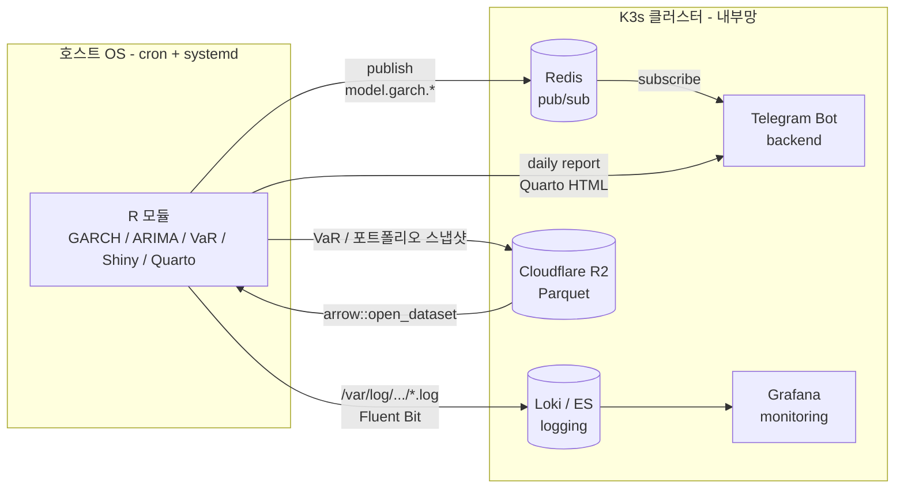

> 토요일 밤, 텔레그램으로 한 줄 던졌다 :
> *"지금 이 쿠버네티스 클러스터에서 R 언어의 역할에 대해서 깃헙블로그에 써줘."*
>
> 답을 쓰기 전 *답이 있는지* 부터 확인했다.
> 그리고 답은 — **K3s 클러스터 안에 R 워크로드는 *없다*.**

같은 날짜에 *C++ 는 클러스터 밖에 있다* 와 *Go 는 클러스터 어디에나 있다* 를 적었다. 이 글은 같은 시리즈의 *세 번째*. *언어가 *어디서* 도는가* 의 결정에는 *언어 본연의 성격* 이 깊게 박힌다는 *동일한 가설* 을 *R* 로 검증한다.

---

## TL;DR — *한 줄 결론*

> 나는 *R 기반 정량 분석 (GARCH, ARIMA, 공적분, VaR, Shiny, Quarto) 을 *Kubernetes 안* 에 넣지 않았다*.
> K3s 안에는 R 컨테이너도, R 네임스페이스도, R 관련 CronJob 도 없다.
> R 은 *홈랩 호스트의 systemd + crontab* 으로 돈다.
> 이건 *까먹고 못 옮긴* 게 아니라 *의도된 선택* — 메모리 모델, Shiny 의 sticky session, 빌드 의존성, *호스트 데이터에 대한 직접 접근*, *cron 의 충분한 신뢰성* 다섯 가지가 다 K8s 로 옮길 *유인을 갉아먹었다*.
> 이 글은 *"내 인프라에서 R 의 역할" 이라는 평범한 질문이 *발견* 으로 바뀐 한 시간의 기록*.

---

## 1. *발단* — 자기 인프라를 *내가* 잘 모를 때

크립토·주식·공시·뉴스·코딩테스트 채점을 한꺼번에 굴리는 quant-core 모노레포가 있다. C++ 코어 + Go/Julia/Python/R/Rust 의 *5 언어* 모듈을 같이 묶어둔 곳. 그 중 R 디렉토리는 진작 만들어둔 *통계·리포트·대시보드* 자리.

그런데 인프라가 *K3s 홈랩 클러스터* 로 굳어진 *지금* 시점에 *R 모듈들이 실제로 어디서 도는지* 를 *한 번도 글로 정리해본 적이 없다*. 그래서 텔레그램으로 *"블로그에 써줘"* 라고 던졌다.

블로그를 쓰려면 *먼저 사실부터*. 그 *사실 확인* 이 글의 출발점이 됐다.

---

## 2. *클러스터 인벤토리* — R 워크로드는 *0 개*

K3s API 에 직접 물어봤다 :

```bash
# namespace 목록에서 R 관련 키워드 찾기
kubectl get ns -o name \
  | grep -iE 'r-|rstudio|julia|quant|shiny'
# (none)
```

*수십 개의 네임스페이스* 중 *R 관련은 없다*. 전부 도메인 워크로드 (커머스·트레이딩·결제·게이트웨이·교육 등) 또는 인프라 (kafka / logging / monitoring / argocd / velero / nfs / registry-mirror) 일색.

이미지 라벨도 확인 :

```bash
# 모든 Deployment 의 컨테이너 이미지에서 R 흔적
kubectl get deploy -A -o jsonpath='{.items[*].spec.template.spec.containers[*].image}' \
  | tr ' ' '\n' \
  | grep -iE 'rocker/|r-base|rstudio|shiny|quarto'
# (none)
```

`rocker/r-ver`, `rocker/shiny`, `rstudio/rstudio-server`, `quarto/quarto-cli` — *한 줄도 안 나온다*. 모르고 빠뜨린 라벨이 있을까 봐 ConfigMap 까지 grep 했지만 *결과는 동일* — R 의 흔적이 *없다*.

| 분류 | 클러스터 안 개수 |
|---|---|
| R 컨테이너 이미지 | **0** |
| R 관련 네임스페이스 | **0** |
| Shiny / Quarto 워크로드 | **0** |
| R 스크립트 CronJob | **0** |
| RStudio Server | **0** |

> *"내 K3s 안에는 R 이 없다."* — 이 문장 자체가 *블로그의 주제* 가 됐다.

---

## 3. *그럼 R 은 어디서 도나* — 호스트 cron + systemd

답은 *모노레포 README 한 줄에 박혀 있었다* (요약) :

> *대용량 RAM* 호스트에 R 설치. `daily_report` 는 *cron 으로 매일 정해진 시각* 실행, `shiny_dashboard` 는 *systemd 로 내부망 전용 포트* 에서 상시 운영.

K8s 가 아니라 *홈랩 호스트 OS 의 systemd + crontab* 으로 돈다. *컨테이너도, 네임스페이스도, manifest 도 없다*.

실제 cron 등록 예시 (`r/cron.txt`, 호스트·로그 경로는 표기 단순화) :

```cron
# 매일 09:30 KST — Quarto 일간 리포트 + Telegram 전송 (평일)
30 0 * * 1-5  cd $LQC_HOME && Rscript r/daily_report/render.R \
              >> $LQC_LOG/daily_report.log 2>&1

# 매 5분 — GARCH(1,1) 변동성 추정 → Redis publish (시장 시간만)
*/5 0-7,10-23 * * 1-5  cd $LQC_HOME && \
                       Rscript r/stat_models/garch_volatility.R btcusdt \
                       >> $LQC_LOG/garch.log 2>&1

# 매시간 — ARIMA 1 시간 예측
0 * * * *  cd $LQC_HOME && Rscript r/stat_models/arima_forecast.R btcusdt 60 \
           >> $LQC_LOG/arima.log 2>&1

# 매일 08:00 KST — 페어 트레이딩 후보 공적분 재검토
0 23 * * 0-4  cd $LQC_HOME && Rscript r/stat_models/cointegration.R btcusdt ethusdt \
              >> $LQC_LOG/coint.log 2>&1
```

그리고 *Shiny 실시간 대시보드* 는 `systemd unit` 으로 *내부망 전용 포트* 에 떠 있다 — 클러스터 외부 사이트가 아니라 *집안 자기 자신용*.

### 3.1 *R 가 굴리는 것들*

`r/install.R` 의 패키지 목록을 보면 *R 이 맡은 영역* 이 분명해진다 :

| 영역 | 패키지 |
|---|---|
| 정량 / 시계열 | `quantmod`, `PerformanceAnalytics`, `xts`, `zoo`, `forecast`, `rugarch`, `urca`, `tseries`, `FKF` |
| 리스크 / 포트폴리오 | `PortfolioAnalytics`, `ROI`, `ROI.plugin.glpk` |
| 리포트 / 대시보드 | `rmarkdown`, `knitr`, `ggplot2`, `plotly`, `shiny`, `shinydashboard`, `bslib` |
| 데이터 액세스 | `arrow` (R2 Parquet), `RPostgres`, `redux` (Redis), `paws.storage` (S3) |
| 알림 | `telegram.bot` |

즉 *r* 디렉토리는 다음 *5 가지* 를 한다 :

1. **GARCH 변동성** : `rugarch::ugarchfit()` 으로 `sGARCH(1,1) + student-t` 적합, σ_{t+1} 예측 후 Redis `model.garch.btcusdt` 채널로 publish
2. **ARIMA 시계열 예측** : `forecast::auto.arima()` 로 한 시간 가격 예측, Redis publish
3. **공적분 페어** : `urca::ca.jo()` 로 BTC/ETH 페어의 cointegrating relationship 갱신
4. **포트폴리오 리스크** : `PortfolioAnalytics` + Monte Carlo VaR/CVaR, 일 1 회 R2 Parquet 로 저장
5. **일간 리포트 + Shiny** : Quarto + Shiny 가 *내부망* 에서 사람이 보는 대시보드 제공

전부 *시장 데이터 → 통계 모델 → 결과 publish/저장* 의 *비대화형 파이프라인*. *왜 K8s 가 아닌가* 는 다음 절.

---

## 4. *왜* K8s 에 *안 넣었나* — 5 가지 결정

K3s 에 다 들어와 있는데 R 만 빠진 건 *우연이 아니다*. 옮기지 *않기로* 한 *이유* 가 있다.

### 4.1 *R 의 메모리 모델은 *컨테이너 친화적이 아니다*

R 은 *copy-on-modify* 의 *full-data-in-RAM* 모델. 데이터셋을 한 번에 메모리에 올리고, `dplyr` / `data.table` 의 변환마다 일부 객체가 복사된다.

`rugarch::ugarchfit()` 만 해도 GARCH 적합 한 사이클에 *수십~수백 MB* 가 instantaneous spike 로 잡힌다. `forecast::auto.arima()` 가 grid search 들어가면 더 부풀고, Monte Carlo VaR 은 자체적으로 `nsim × nperiod × nassets` 의 행렬을 통째로 잡는다.

이걸 K8s 에 넣으려면 `memory.limits` 를 *peak* 에 맞춰 잡아야 하는데 :

- *너무 작게* 잡으면 → OOMKilled
- *피크에 맞춰 크게* 잡으면 → *평소엔 놀고 있는 RAM 을 다른 워크로드가 못 빌림*

호스트에서 돌면 *호스트의 전체 RAM* 을 *통째로 burst* 해서 *5 분 안에 끝내고 비워준다*. K8s 의 *static cgroup limits* 모델은 *이 burst 패턴과 궁합이 나쁘다*.

### 4.2 *Shiny 의 sticky session* — *Stateless 가정* 과 충돌

Shiny 는 *서버에 사용자 세션 상태를 들고 있다*. 같은 사용자가 *같은 R 프로세스* 에 계속 라우팅돼야 reactive graph 가 의미가 있다.

K8s 의 *기본 Service* 는 *L4 round-robin*. Shiny 를 K8s 에 띄우려면 :
- Ingress 에 `nginx.ingress.kubernetes.io/affinity: cookie` 같은 sticky session 룰
- 또는 *세션 상태를 Redis 로 외부화* (그러면 *R 의 reactive 가 의미를 절반 잃는다*)

내부망 *한 사람용 대시보드* 라 *systemd* 로 한 프로세스 띄우는 게 *압도적으로 단순*. 굳이 Ingress + sticky cookie 를 끼울 *이유* 가 없다.

### 4.3 *빌드 의존성* — R 컨테이너 이미지는 *무겁다*

`rugarch` 한 패키지가 `BLAS`/`LAPACK`/`gsl` 을 끌어오고, `arrow` 가 Apache Arrow C++ 를 끌어오며, `Quarto` 가 별도 CLI 다. `Rscript install.R` 한 번에 *10 분* 가까이 걸린다.

이걸 컨테이너 이미지로 굽는 *Dockerfile* 은 가능하지만 :
- 이미지 크기 *2~4 GB* (rocker/r-ver:4 + 위 패키지들)
- 빌드 캐시 안 살리면 *매 PR 마다 10 분*
- *r-base* 베이스에서도 `libcurl4-openssl-dev`, `libssl-dev`, `libxml2-dev`, `libharfbuzz-dev`, `libfribidi-dev` 등 *apt 패키지 12 종 이상* 필요

호스트에서는 *한 번 apt install + Rscript install.R* 로 끝나고, 그 다음부터는 *Rscript 한 줄* 이 *수십 ms* 안에 시작한다. *컨테이너 cold-start + image pull* 보다 빠르다.

### 4.4 *데이터가 *호스트 가까이* 있다*

R 이 읽는 데이터는 :

- **R2 Parquet** : `arrow::open_dataset()` 으로 S3 호환 직접 접근, 호스트에서 Cloudflare Tunnel 로 r2 endpoint 갔다 옴
- **Redis** : *호스트 로컬* Redis (시장 데이터 피드 C++ 모듈이 publish 하는 그 인스턴스)
- **PostgreSQL** : *호스트 로컬* PG (공시 / 시계열 데이터)

*Redis pub/sub 의 publish 도 같은 호스트*. K8s 로 옮기면 *모든 데이터 액세스가 한 hop 길어진다*. 그 hop 비용이 *5 분마다 도는 GARCH 잡* 에 누적되면 *Redis publish latency 분산* 이 노이즈로 끼게 된다.

### 4.5 *cron + systemd 는 이미 충분히 신뢰성 있다*

K8s CronJob 의 *가산 가치* 는 보통 :
- 분산 스케줄링
- 실패 시 재시도
- 메트릭 노출
- 선언적 관리

그런데 :
- 분산 : *R 잡은 단일 호스트 한 곳에서만 도는 게 정상*. 분산하면 오히려 데이터 일관성이 깨진다 (같은 5분 봉을 두 번 publish)
- 재시도 : `rugarch` 가 5 분 사이클 한 번 *실패* 하면 *다음 5 분 사이클이 실어 옴*. 굳이 K8s `backoffLimit` 안 써도 *자연 재시도*
- 메트릭 : 로그가 *Fluent Bit* 으로 *호스트 채널* 거쳐 *Loki* 로 들어간다. K8s `kube-state-metrics` 대신 *로그 기반 알람*
- 선언적 : `r/cron.txt` 가 *crontab 의 진실* — git 으로 관리, 호스트에 `crontab r/cron.txt` 로 적용

*그리고 무엇보다* — 이 패턴이 *이미 1 년 가까이 안정적으로 돈다*. *불편함이 없다면 옮길 이유도 없다*.

---

## 5. *그럼* R 의 결과는 K8s 와 *어떻게* 만나는가

R 이 호스트에서 *외딴 섬* 으로 도는 건 아니다. K8s 클러스터와 *세 개의 채널* 로 연결돼 있다.



- *Redis* : R 의 모델 출력 (`sigma_next`, `persistence`, `half_life_min`) 을 publish, K8s 안의 *Telegram Bot 백엔드* 가 subscribe 해서 사용자에게 알림 전송
- *Loki / ES* : R 잡 로그를 호스트 fluent-bit 이 *클러스터 logging stack* 으로 전송, Grafana 에서 *R 잡의 성공/실패 추세* 시각화
- *Cloudflare R2* : VaR 스냅샷·일간 리포트 PDF 를 R2 Parquet/Blob 으로 저장, K8s 안 어떤 워크로드도 동일 R2 를 읽을 수 있음

*즉 R 은 호스트에 있지만 데이터 평면에서 보면 클러스터의 일부* — *control plane (스케줄링)* 만 호스트 cron 에 위임돼 있다.

이 *contract 분리* 의 형태는 같은 날 올린 [C++ 글에서 다룬 *3 layer contract*](/2026/06/07/cpp-in-kubernetes-cluster-outside-the-cluster.html) 와 *정확히 동형*. *언어가 host 인지 cluster 인지* 와 무관하게 *gRPC / Redis / Parquet 라는 같은 채널* 위에 얹는다.

---

## 6. *언젠가 K8s 로 옮긴다면* — 체크리스트

지금 결정을 *되돌릴 만한 상황* 이 오면 (예: R 잡이 늘어서 한 호스트로 안 됨, GPU 가속 필요, 다중 사용자 RStudio Server) 옮기는 게 답이다. 그때 *지금 한 결정* 을 그대로 무시하지 않으려면 :

- [ ] **메모리** : `memory.requests / limits` 를 *peak* 가 아니라 *p95* 에 맞추고, *p95 → limits* 사이는 *node memory headroom* 으로. `nodeAffinity` 로 *큰 RAM 노드* 에만 스케줄
- [ ] **Shiny sticky session** : Ingress (`nginx-ingress` / `traefik`) 에 cookie-based affinity. *세션 외부화* 까지 가지 말 것
- [ ] **이미지 빌드** : `rocker/r-ver` 베이스 → BuildKit 캐시 마운트 → renv lockfile 로 *재현성*. 이미지 빌드 *10 분 → 30 초* 로 줄이는 게 우선 목표
- [ ] **데이터 hop** : Redis/PG 를 K8s 안에서 같은 `nodeAffinity` 묶음으로 (NetworkPolicy 까지 좁히면 *호스트 같은 hop* 효과)
- [ ] **CronJob 마이그레이션** : `r/cron.txt` 를 *각 cron 항목마다 별도 K8s CronJob* 으로 분해. `successfulJobsHistoryLimit: 3`, `failedJobsHistoryLimit: 1`, `ttlSecondsAfterFinished: 86400` 미리 박아 *stale Job* 알람 자동 방지 (얼마 전에 [Velero Kopia stale Job 으로 알람이 *한 달간* firing 됐던 이슈](/2026/06/06/velero-kopia-zombie-job-limitrange-ratio-and-argocd-schema-bug.html) 를 *반복하지 않도록*)
- [ ] **모니터링** : `prometheus-r-exporter` 또는 *R 잡 안에서 직접 Pushgateway* 로 `garch_fit_duration_seconds`, `arima_aic_score` 등 *모델 품질 메트릭* 도 같이 노출

위 다섯이 *모두 풀린 다음* 에 옮긴다. 하나라도 풀리지 않으면 *지금 결정이 여전히 옳다*.

---

## 7. *교훈* — *클러스터에 모든 걸 넣을 필요는 없다*

K8s 가 *기본값* 인 시대에 *호스트 OS 로 도는 R* 은 마치 *옛날 방식* 처럼 보인다. 그런데 :

- R 의 *메모리 burst* 는 cgroup 의 정적 limit 보다 호스트 *전체 RAM* 의 free pool 과 잘 맞다
- Shiny 의 *세션 상태* 는 stateless service 모델보다 단일 프로세스 + systemd 와 잘 맞다
- *5 분마다 도는 단일 호스트 잡* 은 분산 스케줄러를 *남용* 할 이유가 없다
- *호스트 가까이 있는 Redis/PG/R2 endpoint* 는 K8s 안으로 데려가도 *결국 같은 NIC 를 거친다*

> *"기술 선택은 *기본값* 이 아니라 *현실에 맞는 *fit** 이 결정한다."*
>
> *— 그리고 그 fit 을 *글로 정리하는 순간* 에야 *왜 그게 fit 인지* 가 보인다.*

---

## 8. *후기* — 텔레그램 한 줄에서 시작된 글의 *진짜 가치*

이 글은 *내가 알고 있다고 생각한 것* 을 *글로 정리하라는 단순 지시* 에서 시작됐다. 그런데 글을 쓰기 위해 *사실 확인부터* 했더니 :

- 내가 *암묵적으로* 알던 *"R 은 호스트에 있다"* 가 *명시적 결정* 으로 *재인식* 됨
- *5 가지 결정 근거* 가 *처음으로 한 문서에* 모임
- *언젠가 옮길 때 의 *되돌릴 조건** 이 *체크리스트* 로 박힘

원래 *진짜 위험한 결정* 은 *잊혀진 결정* 이다. *왜 이렇게 했는지* 를 모르는 미래의 나 (또는 동료) 가 *이유 없는 마이그레이션* 을 시작한다. 그 위험을 *블로그 한 편* 으로 *고정* 시키는 것 — 그게 *오늘 R 이 없는 K3s 에 대한 글을 쓴 진짜 이유* 다.

---

*시리즈 :* C++ 는 클러스터 *밖에* 있다 · Go 는 클러스터 *전체에* 있다 · *R 은 클러스터에 *없다* (현재 글)*

*이 글은 quant-core 의 r/ 모듈과 홈랩 호스트의 cron/systemd 구성을 기반으로 작성됨. 클러스터 인벤토리는 2026-06-07 기준 K3s API 직접 조회.*
