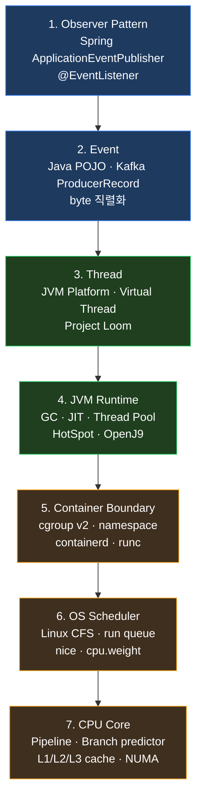

> 친구가 한 줄 그렸다.
>
> ```
> Observer Pattern
>  ↓
> Event
>  ↓
> Thread
>  ↓
> OS Scheduler
>  ↓
> CPU
> ```
>
> *"이게 K8s 클러스터에서 어떻게 *내려가나*?"*
>
> 답: *5 layer 가 아니라 *7 layer* 다*. *K3s 환경* 은 사이에 *cgroup* 과 *containerd* 라는 *2 개의 가상화 단계* 를 더 끼워 넣는다. 그래서 *Spring 의 `publishEvent()` 한 줄* 이 *진짜 CPU 사이클* 로 내려가기까지 *최소 7 번의 dispatch* 가 일어난다.

이 글은 *내 K3s 운영 사례* 로 *그 7 단계 stack* 을 *위에서 아래로* 따라가본 기록.

---

## TL;DR — *한 줄 결론*

> *비즈니스 의도* (`Observer Pattern`) 는 *순수 객체-지향 디자인*. 그게 *CPU 실행 사이클* 이 되려면 *Event 객체화 → JVM thread → cgroup → Linux scheduler → 물리 CPU* 의 *총 7 단계 dispatch* 를 거친다. *각 단계는 자기 추상화 비용* 을 갖고, *각 단계가 자기 곳에서 막힐 수 있다*. *어디가 막혔는지* 를 *layer 별로 분리해서 보는 시야* 가 *성능 진단의 출발점* 이다.

---

## 1. *7 Layer 의 전체 그림*



*위* 로 갈수록 *비즈니스 의도* 가 *직접적*. *아래* 로 갈수록 *물리적 실행* 에 가까움. 그 사이는 *한 layer 가 다음 layer 의 추상화* 를 신뢰하는 *contract* 의 연속.

---

## 2. *Layer 1 — Observer Pattern* — *디자인 의도*

가장 위 layer 는 *코드의 의도* 다. Spring 의 `ApplicationEventPublisher` 가 가장 흔한 형태.

```kotlin
// settlement-service / SettlementCompletedHandler.kt
@Component
class SettlementCompletedHandler(
    private val eventPublisher: ApplicationEventPublisher,
) {
    @Transactional
    fun complete(order: Order) {
        order.markSettled()
        eventPublisher.publishEvent(SettlementCompletedEvent(order.id, order.amount))
    }
}

@Component
class NotifyOnSettlement {
    @EventListener
    fun onSettled(e: SettlementCompletedEvent) { /* ... */ }
}
```

*Observer pattern* 의 핵심은 *송신자가 수신자를 *모르는* 것*. `publishEvent()` 호출자는 *어느 listener* 가 받을지 *몰라도 코드가 작동* 한다.

여기까지가 *비즈니스 의도* 다. 다만 *이 시점엔 *CPU 도 thread 도 아직 모른다**. 아직 *코드 한 줄* 일 뿐.

---

## 3. *Layer 2 — Event* — *데이터화*

`publishEvent()` 가 호출되면 Spring 의 `SimpleApplicationEventMulticaster` 가 *registered listener 목록* 을 보고 *각각에 dispatch* 한다.

```java
// Spring framework 의 동작 (단순화)
public void multicastEvent(ApplicationEvent event, ResolvableType eventType) {
    for (ApplicationListener<?> listener : getApplicationListeners(event, eventType)) {
        Executor executor = getTaskExecutor();
        if (executor != null) {
            executor.execute(() -> invokeListener(listener, event));
        } else {
            invokeListener(listener, event);  // 같은 thread 에서 즉시 호출
        }
    }
}
```

여기서 *분기* 가 일어난다 :

- **Sync 모드** — `executor == null`. 같은 thread 에서 *즉시* listener 호출. *publishEvent() 호출이 끝나려면 모든 listener 가 끝나야 함*. `@Transactional` 이 그대로 묶여 *DB 락이 길어지면 위험*.
- **Async 모드** — `@EnableAsync` + `@Async` 또는 `TaskExecutor` 설정. `executor.execute()` 가 *다른 thread* 로 listener 를 던짐.
- **Kafka 모드** — `SettlementCompletedEvent` 를 *그대로 listener* 가 받는 게 아니라, 한 listener 가 *`KafkaTemplate.send()`* 로 *byte 직렬화* 해 *Kafka broker* 로 보냄. 진짜 *분산 이벤트*.

내 [settlement 의 outbox 패턴](/2026/06/06/velero-kopia-zombie-job-limitrange-ratio-and-argocd-schema-bug.html) 은 *Kafka 모드 + 추가 안전망*. `publishEvent()` 의 listener 가 *outbox 테이블에 INSERT* 만 하고 끝낸다 (= *DB 트랜잭션과 같이 commit*). 그 다음 *별도 polling job* 이 outbox 의 PENDING 행을 읽어 Kafka 로 publish. *at-least-once + transactional* 보장.

```
Observer  →  in-memory listener  →  outbox INSERT  →  COMMIT
                                                          ↓
                                        polling job (5s)  →  Kafka broker
```

여기서 *event 가 *byte 단위 데이터* 가 되는 순간* 이 *진짜 layer 2*. JVM heap 의 객체가 *직렬화 → byte buffer* 로 변환된다.

---

## 4. *Layer 3 — Thread* — *실행 단위*

이제 *누가 그 listener 를 실행* 하느냐. 답은 *JVM Thread*.

### 4.1 *Platform Thread* (전통적)

`new Thread()` 또는 `ThreadPoolExecutor` 의 *worker thread*. 각 thread 가 *OS 의 1:1 thread* 에 매핑됨 (Linux 의 *pthread*). JVM 의 `Thread.start()` 는 내부적으로 *pthread_create()* 를 호출.

- *비용* : thread 당 *스택 1 MB ~ 2 MB* (기본). 10 만 thread = 100 GB. *현실적으로 불가능*
- *I/O blocking* 시 *그 platform thread 가 block* 됨. OS 가 *context switch* 로 다른 thread 로 넘어가지만 *그 1 MB 스택은 점유 유지*

### 4.2 *Virtual Thread* (Java 21+, Project Loom)

`Thread.startVirtualThread()` 또는 `Executors.newVirtualThreadPerTaskExecutor()`. *경량 thread*. *수십 KB* 의 메모리. *10 만 개* 도 가능.

```kotlin
val executor = Executors.newVirtualThreadPerTaskExecutor()
executor.submit {
    val response = http.get("/api/products")  // block 해도 OK
    process(response)
}
```

가장 큰 차이 : *blocking I/O 시 virtual thread 가 *parked*되고 *carrier thread 는 다른 virtual thread 로 넘어감*. *I/O 효율의 OS-level event-driven* 을 *코드 레벨 동기 스타일* 로 표현 가능.

내 다른 글 [*Virtual Threads vs Kotlin Coroutines*](/2026/06/05/virtual-threads-real-cases-vs-kotlin-coroutines.html) 에서 자세히 다뤘다. 핵심 차이 :

| 항목 | Virtual Thread | Coroutine |
|---|---|---|
| Block 가능한 I/O 호출 | 가능 (자동 unpark) | suspend 함수만 가능 |
| 코드 스타일 | 동기 | 비동기 (suspend 키워드) |
| 마이그레이션 | 기존 sync 코드 그대로 | 함수 시그니처 변경 |
| 함정 | Pinned threads (synchronized block 안의 I/O) | Coroutine cancellation chain |

### 4.3 *Thread Pool 분리 (Bulkhead)*

여기서 *bulkhead 패턴* 이 들어온다 — *결제 처리 thread pool* 와 *검색 처리 thread pool* 을 *분리*. 한쪽이 saturate 돼도 다른쪽이 *살아남게*.

```kotlin
@Bean("paymentExecutor")
fun paymentExecutor() = ThreadPoolTaskExecutor().apply {
    corePoolSize = 20; maxPoolSize = 40; queueCapacity = 100
}

@Bean("searchExecutor")
fun searchExecutor() = ThreadPoolTaskExecutor().apply {
    corePoolSize = 50; maxPoolSize = 100; queueCapacity = 500
}
```

*결제* 워크로드는 *DB write-heavy* 라 *20 정도* 면 충분. *검색* 은 *외부 API + 캐시* 라 *50 + 큰 큐* 가 합리적. 이 분리가 [*이커머스 트래픽 제어*](/2026/06/07/ecommerce-saas-traffic-control-defense-in-depth.html) 의 *layer 4* 의 핵심.

---

## 5. *Layer 4 — JVM Runtime* — *언어 추상화의 마지막*

Thread 가 *비즈니스 코드를 실행* 하지만 *진짜 CPU 명령* 으로 가려면 한 단계 더 — *JVM 자체*.

### 5.1 *JIT Compilation*

JVM 의 *HotSpot* 은 *처음엔 interpreted* 로 실행하다 *hot method* (자주 호출되는) 를 *C2 JIT compiler* 로 *machine code 로 컴파일*. 처음 100 번 호출까진 *느리고* 그 후엔 *빠르다*.

이게 *진짜 운영* 에서 *cold start* 문제. 새 frontend pod 가 뜨면 *처음 1~2 분간 latency p99 가 튀는* 건 *JIT warm-up 단계*. *pre-warm* 또는 *AOT (Ahead-of-Time, GraalVM Native Image)* 로 완화.

### 5.2 *Garbage Collection*

JVM heap 에 *Event 객체* 가 쌓이면 *언젠가 GC* 가 돈다. *Young GC* 는 *수 ms*, *Full GC* 는 *수 100 ms ~ 수 초*. *그 시간 동안 모든 application thread 가 멈춤* (stop-the-world).

내 클러스터의 *Spring Boot pod* 들은 *G1GC* 기본. *heap 1 GB* 미만이면 Young GC 가 *5 ms 미만*. *결제* 처럼 *p99 latency* 에 민감한 워크로드는 *ZGC* (sub-millisecond pause) 로 옮길 가치.

### 5.3 *Thread context switch*

JVM thread 가 *물리 CPU* 를 점유하다 *Linux scheduler* 가 *다른 thread 로 switch* 한다. *thread → register save → cache flush → 다른 thread → cache miss*. *context switch 1 회 = 1 ~ 10 μs + 캐시 무효화*.

*Virtual thread* 는 OS context switch 가 *carrier thread 만 발생* 하므로 *1000 virtual thread* 이 *1 carrier thread* 위에서 협력하면 *context switch 비용 ↓*.

---

## 6. *Layer 5 — Container Boundary* — *cgroup v2 + namespace*

*여기서부터 K3s 환경 의 진짜 특이성* 시작.

Pod 가 *물리 노드 위* 에서 도는데, *OS 입장에선* 그 pod 의 process 는 *cgroup* 으로 *자원 제한* 받는다.

### 6.1 *cgroup v2 의 CPU 제한*

Pod spec :

```yaml
resources:
  requests:
    cpu: 100m      # 0.1 CPU (cgroup.weight ≈ 100)
  limits:
    cpu: 500m      # 0.5 CPU (cpu.max = "50000 100000")
```

K8s 가 *cgroup file* 에 :
- `cpu.weight` = 100 (request 의 비율)
- `cpu.max` = "50000 100000" (100ms 의 *50ms* 만 사용 가능 = 0.5 CPU)

`cpu.max` 가 *진짜 throttling* 의 근원. *CPU spike* 시 그 quota 를 다 쓰면 *cgroup throttler* 가 *그 process 의 CPU access 를 100ms 동안 차단*.

내가 *velero CPU throttling 99.54%* 사고 해결 (PR #18 박제) 에서 본 것 — *cpu.max=1 core 의 100ms 안에서 99.54ms 가 throttled*. limit 을 2 로 늘려 해결.

### 6.2 *namespace 격리*

같은 cgroup 안에서도 *PID / network / mount namespace* 로 *다른 pod 와 격리*. *pid 1* 부터 다시 시작. 결제 pod 의 process 가 *다른 pod 의 process* 를 *볼 수 없다*.

`containerd → runc` 가 이걸 만든다. *runc 가 namespace + cgroup 을 셋업한 다음 process 를 exec*.

---

## 7. *Layer 6 — Linux Scheduler (CFS)* — *진짜 dispatch*

이제 *실제 실행할 thread* 를 *물리 CPU* 에 배치한다.

### 7.1 *CFS (Completely Fair Scheduler)*

Linux 의 기본 scheduler. *모든 runnable thread* 를 *red-black tree* 의 *runqueue* 에 둔다. *각 thread 의 vruntime* (가상 실행시간) 이 *가장 작은 thread* 를 다음 실행 대상으로.

*vruntime* 은 *실제 실행 시간 / weight*. weight 는 cgroup 의 `cpu.weight` 에서 옴. *우선순위 높은 cgroup* 의 thread 는 *vruntime 이 천천히 증가* → *더 자주 선택됨*.

이게 *공정 스케줄링* 의 핵심. *하나의 노이즈 thread 가 다른 모든 thread 를 굶기지 않는다*. 다만 *cgroup quota 가 우선* — *cpu.max 다 쓴 cgroup* 의 thread 는 *runnable 이어도 wait*.

### 7.2 *Runqueue per CPU*

리눅스는 *CPU 코어마다 별도 runqueue* 를 둔다. 그래서 thread 들이 *코어 사이 부하 분산* 되어야 함. *Load balancer* 가 *주기적으로* runqueue 들의 부하를 비교해 *migration*.

*Cache miss 비용* 때문에 *thread 가 한 코어에 *고정* 되는 게 일반적으로 빠름*. 그러나 *과부하 코어* 가 있으면 *덜 바쁜 코어* 로 이동.

### 7.3 *Nice 값과 우선순위*

- `nice` (-20 ~ +19) — *전통적 우선순위*. *낮을수록 높은 우선순위*
- `SCHED_OTHER` (CFS), `SCHED_FIFO` / `SCHED_RR` (실시간), `SCHED_DEADLINE` (deadline 기반)

K8s 의 *PriorityClass* 가 *pod 의 PreemptionPolicy 와 부하 시 *who-survives* 결정* 만 함. *runtime CPU 시간* 의 우선순위는 *cpu.weight 와 nice* 가 결정.

내 클러스터의 `lemuel-production` PriorityClass 는 *scheduling-time priority* — *높은 우선순위 pod 가 *낮은 우선순위 pod 를 evict* 한다*. 그러나 *running 중인 pod 의 CPU 우선순위* 는 *cgroup weight* 가 진짜 결정.

---

## 8. *Layer 7 — CPU Core* — *진짜 실행*

Scheduler 가 *thread 를 CPU 코어에 dispatch* 하면 그제서야 *진짜 명령* 이 실행된다.

### 8.1 *Pipeline + Branch Predictor*

현대 CPU 는 *수십 단계의 pipeline*. *명령 fetch → decode → execute → writeback* 이 *겹쳐서* 동시에 진행. *branch (if 문)* 이 나오면 *예측해서 미리 fetch*. *misprediction* 이면 *pipeline flush + 10~20 cycle 손해*.

### 8.2 *L1 / L2 / L3 Cache*

CPU 가 RAM 직접 접근은 *100 cycle 이상*. 그러나 *L1 cache 접근 = 3~4 cycle*. 같은 *데이터를 계속 같은 코어에서 처리* 하면 *L1 hit rate ↑* → *체감 성능 ↑*.

*Virtual thread* 의 carrier thread 가 *한 코어에 고정* 돼 있으면 *L1/L2 cache locality* 가 살아남. *thread pool 가 잘 분리* 돼 있으면 *결제 thread* 가 *결제 hot data* 를 *같은 L2* 에 유지.

### 8.3 *NUMA*

대형 서버는 *여러 NUMA 노드*. *다른 NUMA 노드의 RAM 접근* 은 *같은 NUMA 의 2~3 배 latency*. K8s 의 *Topology Manager* 가 *pod 의 모든 자원 (CPU + memory + GPU) 을 같은 NUMA 노드에* 배치 시도. 내 홈랩 K3s 는 *소규모 노드* 라 NUMA 적용 대상 아님.

---

## 9. *그래서 *한 줄* 이 *얼마나 걸리나*

`eventPublisher.publishEvent(SettlementCompletedEvent(...))` 한 줄의 비용을 *layer 별로 분해* 해보자 :

| Layer | 단계 | 비용 (대략) |
|---|---|---|
| 1. Observer Pattern | `publishEvent()` 호출 | *수십 ns* (메서드 dispatch) |
| 2. Event 객체화 | Event 객체 alloc + listener 목록 lookup | *수 μs* |
| 2'. Kafka 모드 시 | 직렬화 + broker network round-trip | *수 ms* |
| 3. Thread | `executor.execute()` → queue → worker pickup | *수십 μs* |
| 4. JVM | listener method JIT-compiled 이면 즉시, 아니면 *interpreted* | *수 μs ~ 수 ms* |
| 5. Container | cgroup throttle 안 됨 가정 | *0* |
| 6. OS Scheduler | thread 가 runnable 상태에서 *실제 CPU 점유* | *μs 단위* |
| 7. CPU | 실제 instruction 실행 + cache hit/miss | *수십 ns ~ μs* |

*Async 모드 + Kafka 모드* 면 *총 *수 ms* 수준* 이 *publish → listener 시작* 까지. *Sync 모드* 면 *수십 μs 수준*. 그러나 *cgroup throttle* 이 일어나면 *수 100 ms 도 추가* (PR #18 의 99.54% throttling 처럼).

---

## 10. *어디서 막혔는지 *layer 별로 보는 도구*

각 layer 의 *진단 도구* :

| Layer | 도구 |
|---|---|
| 1. Observer | Spring Actuator `/metrics` 의 `spring.eventListener.processing.duration` |
| 2. Event/Kafka | Kafka consumer lag, broker p99, schema registry 응답 |
| 3. Thread | `jstack` thread dump, Micrometer `executor.*`, virtual thread pinning detection |
| 4. JVM | JFR (Java Flight Recorder), `jcmd VM.gc_info`, JIT compilation log (`-XX:+PrintCompilation`) |
| 5. Container | cgroup files (`/sys/fs/cgroup/.../cpu.stat`), Prometheus `container_cpu_throttled_seconds_total` |
| 6. OS Scheduler | `perf sched record`, `bpftrace`, `runqlat` (BCC), `/proc/sched_debug` |
| 7. CPU | `perf stat -e cache-misses,branch-misses`, `pmu-tools`, `intel-cmt` |

가장 *유용한 빠른 진단* :

- **`container_cpu_throttled_seconds_total` 가 평균보다 높다** → layer 5 막힘 (cgroup)
- **thread dump 에 `WAITING (parked)` 다수** → layer 3 풀 부족
- **GC pause p99 가 높다** → layer 4 heap / GC tuning
- **Kafka consumer lag 증가** → layer 2 처리 속도 부족
- **CPU runqueue (`runqlat`) 가 길다** → layer 6 노드 과부하

---

## 11. *내 K3s 의 실제 사례*

### Case 1 — *9 일 묻힌 frontend 사고* ([어제 글](/2026/06/06/velero-kopia-zombie-job-limitrange-ratio-and-argocd-schema-bug.html))

- Layer 1~7 *전혀 문제 없음*
- 진짜 원인은 *그 위* 의 *CI/CD layer 0* — ArgoCD Image Updater 의 *write-back* race
- 즉 *실행 stack* 이 멀쩡해도 *코드가 *그* 실행 stack 에 도달하지 못함*

### Case 2 — *Velero CPU throttling 99.54%* ([velero 문서](https://github.com/MyoungSoo7/helm-deploy/blob/master/docs/VELERO-RUNTIME-CONFIG.md))

- Layer 5 (cgroup) 의 `cpu.max = 1 core` 가 부족
- *Layer 1~4 코드* 는 멀쩡, *Layer 5 가 그 코드 실행을 막음*
- fix: limit 1 → 2 → throttling 99.54% → 0.5%

### Case 3 — *etcd HDD trap* ([etcd 글](/2026/06/06/etcd-fsync-hdd-trap-kube-api-error-budget-burn.html))

- Layer 7 도 *너머* 의 *디스크 I/O 가 진짜 원인*
- *etcd 의 fsync* 가 *HDD 의 4~10 ms* 회전 대기에 *block*
- 7 layer 모델은 *CPU* 까지만 — *I/O 는 별도 stack*

---

## 12. *교훈*

*Observer Pattern → CPU* 의 *5 layer 표기* 는 *추상적으로는 맞다*. 그러나 *실제 K3s 환경* 에선 *container + Linux* 의 *2 layer* 가 더 들어가 *7 layer* 가 된다. *각 layer 가 자기 책임* 을 갖고 *자기 곳에서 막힐 수 있다*.

> *"성능 문제 는 *한 layer* 의 문제가 아니라 *어느 layer 에서 막혔는지를 *구분 못 한* 진단의 문제다."*
>
> *— 그래서 *시각화 한 그림* 이 *진단 도구의 출발점* 이 된다.*

각 layer 가 *자기 측정 도구* 를 제공하는 시대다. *Prometheus + Micrometer + perf + eBPF* 의 *조합* 만 있으면 *layer 별 분리 진단* 이 가능. *진단의 시야* 가 *문제 해결의 절반*.

---

## 13. *후기 — 친구의 한 줄에서 출발한 글*

이 글은 친구가 텔레그램으로 *5 단계 화살표 그림* 을 *한 줄* 보내며 *"K8s 클러스터에서 어떻게 되나"* 라고 물어본 *한 순간* 에서 시작했다. 그 *단순한 질문* 이 *내 인프라* 를 *위에서 아래로* 다시 *훑어보는 동기* 가 됐다.

원래 *친숙한 추상화* 가 *친숙해서 무서운 게 아니라 *친숙해서 *깊이* 를 잊는 게 무섭다*. 그래서 *가끔* *위에서 아래로 stack dive* 하는 글이 *내 인프라 이해의 *지도* 가 된다.

---

*시리즈 :* [C++ 는 클러스터 *밖에* 있다](/2026/06/07/cpp-in-kubernetes-cluster-outside-the-cluster.html) · [Go 는 클러스터 *전체에* 있다](/2026/06/07/go-is-everywhere-in-my-k3s-cluster.html) · [R 은 클러스터에 *없다*](/2026/06/07/r-not-in-my-k3s-cluster-and-why.html) · [이커머스 SaaS 의 트래픽 제어](/2026/06/07/ecommerce-saas-traffic-control-defense-in-depth.html) · *Observer Pattern 의 7 layer stack dive (현재 글)*

*이 글은 sparta-msa-project / settlement-service / helm-deploy 의 운영 경험과 [Virtual Threads vs Coroutines](/2026/06/05/virtual-threads-real-cases-vs-kotlin-coroutines.html), [etcd fsync HDD trap](/2026/06/06/etcd-fsync-hdd-trap-kube-api-error-budget-burn.html), [velero kopia 좀비 잡](/2026/06/06/velero-kopia-zombie-job-limitrange-ratio-and-argocd-schema-bug.html) 글들의 *layer 별 진단* 을 종합.*
