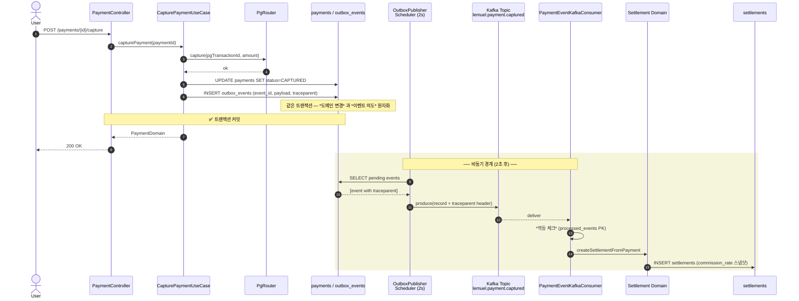

> *Kafka 는 *기본 설치만 *하면* *동작 한다*.
> *그 다음 부터가 *진짜 시작*. *유실 / 중복 / 순서 / 독성 메시지* — *기본값 만 *믿으면 *전부 *터진다*.
> *9년차 의 *settlement 운영 회고*. *메시징을 *길들이는 *네 개 의 *기둥*.

---

## TL;DR

운영 Kafka 가 *조용히 돌아가는* 데엔 *네 개 의 기둥* 이 필요하다.

| 기둥 | 무엇 | 없을 때 |
|---|---|---|
| *Transactional Outbox* | DB 트랜잭션과 Kafka 발행을 *원자화* | 결제 성공 → 정산 누락 (혹은 그 반대) |
| *Triple Idempotency* | L1 outbox UNIQUE → L2 processed_events PK → L3 도메인 UNIQUE | 같은 결제로 정산 *2 회 생성* |
| *DLT + Replay* | 독성 메시지 격리 + 운영자 수동 복구 | 메시지 한 건 stall 로 *파티션 전체 lag 폭주* |
| *Observability* | DLT/retry/lag 메트릭 + 알람 | 사고가 *조용히 발생* — 셀러 입금 D+1 SLA 깨질 때 알게 됨 |

이 글은 *실제 운영 중인 settlement 시스템* 의 4 기둥 구현 과 *9년차 시점에서 본 trade-off* 를 정리한다.

---

## 1. 흐름 한 장 — *결제 → Outbox → Kafka → 정산*



*포인트*:
- *동기 경로* (User ↔ Web ↔ DB) 와 *비동기 경로* (Poll → Kafka → Cons) 의 *경계* 가 명확
- 동기 경로 *안* 에서 outbox_events 만 INSERT — Kafka 는 *건드리지 않는다*
- 비동기 경로 *안* 에서 처음으로 Kafka 가 등장
- *traceparent 헤더* 가 모든 경계를 따라가서 Tempo 에서 *단일 trace* 로 가시화

---

## 2. *Outbox* — 왜 굳이 *DB 에 한 번 더 쓰는가*

### 2.1. *원자성 의 본질* — DB 와 Kafka 는 *같은 트랜잭션 에 들어갈 수 없다*

가장 흔한 잘못된 코드:

```java
@Transactional
public void capturePayment(Long id) {
    paymentRepo.markCaptured(id);               // 1) DB UPDATE
    kafkaTemplate.send("payment.captured", ev); // 2) Kafka publish
}
```

*보기엔 *원자적* — *@Transactional 안 에 *두 줄*. *사실은 *전혀 원자적 이지 않다*.

| 시점 | 시나리오 A — send-then-commit | 시나리오 B — commit-then-send |
|---|---|---|
| 1 | Kafka 발행 성공 | DB 커밋 성공 |
| 2 | DB 커밋 실패 (deadlock, conn drop) | Kafka 발행 실패 (broker down) |
| 결과 | *결제 안 됐는데 *정산 시작* | *결제 됐는데 *정산 누락* |

*두 매체 가 *서로 다른 트랜잭션 코디네이터* 를 갖기 때문* — *2PC (XA) 가 답* 일 수 있지만:
- Kafka 는 *XA 미지원* (transactional producer 는 *Kafka 내부 트랜잭션* 일 뿐, DB 와 같은 트랜잭션 합치 불가)
- XA 자체가 *운영 복잡도 폭증* + *성능 절벽*

### 2.2. *Outbox 의 아이디어* — *의도만 같은 트랜잭션 에 기록*

```java
@Transactional
public void capturePayment(Long id) {
    paymentRepo.markCaptured(id);               // 1) DB UPDATE
    outboxRepo.insert(new OutboxEvent(          // 2) DB INSERT (PENDING)
        UUID.randomUUID(), "PaymentCaptured", payload, traceparent));
    // Kafka 는 *건드리지 않음*
}

// ─── 별도 폴러 (2초 주기) ───
@Scheduled(fixedDelay = 2000)
public void publishPending() {
    List<OutboxEvent> events = outboxRepo.findPendingOldest(BATCH_SIZE);
    for (var event : events) {
        kafkaTemplate.send(event.toRecord());
        outboxRepo.markPublished(event.id);
    }
}
```

*같은 트랜잭션 에 들어가는 건 *DB 두 줄* 뿐* — *진짜 원자적*. Kafka 는 *별도 폴러* 가 *나중에* 발행.

*테이블 스키마* (`V28__create_outbox_events.sql`):

```sql
CREATE TABLE opslab.outbox_events (
    id             BIGSERIAL PRIMARY KEY,
    aggregate_type VARCHAR(50)  NOT NULL,
    aggregate_id   VARCHAR(64)  NOT NULL,
    event_type     VARCHAR(100) NOT NULL,
    event_id       UUID         NOT NULL,         -- *전역 고유* — 컨슈머 측 멱등 키
    payload        JSONB        NOT NULL,
    status         VARCHAR(20)  NOT NULL DEFAULT 'PENDING',
    retry_count    INTEGER      NOT NULL DEFAULT 0,
    last_error     TEXT,
    created_at     TIMESTAMP    NOT NULL DEFAULT NOW(),
    published_at   TIMESTAMP,

    CONSTRAINT chk_outbox_status CHECK (status IN ('PENDING', 'PUBLISHED', 'FAILED'))
);

-- 폴러 조회용 인덱스 (PENDING + 오래된 순)
CREATE INDEX idx_outbox_status_created
    ON opslab.outbox_events (status, created_at)
    WHERE status IN ('PENDING', 'FAILED');

-- *컨슈머 멱등 체크* 를 위한 event_id 유니크
CREATE UNIQUE INDEX uq_outbox_event_id
    ON opslab.outbox_events (event_id);
```

### 2.3. *Outbox 의 trade-off*

| 좋은 점 | 나쁜 점 |
|---|---|
| *원자성* (DB 와 의도가 같은 트랜잭션) | *발행 지연* (폴링 주기만큼) |
| *crash 안전* (커밋된 이상 *반드시* 발행됨) | *DB 부하* (INSERT + 폴링 SELECT) |
| *재시도 자연 내장* (PENDING 인 한 계속 시도) | *순서 보장* 은 *별도 신경* (event_id 순서 ≠ business 순서) |
| *traceparent 같이 보관* → 분산 trace | *outbox 테이블 자체 가 hotspot* 우려 (partitioned table 고려) |

settlement 는 *원자성 이 절대* 라 *지연 + DB 부하 를 받아들임*. 폴러 주기 2 초 → 셀러 입금 D+1 SLA 에 무시 가능 수준.

> *9년차 시점*: *2PC 보다 Outbox 가 *현실적인 답*. *XA 트랜잭션을 *프로덕션 에서 *오래 굴려 본 사람 일수록* *Outbox 를 *선호*. *XA 는 *교과서 답* 이지 *현장 답* 이 아니다.

---

## 3. *Triple Idempotency* — *같은 메시지 두 번 와도 안전*

Kafka 는 *at-least-once* 가 기본. 즉 *같은 메시지 가 *두 번 이상 배달* 될 수 있다 (리밸런싱, consumer crash 후 재처리, 네트워크 재전송 등).

*"중복 이 와도 *결과 가 *같다"* — 이게 *멱등성 (idempotency)* 의 정의. settlement 는 *3 단 으로 방어*.

### 3.1. *L1 — Outbox event_id UNIQUE* (프로듀서 측)

```sql
CREATE UNIQUE INDEX uq_outbox_event_id ON opslab.outbox_events (event_id);
```

같은 비즈니스 이벤트 를 *두 번 outbox 에 INSERT* 시도 → *DB 제약 위반* → *비즈니스 트랜잭션 자동 롤백*. *프로듀서 측 에서 부터 차단*.

### 3.2. *L2 — processed_events PK* (컨슈머 측)

(`V29__create_processed_events.sql`)

```sql
CREATE TABLE opslab.processed_events (
    consumer_group VARCHAR(100) NOT NULL,
    event_id       UUID         NOT NULL,
    event_type     VARCHAR(100) NOT NULL,
    processed_at   TIMESTAMP    NOT NULL DEFAULT NOW(),
    PRIMARY KEY (consumer_group, event_id)
);
```

*컨슈머 코드 패턴*:

```java
@KafkaListener(topics = "lemuel.payment.captured")
@Transactional
public void handle(ConsumerRecord<String, PaymentCapturedEvent> record) {
    try {
        // 1) 멱등 체크 — INSERT 시도. unique 충돌 = 이미 처리됨.
        processedEventRepo.insert(new ProcessedEvent(
            "settlement-consumer", record.value().eventId(), "PaymentCaptured"));
    } catch (DataIntegrityViolationException e) {
        log.info("Already processed: {}", record.value().eventId());
        return;  // ACK 만 하고 종료
    }

    // 2) 비즈니스 처리 — 위 INSERT 와 *같은 트랜잭션*
    settlementService.createFromPayment(record.value());
}
```

*포인트*: processed_events INSERT 와 settlements INSERT 가 *같은 트랜잭션* — *둘 다 커밋 되거나 둘 다 롤백*. 만약 settlements INSERT 가 실패하면 processed_events 도 같이 롤백 → *다음 재배달 때 다시 시도 가능*.

### 3.3. *L3 — 도메인 UNIQUE* (자연 키)

```sql
ALTER TABLE opslab.settlements
    ADD CONSTRAINT uq_settlements_payment_id UNIQUE (payment_id);
```

L1, L2 가 *모두 뚫려도* (예: processed_events 테이블 가 *유실* — 인프라 사고) *마지막 으로 DB 의 자연 키 제약 이 막는다*. *같은 payment 로 settlement 두 건 생성 불가*.

### 3.4. *왜 3 단인가* — *각 layer 의 가정 이 다르다*

| Layer | 막는 것 | 가정 |
|---|---|---|
| L1 (event_id UNIQUE) | 프로듀서 측 *중복 이벤트 생성* | outbox 폴러가 *건강* |
| L2 (processed_events PK) | 컨슈머 측 *중복 처리* | processed_events 가 *건강* |
| L3 (도메인 UNIQUE) | *비즈니스 데이터 중복* | DB 가 *건강* |

*어느 한 layer 가 *오작동 해도* 다른 layer 가 *catch* 한다*. 분산 시스템 에서 *"하나만 믿지 마라"* 의 교과서.

> *9년차 시점*: *멱등성 을 *1 단 만 둔 시스템 이 *결국 사고 가 나고* *3 단 으로 늘린다*. *처음 부터 3 단* 으로 두는 게 *비용 절약*. *L3 자연 키 UNIQUE 는 *DDL 만 추가* 라 비용 거의 0.

---

## 4. *DLT (Dead Letter Topic) + Replay* — *독성 메시지 격리*

### 4.1. *문제* — *스프링 기본 설정 의 silent skip*

Spring Kafka 의 기본 `DefaultErrorHandler` 동작:

```
FixedBackOff(0, 9)  ─  즉시 9 회 재시도 → *조용히 skip*
```

*9 회 재시도 후 메시지 가 *유실됨* — *메트릭 도 *0* 으로 안 잡힌다*. 운영자 가 *모르는 사이에 데이터 가 사라진다*.

면접 질문: *"카프카 컨슈머가 한 건 처리 실패하면 어떻게 되죠?"*
*"3 중 멱등 으로 안전합니다"* — 부족하다. *"실패가 *어디로 가나요? *누가 그걸 *보나요? *다시 처리 할 수 있나요?"* 가 진짜 질문.

### 4.2. *해법* — *DLT (.DLT 토픽 으로 라우팅)*

settlement 의 `KafkaErrorHandlerConfig` (`shared-common` 모듈) 가 기본 핸들러 를 override:

```java
@Bean
public DefaultErrorHandler errorHandler(KafkaTemplate<?, ?> template) {
    var recoverer = new DeadLetterPublishingRecoverer(template,
        (record, ex) -> new TopicPartition(record.topic() + ".DLT", record.partition()));

    var handler = new DefaultErrorHandler(recoverer, new FixedBackOff(2000, 3));  // 2s × 3회

    // *독성 메시지* — 재시도 의미 없음. 즉시 DLT.
    handler.addNotRetryableExceptions(
        JsonProcessingException.class,    // 페이로드 파싱 실패
        IllegalArgumentException.class,   // 도메인 인풋 검증 실패
        IllegalStateException.class       // 상태 머신 위반 (이미 종료된 정산 재처리 등)
    );

    return handler;
}
```

*핵심 결정*:

| 항목 | 값 | 이유 |
|---|---|---|
| 재시도 주기 | 2s | 일시 장애 (DB 락, 네트워크) *회복 시간* |
| 재시도 횟수 | 3 회 | 총 6 초 — *파티션 stall* 허용 한계 |
| 즉시 DLT 예외 | Json/IllegalArg/IllegalState | *재시도 해도 같은 결과* |
| DLT 토픽 명 | `<source>.DLT` | Spring Kafka 표준, 도구 친화 |
| DLT 보관 기간 | 30 일 | 원본 7 일 보다 *길게* — 사후 분석 시간 |
| DLT 파티션 수 | 원본과 동일 (3) | replay 시 *key 기반 순서 유지* |

### 4.3. *Replay* — *운영자 수동 복구 워크플로*

DLT 에 쌓인 메시지를 *수정 후 다시 흘려보내는* 인터페이스:

```
GET  /admin/dlq/inspect?topic=lemuel.payment.captured.DLT&max=20
POST /admin/dlq/replay?topic=lemuel.payment.captured.DLT&max=10
```

*디자인 포인트*:

- *권한*: ROLE_ADMIN (`/admin/dlq/**` SecurityConfig 강제)
- *감사*: 모든 호출 → V34 `audit_logs` 기록 (operator, topic, count, timestamp)
- *임시 컨슈머 그룹*: `replay-<UUID>` — *commit 하지 않음* → lag 누적 X
- *헤더 패스스루*: `event_id`, `traceparent` 그대로 → *processed_events 멱등 자동 작동*
- *DLT 식별 헤더 (`kafka_dlt-*`) strip* 후 republish

### 4.4. *무한 루프 안전망* — `x-replay-count`

```java
int replayCount = Integer.parseInt(
    Optional.ofNullable(record.headers().lastHeader("x-replay-count"))
        .map(h -> new String(h.value())).orElse("0"));

if (replayCount >= 5) {
    log.warn("Replay cap reached for event_id={}, skipping", eventId);
    metrics.replayCappedCounter.increment();
    return;
}
record.headers().add("x-replay-count", String.valueOf(replayCount + 1).getBytes());
```

*운영자 가 같은 메시지를 *끝없이 replay* 하다 시스템 을 무너뜨리는 사고 방지*. 5 회 도달 시 *페이로드 직접 수정 또는 폐기 결정* 강제.

### 4.5. *DLT 의 trade-off*

| 좋은 점 | 나쁜 점 |
|---|---|
| *메시지 유실 0* — 모든 실패 가 DLT 에 보존 | DLT 보관 storage 비용 (~300MB/월) |
| *파티션 stall 방어* (재시도 ≤ 6 초) | 재시도 6 초 동안 후속 메시지 대기 |
| *운영 워크플로 완성* (inspect → 수정 → replay) | 운영자 권한 분리 + 감사 부담 |
| *3 단 멱등 → 4 단 멱등* (replay-count cap 포함) | 코드 복잡도 증가 |

> *9년차 시점*: *DLT 없는 컨슈머 는 *컨슈머 가 아니다*. *Spring 기본 9 회 silent skip 은 *반드시* override 하라*. *6 초 의 stall 은 *D+1 SLA 에 무시 가능 *— 그러나 *유실 은 *복구 불가*.

---

## 5. *관측 가능성* — *진짜 의미 있는 SLI 4 가지*

Kafka 운영 의 *진짜 KPI* 는 *처리량 (msg/s)* 이 아니다. *건강함 의 4 가지 signal*:

| 메트릭 | 의미 | 알람 임계 | Grafana 라벨 |
|---|---|---|---|
| `settlement.kafka.consumer.lag` | 컨슈머 가 브로커 보다 *얼마나 뒤처져 있나* | > 1000 msgs for 5m | `topic=*, group=*` |
| `settlement.kafka.dlt.published.total` | DLT 로 라우팅 된 *누적* 메시지 수 | rate 5m > 0.1/s → 운영자 호출 | `topic=*` |
| `settlement.kafka.retry.total` | 재시도 시도 *누적* (백엔드 불안 신호) | rate 5m > 1/s → 인프라 점검 | `topic=*` |
| `settlement.kafka.dlt.replayed.total` | replay 누적 — 사고 후 정상화 추적 | 정보용 | `topic=*` |

*Prometheus 룰 예시*:

```yaml
- alert: KafkaDltSpike
  expr: |
    rate(settlement_kafka_dlt_published_total[5m]) > 0.1
  for: 2m
  labels:
    severity: warning
    channel: telegram
  annotations:
    summary: "DLT 발행 률 spike — {{ $labels.topic }}"
    description: |
      DLT 발행 률 5m rate > 0.1/s.
      독성 메시지 가능성. /admin/dlq/inspect 로 확인 필요.
```

*포인트* — *4 가지 가 다 의미 가 다르다*:

- *consumer.lag* — *처리 속도 < 발행 속도*. *처리 자체 가 늦음*
- *dlt.published* — *실패 가 *발생* 하고 *있음*
- *retry* — *실패 가 *발생 했다 회복*. *백엔드 불안 의 *조기 신호*
- *dlt.replayed* — *사고 후 정상화 진행 률*

*4 가지 를 *각자 분리* 해야 *원인 진단 가능*. *하나로 합치면 *원인 파악 불가*.

> *9년차 시점*: *lag 만 보는 컨슈머 는 *반쪽*. *retry rate 증가 → DLT 발행 increase 의 패턴 이 *백엔드 장애 의 *전조*. *둘 다 같이 봐야* 사고 *를 *미리 잡는다*.

---

## 6. *9년차 회고* — *흔히 망치는 5 가지*

### 6.1. `auto.offset.reset=latest` 로 *데이터 유실*

```yaml
spring:
  kafka:
    consumer:
      auto-offset-reset: latest  # ← 기본값. *위험*.
```

새 컨슈머 그룹 으로 처음 connect 했을 때 *과거 메시지 를 *전부 건너뛴다*. 운영 환경에서 *컨슈머 추가* 하는 순간 *그 동안 쌓인 메시지 전부 유실*.

*고치는 법*: `earliest` 로 시작 → 의도적인 *처음 부터 재처리* 보장.

### 6.2. `max.poll.records` 안 줄여서 *rebalance 폭풍*

기본값 500. 컨슈머 가 *500 건 처리 하는 동안* `max.poll.interval.ms` (기본 5분) 초과 → 브로커 가 *컨슈머 죽음 으로 판정* → 리밸런싱.

리밸런싱 → *전체 파티션 재할당* → *모든 컨슈머 가 동시에 stall*.

*고치는 법*:
- `max.poll.records=50` 같이 *작게*
- 또는 *한 건 처리 시간 측정* 해서 *역산*

### 6.3. *Partition 키 를 random 으로* → *순서 깨짐*

```java
kafkaTemplate.send("payment.captured", UUID.randomUUID().toString(), event);
//                                     ↑ *치명적 실수*
```

같은 paymentId 의 *capture / refund 가 *다른 파티션 으로 가서* *처리 순서 가 *뒤바뀐다*. 환불 이 결제 보다 *먼저 처리* 되는 사고.

*고치는 법*: *비즈니스 자연 키* 로 partition. settlement 에서는 `paymentId.toString()` 사용 → 같은 payment 의 모든 이벤트 가 *같은 파티션 = 순서 보장*.

### 6.4. *Outbox 안 두고 send-then-commit* → *유실*

```java
@Transactional
public void capturePayment(Long id) {
    kafkaTemplate.send(...).get();   // 1) 발행 *완료* 대기
    paymentRepo.markCaptured(id);    // 2) DB UPDATE
}
```

*"send 가 *성공* 했으니 *DB 도 *되겠지"* — 안 됨. 2 번 에서 *deadlock 으로 rollback* → *결제 안 됐는데 *정산 메시지 가 *이미 발행*.

*고치는 법*: §2 의 Outbox 패턴. *DB 만 두 줄* 같은 트랜잭션, Kafka 는 별도 폴러.

### 6.5. *DLT 안 두고 @Retryable 만* → *silent skip*

```java
@KafkaListener(...)
@Retryable(maxAttempts = 3)  // *조용히 3 회 시도 후 *조용히 skip*
public void handle(Record record) { ... }
```

3 회 후 *예외 가 *escape* 하면 Spring Kafka 가 *조용히 다음 메시지 로 진행*. *메트릭 도 *증가 안 함*. *데이터 유실*.

*고치는 법*: §4 의 `DefaultErrorHandler + DeadLetterPublishingRecoverer`. *모든 실패 가 DLT 로 가게* 강제.

---

## 7. *결론* — *4 기둥 + 1 원칙*

| 4 기둥 | 핵심 한 줄 |
|---|---|
| *Outbox* | DB 와 Kafka 는 *같은 트랜잭션 에 못 들어간다* — 의도 만 같은 트랜잭션 에 INSERT |
| *Triple Idempotency* | *어느 한 layer 가 *뚫려도 *다음 layer 가 *막는다* |
| *DLT + Replay* | *유실 0* + *운영자 수동 복구* — Spring 기본 *9 회 silent skip 은 *반드시* override |
| *Observability* | *lag / DLT / retry / replay 를 *분리* 해야 *원인 진단 가능* |

*1 원칙*: *"Kafka 는 *기본 설치 만 *하면 *돌아간다. *그 다음 부터 가 *진짜 시작."*

*기본값 의 *9 회 silent skip*, *latest offset reset*, *max.poll.records=500* — *전부 *프로덕션 에서 *터지는 *디폴트*. *4 기둥 을 *처음부터* 둬야 *나중 에 *사고 비용 절약*.

---

9년차 회고 :

> *"메시징 시스템 의 *80% 의 사고 는 *기본 설정* 에서 나온다. *나머지 20% 는 *원자성 의 *오해* 에서 나온다."*

다음 글 — *Saga / Choreography vs Orchestration* — Outbox + Kafka 를 *여러 서비스* 에 걸친 *분산 트랜잭션 패턴* 으로 *확장* 하는 깊이. 같은 시리즈 로 이어 집니다.

---

> 본 글은 *9년차 백엔드 / 메시징 운영 회고*. *Spring / Kafka 중심* 이지만 *4 기둥 의 *원리* 는 *언어 / 플랫폼 무관*. *분산 메시징 의 *완벽한 답 은 *없는 영역* — *trade-off 의 *지속 적 *결정*. *본 글 의 settlement 사례 는 *D+1 셀러 입금 SLA* 기준 이라, *밀리초 SLA 환경* (실시간 게임 / 거래소) 에서는 *다른 trade-off* 가 필요.
