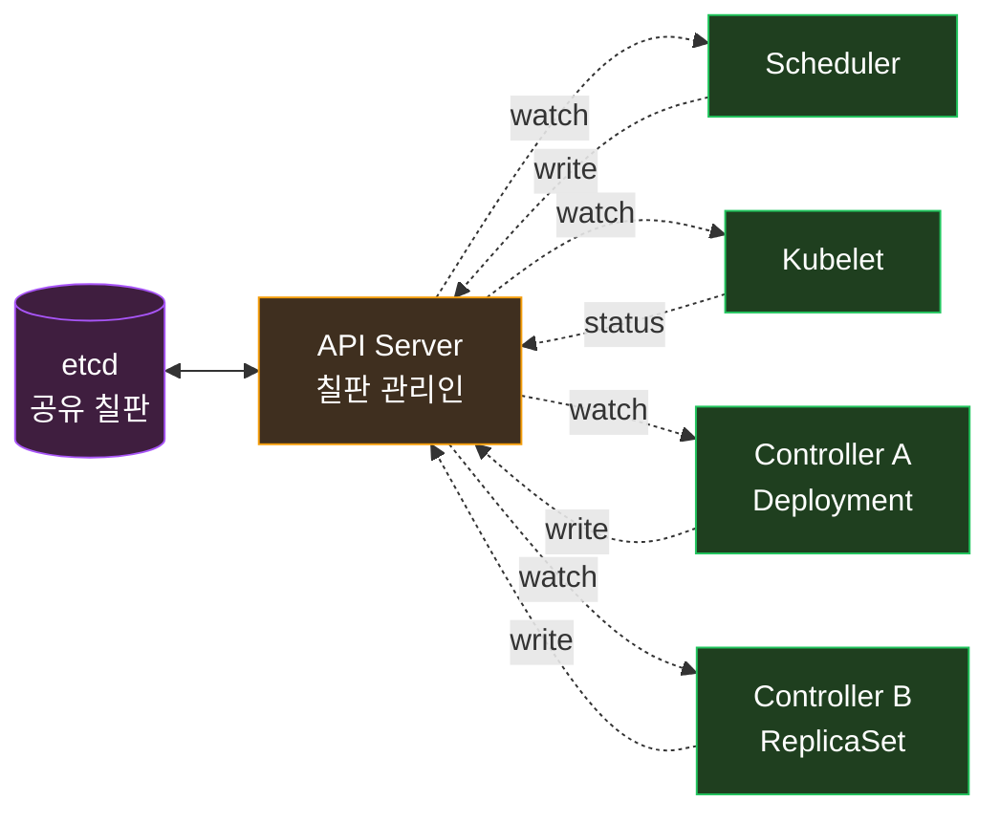
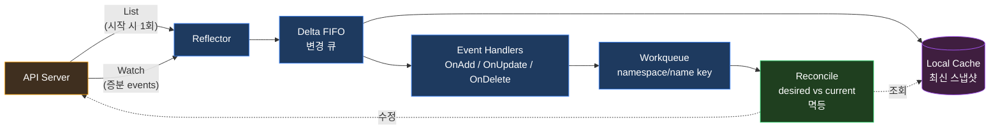
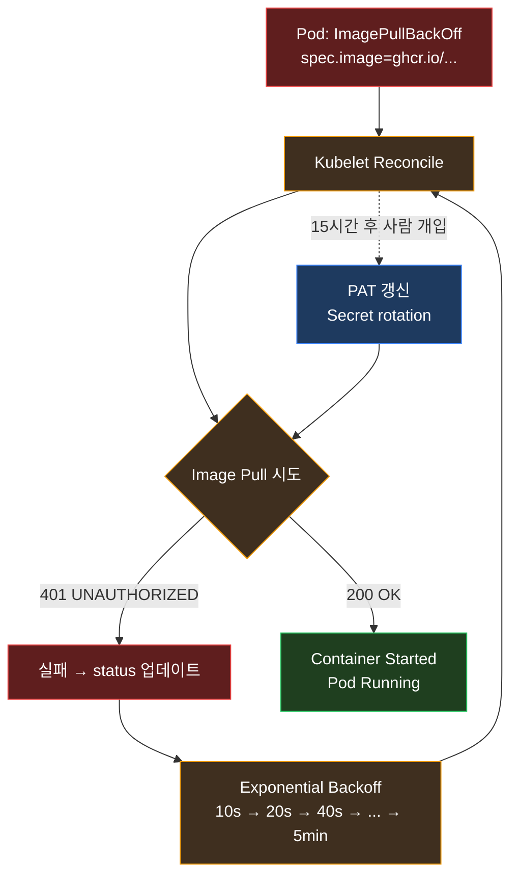

> *kubectl run echo --image=...* *한 줄*. *Enter*. *몇 초 뒤* *Pod 가 Running*.
>
> *이 사이* 에 *무슨 일* 이 일어나는가. *이 한 줄* 이 *왜 *Scheduler* 와 *Kubelet* 사이 의 *두 개의 *독립적 루프* 로 처리* 되는가. *왜 그 둘 은 *서로를 직접 호출* 하지 않는가*. *왜 *어느 쪽이 죽어도 *다른 쪽 이 계속* * 인가.

이 그림 한 장 :


*위 시퀀스* 의 *진짜 의미* 는 *Kubernetes 의 *전체 아키텍처 철학* * 이다. *오늘 의 글* 은 *이 두 루프* 를 *현미경 으로 들여다 보고*, *그게 왜 *마이크로서비스 + 분산 시스템* 의 *교과서* 인지* 풀어본다.

---

## TL;DR — *한 줄 결론*

> *Kubernetes 의 본질 은 *느슨하게 결합된 *컨트롤 루프 들* 의 *집합*. *Scheduler · Kubelet · ReplicaSet 컨트롤러 · Deployment 컨트롤러 · Ingress 컨트롤러* — *모두 *서로를 직접 호출하지 않는다*. *각자 *API Server 의 *watch* 로 *desired state* 만 본다*. *Push 가 아니라 *Pull*. *명령 이 아니라 *합의*. *그래서 *어느 컴포넌트 가 죽어도 *재시작 하면 자동 복구* 되고*, *그래서 *Custom Operator* 가 *수십 줄 로 K8s 의 일등 시민* 이 된다*.

---

## 1. *그림 *5 단계 의 *상세 해부***

위 시퀀스 의 *각 단계 별* — *실제로 *무엇이 일어나는지*.

### Step 0 — *kubectl run* (그림 상 *맨 위 의 한 줄*)

```sh
kubectl run echo --image=nginx
```

내부 :

1. *kubectl* 이 *POST /api/v1/namespaces/default/pods* 호출
2. *API Server* 가 *admission webhook* 통과 → *etcd 에 *Pod object* 저장*
3. *이때 *spec.nodeName* 은 *빈 값*. *status.phase* 는 *Pending*

*핵심* — *이 시점 에 *Scheduler 도 Kubelet 도 *호출 받지 않았다*. *그냥 *etcd 에 *문서 하나* 쓰였을 뿐*.

### Step 1 — *Scheduler 의 *Watch* — *할당 안 된 Pod 감시* *

*Scheduler* 는 *시작 시 부터* *API Server 에 *watch* 연결* 을 *영원히 열어 둠*. 정확히 :

```
GET /api/v1/pods?watch=true&fieldSelector=spec.nodeName=
Accept: application/json
Connection: keep-alive  (HTTP/2 또는 long-poll)
```

*이 응답 은 *끝나지 않는다*. *새 Pod 가 *etcd 에 들어오자 *Scheduler 에게 *event 푸시*. *Push 처럼 보이지만 *기술 적으로 는 *Scheduler 가 *자발적 으로 *Pull 한 long-running 응답*.

*event 형태* :
```json
{"type":"ADDED","object":{"kind":"Pod","metadata":{...},"spec":{"nodeName":"",...}}}
```

### Step 2 — *Scheduler 가 *Pod 을 *노드 에 할당***

*Scheduler 가 보는 것* :
- *현재 *사용 가능 노드* 5 개 (lemuel/louise/david/ilwon/solomon)
- *각 노드 의 *남은 CPU / 메모리*
- *Pod 의 *resource requests / tolerations / affinity / taint*

*점수화 (scoring)* → *최적 노드 선택* → *결과 를 *어떻게 반영* 하는가? *직접 Kubelet 호출* 이 *아니다*.

```sh
PATCH /api/v1/namespaces/default/pods/echo/binding
Body: {"target":{"kind":"Node","name":"david"}}
```

*Scheduler 는 *API Server 에 *binding 요청* 만 보낸다*. *그러면 *API Server 가 *해당 Pod 의 *spec.nodeName 을 "david" 로 *업데이트*. *그게 끝*.

*Scheduler 는 *Kubelet 의 *존재 도 모른다*. *그저 *etcd 에 *주소 적힌 편지* 를 *써둔다*.

### Step 3 — *Kubelet 의 *Watch* — *노드 에 할당된 Pod 감시***

*각 노드 의 *Kubelet* 도 *시작 시 부터* *영원한 watch* :

```
GET /api/v1/pods?watch=true&fieldSelector=spec.nodeName=david
```

*david 노드 의 *Kubelet 은 *spec.nodeName=david 인 Pod 만 본다*. *Scheduler 가 *binding 한 직후* — *API Server 가 *event 푸시*.

*event 형태* :
```json
{"type":"MODIFIED","object":{"kind":"Pod","spec":{"nodeName":"david","containers":[{"image":"nginx",...}]}}}
```

### Step 4 — *Kubelet 이 *컨테이너 생성***

*Kubelet 의 *실제 일* * :

1. *Image pull* — *CRI (containerd/cri-o) 에 *image pull 요청*
2. *Pod sandbox 생성* — *pause container + network namespace*
3. *각 init / regular container 순차 시작* (CRI 호출)
4. *Pod IP 할당* — *CNI plugin (Flannel / Calico / Cilium) 호출*
5. *Volume mount* — *CSI plugin 호출*

*이 모든 것* 이 *Kubelet → 노드 OS 안* 의 일. *API Server 와 무관*.

### Step 5 — *Kubelet 이 *Pod 상태 를 *전달***

*Kubelet 이 *주기적 (10s 기본)* 으로* :

```
PATCH /api/v1/namespaces/default/pods/echo/status
Body: {"status":{"phase":"Running","containerStatuses":[...]}}
```

*상태 만 *보고*. *명령 받는 게 아니다*. *etcd 에 *Pod 의 *현재 상태* 가 *기록* 된다.

*그리고 *그 status 변화* 를 *또 다른 컨트롤러 들 — *Deployment / ReplicaSet / Service endpoint* — *각자의 watch 로 본다*.

---

## 2. *Push 가 아니라 *Pull* — *왜 이 패턴 인가***

### 2.1 *Push 기반 의 *전통 모델***

```mermaid
flowchart LR
    O[Orchestrator<br/>중앙 명령자]
    W1[Worker 1]
    W2[Worker 2]
    W3[Worker 3]
    O -->|HTTP POST<br/>"이거 해"| W1
    O -->|HTTP POST<br/>"이거 해"| W2
    O -->|HTTP POST<br/>"이거 해"| W3
    classDef boss fill:#5f1e1e,stroke:#ef4444,color:#fff
    classDef worker fill:#1e3a5f,stroke:#3b82f6,color:#fff
    class O boss
    class W1,W2,W3 worker
```

*문제* :
- *Worker 가 *재시작 되면 *Orchestrator 가 *재전송* 해야 함
- *Network partition 시 *명령 손실* → *복잡한 retry / dedup*
- *Orchestrator 가 *Worker 의 *주소 + 상태* 를 *알아야* 함
- *Orchestrator 죽으면 *전체 멈춤*

### 2.2 *Pull (Watch) 기반 의 *Kubernetes 모델***



*특성* :
- *API Server 는 *Scheduler 의 *주소 도 모름*. *그냥 *문서 저장소 + 변경 알림기*
- *Scheduler 가 *재시작 되면 *기존 etcd 상태 를 *처음부터 다시 본다*. *복구 비용 = 0*
- *Network partition 후 *복귀 하면 *그 사이 변경* 을 *catch up*
- *어떤 컨트롤러 도 *서로를 알 필요 없음*

*핵심 — *desired state 와 *current state* 의 *지속적 화해* (continuous reconciliation)*. *명령* 이 아니라 *합의*.

### 2.3 *철학 적 비유*

*Push 모델 = *상사 가 부하 에게 *지시*. *상사 가 죽으면 일이 멈춤*.

*Pull (Watch) 모델 = *공유 칠판*. *지시 가 칠판 에 *적힌다*. *직원 들 이 *칠판 을 *수시로 본다*. *지시 가 *변하면 *직원 들 이 *알아서 한다*. *상사 가 죽어도 *직원 들 이 *마지막 지시* 를 *계속 본다*. *직원 이 죽었다 살아나도 *칠판 을 *다시 보면 된다*.

이게 *K8s 의 *진짜 *철학*. *etcd 가 *칠판*. *모든 컨트롤러 가 *직원*.

---

## 3. *Watch 의 *실제 구현* — *Informer · Reflector · Cache***

*"watch 가 *그렇게 자주 *연결돼 있으면 *etcd 가 부하 *안 받나?"* 라는 의문 — *합리적*. K8s 는 *우아한 *2 단 캐싱* 으로 푼다.

### 3.1 *Reflector + Local Cache*

각 컨트롤러 (Scheduler 포함) 는 *client-go 라이브러리* 의 *Informer* 를 사용. 내부 구조 :



작동 :
1. *시작 시 *List* — *전체 상태 의 *스냅샷* 을 *한 번에 가져옴*
2. *그 후 *Watch* — *resourceVersion* 이후의 *변경 만 *증분 적* 으로
3. *Local Cache 에 *최신 상태 유지*. *컨트롤러 의 *queries 는 *전부 local cache 에서* — *API Server 부하 0*
4. *Network 끊기면 *Watch 재연결 + Resync* — *항상 *최신 상태*

*결과* — *수십 명의 watcher 가 있어도 *etcd 부하 는 *O(이벤트 수)*. *조회 부하 는 *0*. *대규모 클러스터 의 *기반*.

### 3.2 *Workqueue 의 *멱등 reconcile***

*Informer 의 *event handler* 는 *직접 일을 하지 않는다*. *그냥 *workqueue 에 *Pod 의 namespace/name 을 넣는다*.

```go
func (c *Controller) onPodAdd(obj interface{}) {
    key, _ := cache.MetaNamespaceKeyFunc(obj)
    c.workqueue.Add(key)  // "default/echo"
}
```

*Reconcile 루프* 는 *workqueue 에서 key 를 꺼내* :

```go
func (c *Controller) reconcile(key string) error {
    pod, err := c.lister.Pods(namespace).Get(name)  // local cache 에서
    if errors.IsNotFound(err) { return nil }  // 이미 지워진 거. 무시
    
    // *현재 상태* 와 *desired state* 비교
    // *차이가 있으면 *수정 시도*
    // *멱등* — 같은 key 가 *여러 번 reconcile* 돼도 *결과 동일*
}
```

*핵심* — *모든 reconcile 가 *멱등*. *같은 key 가 *10 번 호출* 되도 *최종 상태는 같음*. *그래서 *재시작 / 재시도 / 중복* 이 *문제 가 되지 않는다*.

내 *[Settlement 의 *Triple Idempotency](/2026/06/15/transaction-outbox-pattern-async-integration-deep-dive.html)*  도 *같은 원리*. *분산 시스템 의 *기본 문법*.

---

## 4. *컨트롤러 의 *재진입 안전성 * — *내가 *어제 본 *jabis-prod 의 사례***

*어제 의 *KubeContainerWaiting* 알람* — *jabis-app / jabis-frontend* 가 *ImagePullBackOff* 로 *15 시간* *동안 *Pending*.

*그 동안 의 *내부* :



*15 시간 *4,053 번* 시도*. *명령 받지 않은 상태 에서 *알아서 *재시도*. *내가 *PAT 만 갱신* 하면 — *명령 없이 도 *알아서 *성공*.

*이게 *Kubernetes 의 *위대함*. *명령 받지 않은 상태 에서 *15 시간 *알아서 *재시도*. *그리고 *내가 *PAT 만 갱신* 하면 — *명령 없이 도 *알아서 *성공* *.

*Push 모델 이었다면* — *Orchestrator 가 *15 시간 동안 *4,053 번 *명령 을 보내야* 했을 것. *상태 관리 의 폭발*.

*Watch-Reconcile 의 *진짜 가치* — *자기 치유 (self-healing)* 가 *공짜로 따라옴*.

---

## 5. *어느 컴포넌트 가 *죽으면 어떻게 되는가***

### 5.1 *Scheduler 가 죽으면*

- *기존 Running Pod* 들은 *아무 영향 없음* (그건 *Kubelet 의 일*)
- *새 Pod* 의 *spec.nodeName 이 비어있게* 됨 — *Pending 상태로 *대기*
- *Scheduler 가 *재시작 되면* — *etcd 의 *Pending Pod 들* 을 *List 로 처음부터* 읽고 *스케줄링 재개*
- *중복 스케줄링* 도 *binding API 가 *조건부 update (resourceVersion 검증)* 이라 *안전*

### 5.2 *Kubelet 이 죽으면*

- *해당 노드 의 *Running Pod 는 *계속 동작* (Container runtime 이 *별도 프로세스*)
- *그러나 *상태 보고* 가 멈춤 → *node-status-update-frequency (기본 10s)* 만큼 지나면 *NodeNotReady*
- *5 분 (eviction timeout)* 지나면 *Controller Manager 가 *해당 노드 의 *Pod 를 *다른 노드 로 재스케줄*
- *Kubelet 재시작 되면 *기존 Pod 들 *그대로 인수* (container 가 *살아있으면 *재연결* 만)

### 5.3 *API Server 가 죽으면*

- *Watch 가 모두 끊김* — *Scheduler / Kubelet / 모든 컨트롤러 가 *대기*
- *그러나 *기존 Running Pod 는 *영향 없음* (직접 호출 받지 않음)
- *HA 환경* 이면 *다른 API Server 로 *재연결*
- *API Server 가 *영원히 죽으면* — *변화 가 멈출 뿐 *기존 상태 는 유지*

이게 *어제 점검 시 *컨트롤 플레인 503* 임에도 *기존 워크로드 가 *Ingress 80/443 응답 했던* 이유. *데이터 플레인 ≠ 컨트롤 플레인*.

### 5.4 *etcd 가 죽으면*

- *유일한 *진짜 *재앙*. *etcd 가 *Source of Truth*
- *그래서 *etcd 는 *Raft *3 노드 이상 의 HA* 가 *기본*
- *Backup + 정기 snapshot 이 *생명선*

---

## 6. *이 패턴 의 *확장 *— *Operator / CRD / Custom Controller***

Watch-Reconcile 이 *왜 *위대한 추상화* 인가 — *내가 *동일 패턴 으로 *내 도메인 컨트롤러* 를 *만들 수 있다*.

### 6.1 *Operator 패턴*

```go
// 1. CRD 정의 — *내 자원* 을 *K8s 의 일등 시민* 으로
apiVersion: settlement.lemuel.io/v1
kind: SettlementJob
spec:
  cycle: "monthly"
  sellerId: "S-12345"

// 2. 내 컨트롤러 — *내 CRD 를 watch 하고 reconcile*
func (r *SettlementReconciler) Reconcile(ctx context.Context, req ctrl.Request) (ctrl.Result, error) {
    job := &settlementv1.SettlementJob{}
    r.Get(ctx, req.NamespacedName, job)
    
    // *desired state* 와 *current state* 비교
    if job.Status.Phase == "" {
        r.startSettlement(job)
        return ctrl.Result{RequeueAfter: 30 * time.Second}, nil
    }
    if job.Status.Phase == "Processing" {
        r.checkProgress(job)
        return ctrl.Result{RequeueAfter: 30 * time.Second}, nil
    }
    return ctrl.Result{}, nil
}
```

*내 컨트롤러* 가 *Scheduler / Kubelet 과 *완전히 동일 한 방식* * 으로 동작. *그저 다른 자원 을 본다*. *동일 한 자기 치유 / 재진입 안전성 / 분산 합의* 를 *공짜로 얻는다*.

### 6.2 *내 가 본 *Operator 들***

- **cert-manager** — *Certificate CRD* 를 watch 하고 *Let's Encrypt 호출 → Secret 갱신*
- **ArgoCD** — *Application CRD* 를 watch 하고 *Git 의 desired state ↔ 클러스터의 current state 화해*
- **Prometheus Operator** — *ServiceMonitor CRD* 를 watch 하고 *Prometheus config 재생성*
- **kube-image-updater** — *Image CRD* 를 watch 하고 *새 이미지 detect → Application 업데이트*

*[내 K3s 클러스터](/2026/05/04/homelab-infrastructure.html)* 의 *대부분의 운영 도구 들* 이 *모두 이 패턴*. *수십 개 의 Operator 가 *서로를 모르고 *각자의 일* 만 한다*. *그런데 *전체 시스템 은 *조화*. *분산 합의 의 미학*.

---

## 7. *왜 *느슨한 결합 이 *시스템 디자인 의 *교과서* 인가***

위 그림 의 *그림 한 장 이 가르치는 진짜 교훈* 두 가지 :

### 7.1 *컴포넌트 간 *직접 호출 의 *함정***

```
[ Push 모델 — *전통적 *마이크로서비스* ]
Service A → HTTP → Service B → HTTP → Service C

문제 :
- *A 가 *B 의 주소* 를 알아야 함 (service discovery)
- *B 가 *느리면 *A 도 느려짐* (cascading failure)
- *B 가 *retry 받기 싫으면 *A 가 idempotency-key 관리*
- *전체 시스템 의 *상호 의존성 그래프 가 복잡*
```

```
[ Pull 모델 — *Event-driven + Reconcile* ]
Service A → 칠판 ← Service B
              ← Service C

특성 :
- *각 서비스 는 *칠판* 만 안다 — *주소 0*
- *느린 서비스 가 *다른 서비스 를 막지 못함*
- *idempotent reconcile 이 *retry 의 복잡성* 을 *흡수*
- *상호 의존성 = 칠판 의 *스키마* 만*
```

내 *[Settlement 의 *Outbox 패턴](/2026/06/15/transaction-outbox-pattern-async-integration-deep-dive.html)* 이 *바로 *후자*. *order-service → outbox 테이블 → Kafka → settlement-service*. *각 서비스 는 *상대를 모름*.

### 7.2 *Eventual Consistency 의 *받아들임***

*K8s 의 *모든 상태* 는 *eventual consistent*. *kubectl run* 직후 *kubectl get pods* 하면 *처음 몇 초* 는 *Pending*. *그리고 잠시 뒤 Running*. *이건 *버그가 아니라 *기능*.

*"즉시 Running 이 보장* 되어야 한다" 는 *전제 가 *Push 모델 의 *복잡성 의 근원*. *Eventual consistency 를 *받아들이면 *시스템 디자인이 *극적으로 단순* 해진다*.

내 [Settlement 도 *동일 철학* — *주문 결제 → Kafka → 정산* 의 *지연 은 *기능* * 이지 *버그* 가 아니다. *정산 의 *완료* 가 *결제 의 *완료* 를 막아서는 안 됨*.

---

## 8. *체감 정리 *— *오늘 *3 분 안 에 할 *3 가지***

내 클러스터 / 내 시스템 의 *건강 확인* :

```sh
# 1. *Pending 상태 의 *Pod 들* — *Scheduler 가 *못 잡고 있는 *Pod*
kubectl get pods -A --field-selector=status.phase=Pending

# 2. *NotReady 노드* — *Kubelet 이 *report 못 한 노드*
kubectl get nodes --no-headers | grep -v ' Ready '

# 3. *Reconcile 실패 가 *누적된 *events*
kubectl get events -A --field-selector type=Warning --sort-by='.lastTimestamp' | tail -20
```

*이 셋 만 봐도 *클러스터 의 *컨트롤 루프 들 이 *건강하게 돌고 있는지* * 알 수 있다.

---

## 9. *맺음 *— *그림 한 장 의 *철학***

*kubectl run* 한 줄. *5 단계*. *2 개의 루프*. *직접 호출 0 회*. *서로의 존재 도 모름*.

*이게 *Kubernetes 의 *위대함*. *분산 시스템 의 *어려움 의 *대부분* * (실패 복구 / retry / 멱등 / 합의) 을 *Watch-Reconcile 의 단일 패턴* 으로 *우아하게 해결*.

내가 *내 시스템 을 만들 때* — *Settlement 의 Outbox 도*, *Lemuel 의 Operator 들 도*, *Jabis 의 컨트롤러 도* — *이 그림 의 *5 단계 의 패턴* 을 *반복* 한다. *어떤 컴포넌트 도 *서로를 모름*. *공유 상태 (DB / Kafka / etcd) 만 본다*. *그래서 *어느 부분이 죽어도 *전체 가 *살아남는다*.

내일 *내가 *새 시스템 을 설계 할 때* — *컴포넌트 들 이 *서로를 직접 호출* 하려고 하면* — *멈춘다*. *"이걸 *Watch-Reconcile 로 *바꿀 수 있나?"* 한 번 더 생각. *대부분 의 답 은 *"그렇다"*. *그게 *K8s 가 가르쳐 준 *분산 시스템 의 *기본 문법*.

내 다음 시스템 도 *이 그림 한 장* 의 *복사판* 이 될 것이다.

---

*관련 글*

- [*쿠버네티스 *런타임 layered view — Deployment / ReplicaSet / Service / ConfigMap / Secret / Volume 위 에서 Pod 가 돈다*](/2026/06/18/kubernetes-runtime-layered-view-deployment-replicaset-service-configmap-secret-volume.html) — *오늘 글 의 *상위 레이어 시야*
- [*Transactional Outbox 패턴 과 비동기 통합 *깊이 들여다 보기*](/2026/06/15/transaction-outbox-pattern-async-integration-deep-dive.html) — *Watch-Reconcile 의 *Event-driven 형제*
- [*모두의 창업 · 패스트캠퍼스 · 쿠팡 — *2026 보안 사태 3 건 의 공통 원인 과 *방어법*](/2026/06/19/korean-security-breaches-2026-coupang-fastcampus-modu-startup.html) — *어제 의 GHCR PAT 이슈* 가 *Watch-Reconcile 의 *자기 치유* * 의 *증거*
- [*프로세스 라는 추상화 — *CPU · 메모리 · 스레드 · 코어 가 만나는 중심*](/2026/06/18/process-abstraction.html) — *Kubelet 이 *CRI 호출* 할 때 *결국 *프로세스 추상화* 위에서 동작*
