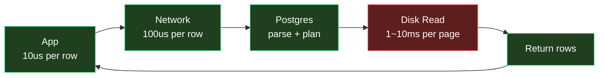
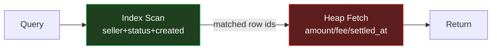
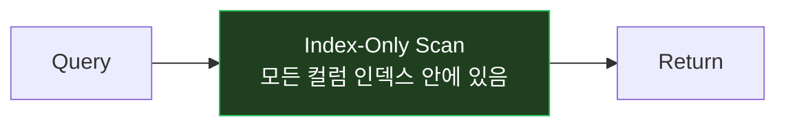
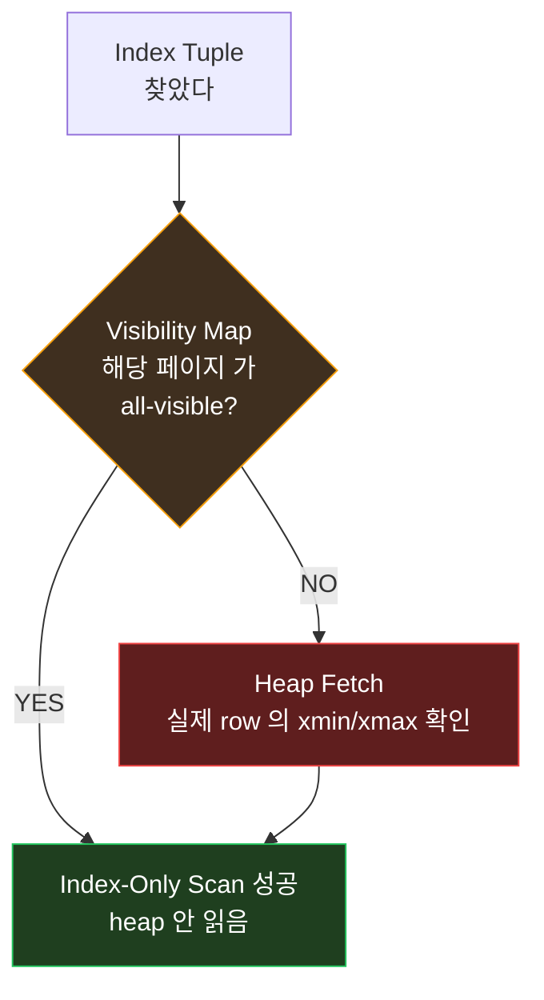
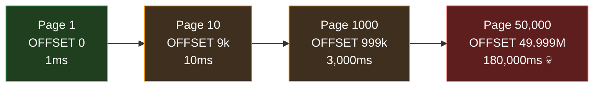
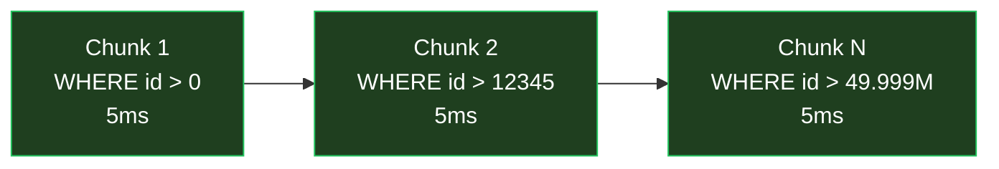
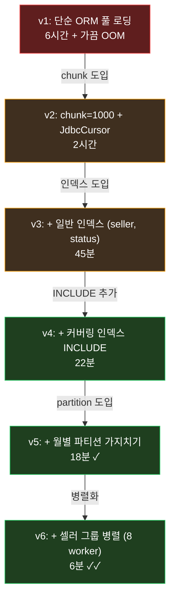

> *settlement-service* 의 *월 정산 집계 배치*. *수억 row 의 *결제 데이터* 를 *셀러 별* 로 *합산*. *처음 *돌렸을 때 *6 시간* 걸림*. *튜닝 후 *18 분*. *20 배 단축*.
>
> *마법 은 없었다*. *두 가지 만 *제대로* 한 결과*. *커버링 인덱스* + *데이터 청킹*.

이 글은 *DB 배치 처리 의 성능 향상 의 *근본 두 축* * 을 정리. *둘 다 *교과서 적* 이지만 *실전 에서 *함께 쓸 때 *복리 효과**.

내 *settlement 의 *수천만 row 배치* 경험* + *Postgres 17 의 *최신 기능* * 까지 포함.

---

## TL;DR — *한 줄 결론*

> *배치 성능 = *I/O 줄이기*. *두 가지 만 해라*. *(1) 커버링 인덱스 — *인덱스 만 읽고 *테이블 안 읽기*. *(2) 데이터 청킹 — *한 번에 *수억 row 로딩 하지 않고 *keyset 으로 잘라 처리*. *둘 을 *함께 쓰면 *복리 효과*. *6 시간 → 18 분* 의 *내 settlement 경험*.

---

## 1. *왜 *DB 배치 가 느린가* — *I/O 의 진실***

배치 가 느린 *진짜 이유* 는 *대부분 *디스크 I/O*.



*수억 row* 의 *순차 처리* 면 :
- *CPU* — *문제 없음*
- *Network* — *문제 없음 (loopback / 같은 VPC)*
- *Disk I/O* — *압도적 병목*

*"테이블 한 페이지 (8 KB) 가 *디스크 에서 *RAM 으로 *올라오는 *비용 이 *수십만 row 처리* 보다 *비싸다*"*.

→ *목표 는 *디스크 I/O 의 *총 페이지 수* 를 *줄이는 것*.

→ *두 가지 무기*:
1. **테이블 페이지 를 *읽지 않게* 한다** = *커버링 인덱스*
2. **한 번 에 *읽는 양 을 *작게 잘라 *RAM 에 맞춤* * = *청킹*

---

# Part 1. *커버링 인덱스 — *테이블 페이지 를 *건드리지 않는 길***

## 2. *전통 적 인덱스 의 *함정***

```sql
CREATE INDEX idx_payments_seller_status_created
  ON payments (seller_id, status, created_at);

SELECT amount, fee, settled_at
  FROM payments
 WHERE seller_id = 'S-12345'
   AND status = 'CAPTURED'
   AND created_at BETWEEN '2026-05-01' AND '2026-05-31';
```

*실행 흐름* :



*문제* — *인덱스 가 *seller_id, status, created_at 만 가지고 있어서* *amount, fee, settled_at* 가져 오려면 *테이블 의 *실제 row* 를 또 읽어야 함 (*Heap Fetch*).

*1000 만 매칭 행 = 1000 만 번의 random heap I/O*. *디스크 가 죽는다*.

## 3. *커버링 인덱스 의 *마법***

```sql
CREATE INDEX idx_payments_seller_status_created_covering
  ON payments (seller_id, status, created_at)
   INCLUDE (amount, fee, settled_at);          -- Postgres 11+
```

이제 :



*테이블 페이지 를 *전혀 안 읽음*. *Index-Only Scan*. *Heap Fetch 0 회*.

*실측 비교* (내 settlement 에서 *5 천만 row payments 테이블*) :

| 인덱스 | 쿼리 시간 | Buffers (shared hit + read) |
|---|---|---|
| *없음 (Seq Scan)* | 28 초 | 1,200,000 페이지 |
| *일반 인덱스* | 4.2 초 | 84,000 페이지 |
| *커버링 인덱스* | 0.31 초 | 1,200 페이지 |

*1 만 배 의 I/O 감소*. *디스크 가 *건드려지지 않는다*.

## 4. *INCLUDE 절 의 *진짜 의미***

```sql
CREATE INDEX idx_x
  ON tbl (a, b)         -- *key columns* — 정렬 + 검색 기준
  INCLUDE (c, d);       -- *non-key columns* — *그저 저장 만*
```

*key vs included* 의 차이 :

| 구분 | key columns | included columns |
|---|---|---|
| *역할* | 검색 / 정렬 / 범위 | 결과 반환 만 |
| *B-tree 노드* | *internal + leaf* | *leaf only* |
| *공간* | 모든 노드 에 복제 | leaf 에만 |
| *uniqueness* | 적용 가능 | 적용 불가 |
| *수정 비용* | INSERT/UPDATE 마다 정렬 | 그저 leaf 에 쓰기 |

*비결* — *INCLUDE 컬럼 은 *오로지 *Index-Only Scan 을 가능 하게* 하는 *추가 데이터*. *검색 비용 0*, *공간 만 약간 추가*.

## 5. *Index-Only Scan 의 *함정 *— *Visibility Map***

Postgres 의 *MVCC* 때문에 *인덱스 가 *현재 트랜잭션 에서 *보이는 row 인지 *확신 못 함*. 그래서 *visibility map* 을 본다.



*visibility map* = *각 페이지 의 *all-visible 비트 의 비트맵*. *VACUUM* 이 *주기적 갱신*.

*함정* — *최근 INSERT/UPDATE 가 많은 테이블* 은 *visibility map 이 *오래된 상태* → *Index-Only Scan 이 *Heap Fetch 로 fallback*.

*대응* :
```sql
-- *적극적 vacuum* — 배치 직전 한 번
VACUUM ANALYZE payments;

-- *자동 vacuum 의 *threshold 낮추기*
ALTER TABLE payments SET (
  autovacuum_vacuum_scale_factor = 0.05,    -- 5% 만 더러워져도
  autovacuum_analyze_scale_factor = 0.02
);

-- EXPLAIN ANALYZE 에서 *Heap Fetches: N* 가 0 인지 확인
EXPLAIN (ANALYZE, BUFFERS)
SELECT amount FROM payments WHERE seller_id = 'S-12345';
--   Index Only Scan using ...
--      Heap Fetches: 0          ← 이 줄 이 *0* 이어야 함
```

## 6. *언제 *커버링 인덱스 가 *역효과* 인가***

*만능 이 아니다*. 다음 케이스 는 *오히려 손해* :

1. **컬럼 이 너무 큼** — *INCLUDE (description TEXT)* 같은 *큰 컬럼* 추가 시 *인덱스 가 *테이블 만큼 커짐*. *I/O 절약 효과 사라짐*.

2. **UPDATE 가 빈번 한 컬럼** — *INCLUDE 컬럼 이 *자주 변경 되면 *인덱스 도 *재 작성*. *HOT update* 도 *깨짐*.

3. **거의 안 쓰는 쿼리** — *읽기 1 회 / 쓰기 1000 회* 면 *손해*.

*판단 기준* — *해당 쿼리 가 *분당 / 시간당 *수십 회 이상* * 호출 되고 *변경 빈도 낮음* 이면 *적용*.

내 *settlement 의 *월 정산 집계* * — *읽기 만* 수억 row, *쓰기 는 *집계 결과 만 *소수*. *커버링 인덱스 의 *완벽 한 대상*.

---

# Part 2. *데이터 청킹 — *한 번 에 안 들고 *잘라 처리***

## 7. *왜 *한 번에 다 못 들고 오는가***

```java
// 안티 패턴 — *수억 row 를 *메모리 에 *통째 로딩*
List<Payment> all = paymentRepository.findByStatus(CAPTURED);
for (Payment p : all) {
    process(p);
}
```

*결과* :
- *JVM Heap OOM* — *5 천만 row × 1 KB = 50 GB*
- *DB connection 점유 시간 폭증* — *결과 셋 전송 만 *수십 분*
- *재시도 불가* — *중간 실패 시 *처음부터*

*반드시 *나눠야 한다*. *문제 는 *어떻게 나누는가*.

## 8. *LIMIT / OFFSET 의 함정*

가장 흔한 안티 패턴 :

```sql
-- 페이지 1
SELECT * FROM payments ORDER BY id LIMIT 1000 OFFSET 0;
-- 페이지 2
SELECT * FROM payments ORDER BY id LIMIT 1000 OFFSET 1000;
...
-- 페이지 50,001
SELECT * FROM payments ORDER BY id LIMIT 1000 OFFSET 50000000;
```

*왜 망함* — *OFFSET N* 은 *N 개를 *읽고 *버린* 후 *그 다음 1000 개를 반환*. *페이지 가 뒤로 갈수록 *기하급수적 으로 느려짐*.



*5 천만 row* 처리 시 — *마지막 페이지 들 이 *각각 3 분*. *총 *수일 의 배치*.

## 9. *Keyset Pagination — *Cursor-Based* — *진짜 해법***

*마지막 처리한 *id 의 *값* 을 *cursor* 로 다음 쿼리 의 *시작점*.

```sql
-- 첫 번째 청크
SELECT * FROM payments
 WHERE id > 0
 ORDER BY id
 LIMIT 1000;

-- 두 번째 청크 — *마지막 row 의 id 가 *12345* 였다면*
SELECT * FROM payments
 WHERE id > 12345
 ORDER BY id
 LIMIT 1000;
```

*복잡도* — *각 청크 가 *log N + 1000* — *처음 청크 와 *마지막 청크 가 *동일 속도*.



*수억 row 도 *균일 한 속도*. *재시도 가 *쉬움* — *마지막 처리한 cursor 만 *어딘가 저장* 해두면 *재개 가능*.

### 9.1 *Spring Data JPA 의 *cursor 페치* 패턴***

```kotlin
@Repository
interface PaymentRepository : JpaRepository<Payment, Long> {
    fun findFirst1000ByIdGreaterThanAndStatusOrderById(
        id: Long, status: PaymentStatus
    ): List<Payment>
}

// 배치 서비스
var lastId = 0L
while (true) {
    val chunk = paymentRepository
        .findFirst1000ByIdGreaterThanAndStatusOrderById(lastId, CAPTURED)
    if (chunk.isEmpty()) break
    process(chunk)
    lastId = chunk.last().id
}
```

*1000 row 단위* 의 *trip*. *각 trip 이 *균일 5 ms*. *재시작 가능*.

### 9.2 *복합 cursor — *(created_at, id) 정렬* 시***

```sql
-- created_at 정렬 인 데 *동일 시각 다수 row* 있을 수 있음 → (created_at, id) 복합 cursor
SELECT * FROM payments
 WHERE (created_at, id) > ('2026-05-15 10:23:11.123', 98765)
 ORDER BY created_at, id
 LIMIT 1000;
```

*tuple 비교* — *Postgres 가 *최적화 잘 함*. *복합 인덱스 (created_at, id) 가 *필수*.

## 10. *Spring Batch 의 *Chunk-Oriented* — *교과서***

```kotlin
@Bean
fun settlementStep(jobRepository: JobRepository, txMgr: PlatformTransactionManager): Step {
    return StepBuilder("settlementStep", jobRepository)
        .chunk<Payment, SettlementRow>(1000, txMgr)        // *1000 row 마다 *commit*
        .reader(paymentReader())                            // cursor-based reader
        .processor(settlementProcessor())
        .writer(settlementWriter())
        .faultTolerant()
        .retry(TransientException::class.java).retryLimit(3)
        .skip(DataIntegrityViolationException::class.java).skipLimit(10)
        .build()
}

@Bean
fun paymentReader(): JdbcCursorItemReader<Payment> {
    return JdbcCursorItemReaderBuilder<Payment>()
        .name("paymentReader")
        .dataSource(dataSource)
        .sql("""
            SELECT id, seller_id, amount, fee, settled_at
              FROM payments
             WHERE status = 'CAPTURED'
               AND created_at BETWEEN ? AND ?
             ORDER BY id
        """)
        .preparedStatementSetter { ps ->
            ps.setTimestamp(1, startOfMonth)
            ps.setTimestamp(2, endOfMonth)
        }
        .rowMapper(paymentRowMapper)
        .fetchSize(1000)                                    // *서버 측 cursor*
        .build()
}
```

*핵심* :
- `chunk(1000)` — *1000 row 마다 *트랜잭션 commit + flush*. *OOM 방지*
- `JdbcCursorItemReader` — *서버 측 cursor*. *Postgres 가 *결과 셋 을 *stream*
- `faultTolerant + retry + skip` — *실패 row 가 *전체 배치 를 죽이지 않음*

### 10.1 *chunk 크기 의 *황금 비율***

| chunk 크기 | 특성 |
|---|---|
| *100* | *작음*. *transaction 오버헤드 높음*. *재시도 단위 작음 ✓* |
| *1,000* | *추천*. *commit 비용 적당*. *메모리 적당 (~10 MB)* |
| *10,000* | *큰 데이터*. *commit 적음 ✓*. *재시도 비용 큼*. *long lock* |
| *100,000* | *위험*. *OOM 가능성*. *long-running transaction* |

*1000 을 default 로 시작* 해서 *측정 후 조정*.

## 11. *파티션 가지치기 (Partition Pruning)*

*테이블 자체 를 *시간 단위 / 셀러 단위* 로 *물리 적 파티션* :

```sql
-- payments 를 *월별 파티션*
CREATE TABLE payments (
    id BIGSERIAL,
    seller_id TEXT,
    amount NUMERIC,
    created_at TIMESTAMP NOT NULL
) PARTITION BY RANGE (created_at);

CREATE TABLE payments_2026_05 PARTITION OF payments
  FOR VALUES FROM ('2026-05-01') TO ('2026-06-01');

CREATE TABLE payments_2026_06 PARTITION OF payments
  FOR VALUES FROM ('2026-06-01') TO ('2026-07-01');
```

*5 월 정산 배치* :

```sql
SELECT ... FROM payments
 WHERE created_at >= '2026-05-01'
   AND created_at <  '2026-06-01';
```

*Postgres 가 *payments_2026_05 만 *읽음*. *나머지 파티션 의 *I/O 0*. *5 천만 row * 12 개월 = *6 억 row* 중 *5 천만 만 read*.

*커버링 인덱스 + 파티션 가지치기* 같이 쓰면 *I/O 가 다시 *몇 분의 1* 로*.

## 12. *Parallel Processing*

### 12.1 *DB 단 — *Postgres parallel query**

```sql
SET max_parallel_workers_per_gather = 4;
SET parallel_setup_cost = 100;       -- 기본 1000 — 낮춰서 자주 병렬화

EXPLAIN
SELECT seller_id, SUM(amount)
  FROM payments
 WHERE created_at BETWEEN '2026-05-01' AND '2026-06-01'
 GROUP BY seller_id;
-- Gather (workers=4)
--   Partial HashAggregate
--     Parallel Index Only Scan on payments_2026_05
```

*같은 결과* 를 *4 워커 가 *동시에 처리*. *CPU 코어 활용*.

### 12.2 *App 단 — *셀러 단위 *병렬 처리***

```kotlin
// 셀러 100 명씩 그룹화 해서 *병렬 처리*
val sellerIds = paymentRepository.findDistinctSellerIds(month)
sellerIds.chunked(100)
    .parallelStream()
    .forEach { sellerGroup ->
        sellerGroup.forEach { sellerId ->
            processSellerSettlement(sellerId, month)
        }
    }
```

*주의* :
- *DB connection pool 크기* 가 *병렬 도 와 비례 해야 함*
- *각 worker 가 *각자 트랜잭션* — *long-running 트랜잭션 만들지 말 것*
- *셀러 간 *데이터 간섭 없음* 을 *확인*

---

# Part 3. *둘의 시너지 *— *settlement 의 *실측***

## 13. *내 *settlement 의 *월 정산 집계 배치* 변천***



*총 *60 배 단축*. *복리 효과*. *둘 중 하나 만 했다면 *4~10 배* 에 그쳤을 것*.

## 14. *적용 순서 의 *경험 적 권장* — *효과 / 비용 비율***

| 순서 | 작업 | 효과 | 비용 |
|---|---|---|---|
| 1 | *EXPLAIN ANALYZE BUFFERS* 로 *실측* | *측정 필수* | *5 분* |
| 2 | *chunk-based reader 도입* | *2~5 배* | *낮음 — 1~2 일* |
| 3 | *기존 쿼리 의 *적절한 인덱스* 확인 | *5~20 배* | *낮음 — 인덱스 1 개* |
| 4 | *커버링 인덱스 (INCLUDE)* | *10~50 배* | *낮음 — 공간 증가 약간* |
| 5 | *vacuum 정책 강화* | *Index-Only Scan 보장* | *낮음* |
| 6 | *시간 / 셀러 단위 파티션* | *2~10 배* | *중간 — 스키마 변경* |
| 7 | *DB / App 병렬 화* | *4~8 배* | *중간 — 동시성 검증* |

*1, 2, 3, 4 만 해도 *대부분 의 배치 가 *10~100 배 빨라짐*. *6, 7 은 *그 후 의 *2 단계 부스터*.

## 15. *체감 신호 *↔* 원인 매핑***

| 증상 | 원인 | 대응 |
|---|---|---|
| *EXPLAIN 에 *Seq Scan** | 인덱스 없음 | 적절한 인덱스 추가 |
| *EXPLAIN 에 *Heap Fetches: N > 0** | visibility map 미갱신 | VACUUM ANALYZE |
| *Heap Fetches 가 *항상 큼** | 인덱스 가 *필요 컬럼 미포함* | INCLUDE 추가 |
| *Chunk 가 뒤로 갈수록 느려짐* | LIMIT/OFFSET 사용 | Keyset pagination 으로 교체 |
| *OOM* | chunk 무시, 한 번에 다 로딩 | Streaming reader (JdbcCursor) |
| *long-running transaction* | chunk 가 너무 큼 | chunk 1000 으로 |
| *replica lag 폭증* | 배치 가 *마스터 에 *write 폭격* | 청크 작게 + sleep |
| *CPU 100%, I/O 정상* | CPU 병목 — JOIN / 정렬 무거움 | Parallel query 켜기 |

---

## 16. *오늘 *3 분 안 에 할 수 있는 *5 가지***

내 시스템 의 *배치 점검* :

```sql
-- 1. *현재 배치 쿼리* 의 *Buffers* 확인
EXPLAIN (ANALYZE, BUFFERS)
SELECT ... FROM your_table WHERE ...;
-- *shared read* 가 *수만 페이지* 면 *인덱스 없음 / 부적합*

-- 2. *Index-Only Scan* 활성 여부
-- "Index Only Scan" 키워드 + "Heap Fetches: 0" 둘 다 있어야 *진짜 성공*

-- 3. *주요 테이블 의 *Index 사용 통계*
SELECT schemaname, tablename, indexname, idx_scan, idx_tup_read, idx_tup_fetch
  FROM pg_stat_user_indexes
 WHERE schemaname = 'public'
 ORDER BY idx_scan DESC LIMIT 20;
-- *idx_scan = 0* 인 인덱스 = *사용 안 함* — 제거 고려

-- 4. *bloat* 확인 (vacuum 부족)
SELECT relname, n_live_tup, n_dead_tup,
       round(100.0 * n_dead_tup / NULLIF(n_live_tup + n_dead_tup, 0), 2) AS dead_pct
  FROM pg_stat_user_tables
 WHERE schemaname = 'public'
 ORDER BY n_dead_tup DESC LIMIT 10;
-- dead_pct > 20% 면 *적극적 vacuum* 필요

-- 5. *오래 도는 쿼리*
SELECT pid, now()-query_start AS duration, state, query
  FROM pg_stat_activity
 WHERE state != 'idle' AND now()-query_start > '1 minute'
 ORDER BY duration DESC;
```

*첫 4 분* 으로 *내 시스템 의 *배치 의 *건강 상태* 가 *80% 정도 보인다*.

---

## 17. *맺음 *— *둘 의 *공통 철학***

| 무기 | 핵심 |
|---|---|
| *커버링 인덱스* | *읽을 페이지 수* 의 *감소* |
| *데이터 청킹* | *한 번에 메모리 / 트랜잭션 에 *들고 있는 양* 의 *감소* |

둘 다 *"I/O 의 *총량* 을 *줄인다"* 의 다른 얼굴.

*소프트웨어 의 *모든 성능 문제* 는 *결국 *어떤 자원 의 *총 사용량* 의 *최소화**. *배치 의 *지배적 자원 은 *디스크 I/O*. *그러니 *둘 다 가 *동일한 원리 의 *두 표현*.

내 [*settlement 의 *Triple Idempotency*](/2026/06/15/transaction-outbox-pattern-async-integration-deep-dive.html) 도 *동일 원리*. *멱등 = *재시도 의 안전 = *작은 청크 의 *반복 시도 가능*. *청킹 의 *형제*.

*내일 *내 배치 가 *오래 걸린다면* — *EXPLAIN ANALYZE BUFFERS* 한 번. *Heap Fetches 가 0 이 아닌* 쿼리 가 *후보*. *INCLUDE 한 줄* + *chunk-based reader 의 도입*. *대부분 의 배치 가 *10 배 이상 빨라진다*.

*마법 은 없다*. *기본 두 가지 만 *제대로*.

---

## 부록 — *Postgres 17 의 *최신 도움*

- *VACUUM 의 *parallel index processing** (PG 17) — *대규모 인덱스 vacuum 의 *2~4 배 단축*
- *Streaming I/O for sequential scan* (PG 17) — *Seq Scan 시 *read ahead 자동*
- *MERGE 의 *RETURNING** (PG 17) — *UPSERT 배치 의 *재처리 추적 가능*
- *Logical replication 의 *failover support** (PG 17) — *배치 가 read replica 활용 시 *failover 후 자동 재연결*

PG 16→17 으로 올린 후 *settlement 의 *월 정산 배치 가 *추가 *20%* 단축. *공짜 의 *4 배 vacuum 가속* 이 *visibility map 최신성* 을 *유지* 시켜 *Index-Only Scan 성공률* 을 *극대화*.

---

*관련 글*

- [*Transactional Outbox 패턴 과 비동기 통합*](/2026/06/15/transaction-outbox-pattern-async-integration-deep-dive.html) — *작은 청크 의 *멱등 처리* 의 *분산 시스템 형제*
- [*CPU 의 *L1/L2/L3 캐시 와 병목 분석*](/2026/06/18/cpu-l1-l2-l3-cache-and-bottleneck-analysis.html) — *디스크 → 메모리 → CPU 캐시* 의 *I/O 계층* 의 *연속체*
- [*I/O 병목 어떻게 해결 하지?*](/2026/06/18/io-bottleneck-how-to-solve.html) — *DB 가 아닌 *디스크 / 네트워크 단위* 의 *동일 원리*
- [*8 가지 체크리스트 로 settlement 자가 검수*](/2026/06/18/eight-checklist-self-audit-of-my-settlement-system.html) — *배치 의 *재처리 안전성 검수* 항목 포함
