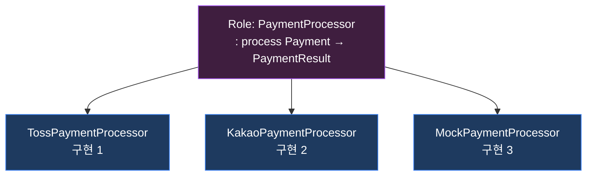
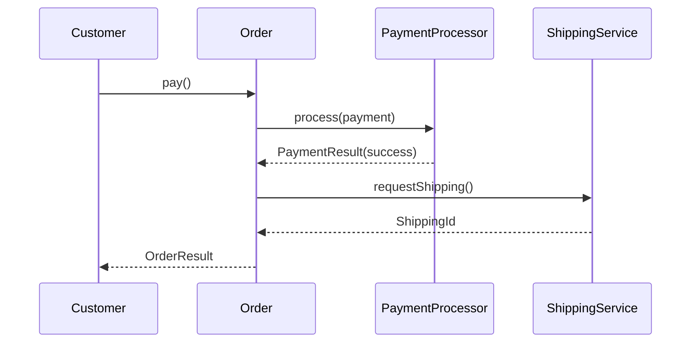
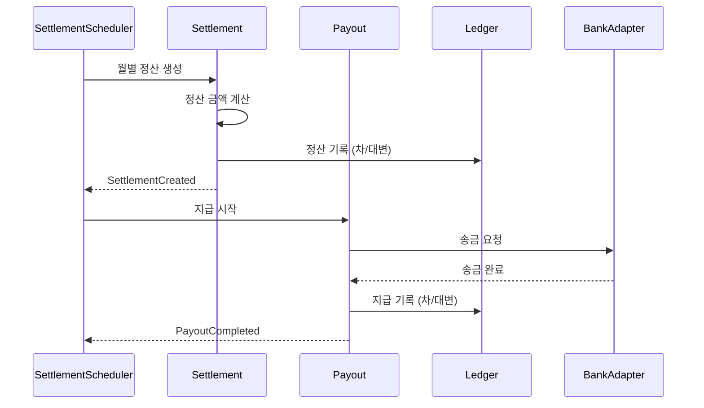
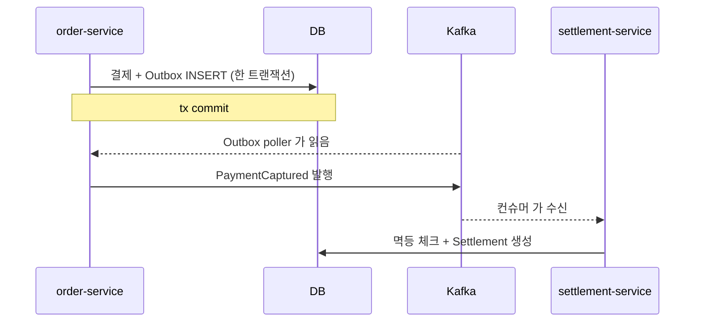
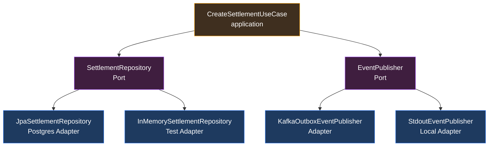

> *"객체지향이 뭐예요?"* 라고 물으면 *대부분* *"클래스, 상속, 다형성, 캡슐화"* 라고 답한다.
>
> 그런데 *알란 케이 (Alan Kay) — 객체지향이라는 단어를 만든 사람* 은 말했다 :
>
> > *"I'm sorry that I long ago coined the term 'objects' for this topic because it gets many people to focus on the lesser idea. The big idea is messaging."*
> >
> > *"오래전 'objects' 라는 용어를 만든 것을 후회한다. 사람들이 *더 작은 개념* 에 집중하게 만들었다. *진짜 큰 아이디어 는 *메시징*"*

*클래스* 가 *작은 개념* 이고 *메시지* 가 *큰 개념* 이라고? 무슨 뜻인가.

이 글 은 *조영호 의 *오브젝트** 의 *3 가지 핵심 — *역할 · 책임 · 협력* — 을 *내 settlement 시스템* 의 *실전 적용 사례* 와 함께 추적한다. *클래스 의 *문법 의 함정* 에서 벗어나 *객체지향 의 *진짜 시야* 로 들어가는 글*.

---

## TL;DR — *한 줄 결론*

> *객체지향 의 본질 은 *클래스 가 아니라 *메시지*. *역할 (Role) = *무엇을 *할 수 있는가 의 *추상**. *책임 (Responsibility) = *알아야 할 것 + 해야 할 것**. *협력 (Collaboration) = *메시지 의 *연쇄**. *클래스 는 *역할 의 *구현 수단* 일 뿐*. *데이터 중심 (getter/setter) 의 *anemic 객체* 가 아니라 *책임 중심 (Tell, Don't Ask)* 의 *살아있는 객체*. *settlement 의 *Settlement / Payout / Ledger 분리* 가 *역할 의 분리*, *order ↔ settlement 의 *Outbox-Kafka 통신* 이 *느슨한 협력*.

---

## 1. *클래스 중심 의 *함정 *— *왜 우리는 *큰 그림 을 잃었나***

대부분의 *교과서* 가 *객체지향 을 *클래스 4 대 특성* 으로 설명* :

```
[ 전통 적 설명 ]
1. 캡슐화 (Encapsulation) — 데이터 와 동작을 *묶음*
2. 상속 (Inheritance) — 부모 의 특성을 *물려받음*
3. 다형성 (Polymorphism) — *같은 메시지* 에 *다르게 응답*
4. 추상화 (Abstraction) — *복잡함 을 *숨김*
```

*이 설명 의 *심각 한 문제* * :

- *"내가 *왜 *이걸 *써야 하는가" 가 *빠짐*
- *"객체 들 이 *어떻게 *서로 협력 하는가" 가 *빠짐*
- *결과 — *클래스 만 잔뜩 그리고 *메서드 가 *데이터 조작 만* — *anemic domain*

*조영호* 가 *오브젝트* 에서 강조 한 것 :

> *"객체지향 의 본질 은 *역할 · 책임 · 협력*. 클래스 와 상속 은 *그 도구* 일 뿐."*

*진짜 핵심* 은 *위 4 대 특성 의 *위 의 *상위 추상* * 이다.

---

## 2. *역할 (Role) — *"무엇을 *할 수 있는가" 의 추상***

### 2.1 *역할 의 정의*

*역할* = *어떤 객체 가 *협력 안 에서 *수행 하는 *책임 의 묶음 의 *추상*.

*예시* — *음식점 의 *주문 협력* * :

```
- *고객 (Customer) 역할* — 주문 하다 / 결제 하다
- *직원 (Server) 역할* — 주문 받다 / 결제 처리 하다
- *주방장 (Chef) 역할* — 음식 만들다
```

*이 역할 들* 의 *구체 적 구현 은 *무엇 이어도 무관* * :
- *Customer = *김철수* | *이영희* | *모바일 앱*
- *Server = *알바생 A* | *직원 B* | *키오스크*
- *Chef = *수석 셰프* | *조리 로봇*

*역할 의 *진짜 가치* * — *교체 가능성*. *Server* 의 자리에 *키오스크* 가 들어와도 *Customer * 와 *Chef* 는 *영향 없음*.

### 2.2 *코드 에서 의 *역할 = 인터페이스***

```kotlin
// *역할 의 *선언*
interface PaymentProcessor {
    fun process(payment: Payment): PaymentResult
}

// *역할 의 *3 가지 구현*
class TossPaymentProcessor : PaymentProcessor { ... }
class KakaoPaymentProcessor : PaymentProcessor { ... }
class MockPaymentProcessor : PaymentProcessor { ... }   // 테스트용
```

*Order 객체* 는 *PaymentProcessor 역할* 에 *의존*. *어떤 구현체 인지 *모름*.

```kotlin
class Order(
    private val processor: PaymentProcessor,    // ← 역할 에 의존
) {
    fun pay(): OrderResult {
        val result = processor.process(this.toPayment())
        return OrderResult(result)
    }
}
```

*테스트 시 *MockPaymentProcessor* 주입*. *프로덕션 에선 *Toss / Kakao*. *Order 코드 *변경 0*.

### 2.3 *역할 이 *추상* 이라는 의미*

*"역할 은 *행위 의 *기대치*, *구현 은 *방법*"*.



이게 *다형성* 의 *진짜 의미*. *"같은 메시지 에 다르게 응답"* 이 *그저 *상속 의 부산물* 이 아니라 *역할 의 *교체 가능성* 의 *직접 표현*.

---

## 3. *책임 (Responsibility) — *Knowing + Doing***

### 3.1 *책임 의 *2 가지 분류 — *Rebecca Wirfs-Brock***

| 분류 | 의미 | 예시 |
|---|---|---|
| **Knowing** | *알고 있는 것* | "내 주문 의 총액" |
| **Doing** | *해야 할 것* | "할인 적용", "결제 시작" |

```kotlin
class Order(
    private val id: OrderId,
    private val items: List<OrderItem>,
    private val coupon: Coupon?,
) {
    // === Knowing ===
    fun totalAmount(): Money =
        items.sumOf { it.subtotal() }

    fun discountAmount(): Money =
        coupon?.calculateDiscount(totalAmount()) ?: Money.ZERO

    // === Doing ===
    fun pay(processor: PaymentProcessor): PaymentResult {
        val payable = totalAmount() - discountAmount()
        return processor.process(Payment.of(id, payable))
    }

    fun cancel(reason: String) {
        require(status.canCancel()) { "이 상태 에선 취소 불가" }
        // 상태 전이 + 도메인 이벤트 발행
    }
}
```

*Order* 는 *자신 의 *총액 / 할인 / 결제 / 취소 의 *책임* 을 *직접 가짐*. *외부 가 *조작 하지 않음*.

### 3.2 *Anemic Domain — *책임 을 잃은 객체***

*안티 패턴* :

```kotlin
// 데이터 만 있는 *빈 껍데기*
class Order(
    var id: OrderId,
    var items: MutableList<OrderItem>,
    var coupon: Coupon?,
    var status: OrderStatus,
) {
    // *getter / setter 만*
}

// 책임 이 *서비스 로 *유출*
class OrderService {
    fun pay(orderId: OrderId, processor: PaymentProcessor): PaymentResult {
        val order = repository.findById(orderId)
        val total = order.items.sumOf { it.price * it.quantity }
        val discount = order.coupon?.let {
            if (it.expiry > LocalDate.now()) it.amount else BigDecimal.ZERO
        } ?: BigDecimal.ZERO
        val payable = total - discount

        if (payable <= BigDecimal.ZERO) throw IllegalStateException()
        // ... 100 줄 의 *서비스 코드*

        return processor.process(Payment(orderId, payable))
    }
}
```

*문제* :
- *Order 는 *데이터 봉투*, *서비스 가 *모든 일* 을 함
- *비즈니스 규칙* 이 *Order 가 아닌 *서비스 에 분산*
- *같은 규칙* 이 *여러 서비스 에 *중복*
- *테스트 어려움* — *DB / Repository 모킹 필요*
- *객체 가 아니라 *함수 의 인자*

*Martin Fowler 가 *"Anemic Domain Model"* 이라고 이름 붙인 *대표 적 안티 패턴*. *Java 의 *Spring 생태계 에서 *흔히 발생*.

### 3.3 *책임 의 *분배 원칙 *— *GRASP / SRP***

- **Information Expert** — *정보 를 *가장 잘 아는 객체* 가 *책임 을 가짐*. *총액 계산* 은 *items 를 가진 Order 가*. *서비스 가 X*.
- **Single Responsibility** — *한 객체 의 *변경 이유* 가 *하나*. *Order 가 *주문 의 라이프 사이클* 만 책임*. *PDF 생성 은 *다른 객체*.
- **Tell, Don't Ask** — *데이터 를 *꺼내서 조작* 하지 말고 *객체 에게 *시켜라*.

```kotlin
// ❌ Ask
if (order.items.size > 10 && order.totalAmount > 100_000) {
    order.discount = order.totalAmount * 0.1
}

// ✅ Tell
order.applyBulkDiscount()
```

---

## 4. *협력 (Collaboration) — *메시지 의 *흐름***

### 4.1 *협력 의 정의*

*협력* = *목표 달성 을 위해 *객체 들 이 *메시지 를 주고 받는 *시나리오*.



*각 화살표 가 *메시지*. *각 객체 가 *역할 을 수행 하면서 *책임 을 *완수*.

### 4.2 *협력 의 *설계 의 *3 단계 *— *조영호 의 *오브젝트** 따라***

1. **시나리오 부터 시작** — *비즈니스 가 *무엇 을 원하는가*. *"주문 결제" 라는 *유스 케이스**
2. **메시지 를 *정의* — *"이 시점 에 *어떤 메시지 가 *오가야 하는가"*. *객체 를 *결정 하기 전 *에*.
3. **메시지 를 *받을 *역할 (객체) 을 *나중에 결정*

*"객체 가 먼저 가 아니다*. *메시지 가 먼저*."

이게 *알란 케이 가 말한 *"messaging 이 큰 아이디어"* 의 *실전 적용 방법*.

### 4.3 *시퀀스 다이어그램 의 *진짜 가치***

*시퀀스 다이어그램* — *클래스 다이어그램* 보다 *훨씬 *객체지향 적*. *왜* :
- *클래스 다이어그램* = *구조* (정적)
- *시퀀스 다이어그램* = *행동* (동적, 협력)

*"객체지향 은 *행동 의 학문 *"*. *그러니 *시퀀스 다이어그램 이 *훨씬 가까움*.

내 *[K8s Watch-Reconcile 글](/2026/06/20/kubernetes-control-loop-watch-reconcile-pattern-deep-dive.html)* 에 *시퀀스 다이어그램 을 *많이 그린* 이유 — *컴포넌트 간 *협력 의 *시간 적 흐름* 을 *보여 주는 데 *최고*.

---

## 5. *settlement 에서 의 *살아있는 적용***

### 5.1 *역할 의 분리 *— *Settlement / Payout / Ledger***

내 *settlement-service* 의 *3 가지 핵심 도메인* :

```kotlin
// === 정산 — *셀러 별 *정산 금액 의 *계산 과 *상태 관리* ===
class Settlement(
    val id: SettlementId,
    val sellerId: SellerId,
    val payments: List<PaymentRef>,
    private var status: SettlementStatus,
) {
    fun calculateAmount(commissionRate: Rate): SettlementAmount { ... }
    fun confirm() { ... }
    fun cancel() { ... }
}

// === 지급 — *정산 의 결과 를 *셀러 계좌 로 *송금* ===
class Payout(
    val id: PayoutId,
    val settlementId: SettlementId,
    val amount: Money,
    val account: BankAccount,
) {
    fun start() { ... }
    fun markCompleted(transactionId: TransactionId) { ... }
    fun markFailed(reason: String) { ... }
}

// === 원장 — *복식 부기* — *모든 돈 의 *흐름 의 *불변 기록* ===
class Ledger(
    val id: LedgerId,
    val entries: List<JournalEntry>,
) {
    fun post(entry: JournalEntry) { ... }
    fun balance(): Money { ... }
}
```

*세 객체 의 *책임 이 *명확히 분리* :
- *Settlement* — *정산 의 라이프 사이클 + 금액 계산*
- *Payout* — *지급 의 *실행 + 상태 추적*
- *Ledger* — *복식 부기 의 *모든 트랜잭션 기록*

*만약 *하나 의 *MoneyManager* 가 *세 일 을 다* 한다면 — *6 천 줄 의 *God Class*. *변경 영향 도 폭증*.

### 5.2 *협력 의 *시나리오 — *셀러 월 정산***



*각 객체 가 *자기 역할 만 *수행*. *서로 의 *내부* 를 *모름*. *메시지 만 *주고 받음*.

*이게 *진짜 객체지향*. *클래스 다이어그램 의 *상속 관계* 가 아니라 *시퀀스 의 *메시지 흐름*.

### 5.3 *느슨 한 협력 *— *Outbox + Kafka***

*order-service* 와 *settlement-service* 는 *물리 적 으로 *다른 프로세스*. *직접 호출 0*.



*객체지향 의 협력* 이 *프로세스 경계 를 넘어* 까지 *확장* — *서비스 간 *메시지 통신*. *이게 *MSA 의 *진짜 *객체지향 적 모습*.

내 *[Outbox 글](/2026/06/15/transaction-outbox-pattern-async-integration-deep-dive.html)* 에서 자세히 설명. *지금 이 글 의 *역할/책임/협력 의 *분산 시스템 판*.

---

## 6. *Port = *역할 의 *형식 화*

### 6.1 *헥사고날 의 Port*

```kotlin
// === 인바운드 포트 — *유스 케이스 의 역할* ===
interface CreateSettlementUseCase {
    fun create(command: CreateSettlementCommand): SettlementId
}

// === 아웃바운드 포트 — *외부 협력자 의 역할* ===
interface SettlementRepository {
    fun save(settlement: Settlement)
    fun findById(id: SettlementId): Settlement?
}

interface PaymentReadModel {
    fun findCapturedByPeriod(sellerId: SellerId, period: Period): List<PaymentSnapshot>
}

interface EventPublisher {
    fun publish(event: DomainEvent)
}
```

*Port = *역할 의 *명시 적 선언*. *Adapter = *역할 의 *구현*.

*Settlement 서비스 의 *Application 계층 은 *Port 만 안다*. *DB / Kafka / HTTP* 같은 *기술 적 세부 * 는 *adapter 에 *숨김*.

### 6.2 *Port 의 *교체 가능성 — *진짜 *느슨 한 결합***



*Adapter 교체 가 *UseCase 코드 *변경 0*. *DB 를 *Mongo 로 바꿔도 *UseCase 코드 그대로*. *Test 에서 *InMemoryAdapter* 주입 — *DB 없이 테스트 가능*.

*이게 *역할 의 *교체 가능성 의 *극적 시각화*.

---

## 7. *데이터 중심 vs 책임 중심 *— *코드 의 *진짜 차이***

### 7.1 *같은 요구 사항 — *두 가지 코드***

*요구 사항* : *VIP 고객 의 주문 은 *5% 할인*. *10 만원 이상 은 *추가 3% 할인*.

#### *데이터 중심 (안티 패턴)*

```kotlin
class DiscountService {
    fun calculateDiscount(customer: Customer, order: Order): Money {
        var discount = Money.ZERO

        if (customer.tier == CustomerTier.VIP) {
            discount = discount.plus(order.totalAmount.multiply(BigDecimal("0.05")))
        }

        if (order.totalAmount.compareTo(Money.of(100_000)) >= 0) {
            discount = discount.plus(order.totalAmount.multiply(BigDecimal("0.03")))
        }

        return discount
    }
}
```

*문제* :
- *Customer / Order 의 *데이터 를 *꺼내서 *서비스 가 *판단*
- *비즈니스 규칙 이 *Service 에 분산* — *나중에 *프로모션 코드 추가 시 *여기 또 수정*
- *Customer 와 *VIP 정책 의 *결합* — *고객 등급 정책 이 바뀌면 *DiscountService 수정*

#### *책임 중심*

```kotlin
class Order(
    private val items: List<OrderItem>,
    private val customer: Customer,
) {
    fun totalAmount(): Money = items.sumOf { it.subtotal() }
    
    fun finalAmount(): Money {
        val total = totalAmount()
        val discount = customer.discountFor(total)            // ← Tell, Don't Ask
        return total.minus(discount)
    }
}

class Customer(private val tier: CustomerTier) {
    fun discountFor(amount: Money): Money = tier.discountFor(amount)
}

sealed interface CustomerTier {
    fun discountFor(amount: Money): Money
}

object Vip : CustomerTier {
    override fun discountFor(amount: Money): Money {
        var d = amount.multiply(0.05)
        if (amount >= Money.of(100_000)) d = d.plus(amount.multiply(0.03))
        return d
    }
}

object Normal : CustomerTier {
    override fun discountFor(amount: Money): Money = Money.ZERO
}
```

*이점* :
- *각 클래스 가 *자신 의 책임 만*. *Customer 는 *할인 의 *주체*. *CustomerTier 는 *정책 의 *전략*
- *새 등급 추가* (예: *Platinum*) — *Platinum 클래스 추가 만*. *Order / Customer / 다른 등급 *변경 0*
- *테스트 — *각 등급 의 *discountFor* 만 단위 테스트*
- *비즈니스 규칙 이 *도메인 객체 안에 *모임*

### 7.2 *체감 — *수정 영향 범위***

*"VIP 정책 이 *5% → 7% 로 변경"* 시 :

| 안티 패턴 | 책임 중심 |
|---|---|
| DiscountService 수정 | Vip.discountFor 수정 |
| *같은 정책 가 *7 군데 에 중복* 가능 | *한 곳* 만 |
| *테스트 가 *서비스 단위 — 무거움* | *단위 — 가볍고 명확* |

이게 *책임 중심 의 *유지 보수 비용 의 *극적 차이*.

---

## 8. *Tell, Don't Ask / Law of Demeter*

### 8.1 *Tell, Don't Ask*

*"객체 의 *상태 를 묻지 말고 *원하는 결과 를 시켜라"*.

```kotlin
// ❌ Ask
if (account.getBalance().getAmount() >= amount) {
    account.setBalance(account.getBalance().minus(amount));
}

// ✅ Tell
account.withdraw(amount)
```

*이유* :
- *Account 의 *내부 상태 가 캡슐화* — *호출자 는 *모름*
- *동시성 제어 / 검증* 이 *account.withdraw 안 에 *집중*
- *변경 시 *Account 만 수정*

### 8.2 *Law of Demeter — *"친구 의 친구 와 *말하지 마라"***

```kotlin
// ❌ chain — *너무 많은 구조 노출*
order.customer.address.city.name

// ✅ 위임
order.customerCity()        // Order 가 알아서 chain 을 내부 처리
```

*"3 점 이상* 의 *연쇄 호출* " 이 *Law of Demeter 위반 의 *경험 적 신호*.

### 8.3 *Getter / Setter 의 *함정*

*Lombok 의 *@Getter @Setter* 가 *Java 의 *국민 어노테이션* 이지만 — *과도 한 사용 이 *anemic domain 의 *직행 표*.

```kotlin
// 위험 신호
@Getter @Setter
class Order {
    private Long id;
    private List<OrderItem> items;
    private OrderStatus status;
}

// → 외부 가 *직접 status 를 *setStatus(CANCELED)* 로 변경
// → *비즈니스 규칙 의 *우회* 가능
```

*개선* :

```kotlin
class Order(
    val id: OrderId,
    private val items: List<OrderItem>,
    private var status: OrderStatus,
) {
    fun cancel(reason: String) {
        require(status == OrderStatus.PAID) { "결제 완료 상태 에서만 취소 가능" }
        status = OrderStatus.CANCELED
        // domain event
    }
    
    val isCancelable: Boolean
        get() = status == OrderStatus.PAID
}
```

*책임 의 *완수 가 *외부 에서 *우회 불가*.

---

## 9. *역할 의 *발견 의 실전 — *내가 *어떻게 *식별 하는가***

### 9.1 *4 가지 신호*

1. **같은 인터페이스 의 *여러 구현체 가 *예상 됨*** → *역할*
2. **테스트 시 *Mock 으로 대체 하고 싶음** → *역할*
3. **외부 시스템 호출** → *역할* (Adapter Out 의 Port)
4. **비즈니스 의 *명사 가 *나타남** → *역할* 후보

### 9.2 *settlement 의 *역할 발견 의 실제***

- *결제 의 *외부 PG (Toss/Kakao)* → `PaymentProcessor` 역할
- *DB 접근* → `SettlementRepository`, `PaymentReadModel` 역할
- *이벤트 발행* → `EventPublisher` 역할
- *PDF 생성* → `SettlementReportGenerator` 역할
- *셀러 등급 별 *수수료 정책* → `CommissionPolicy` 역할

*각 역할* 의 *구현* 이 *Adapter*. *역할 의 *추가 / 교체 가 *application 코드 *변경 0*.

---

## 10. *오늘 *3 분 안 에 *체크 할 수 있는 *5 가지***

내 코드 의 *객체지향 건강 상태* :

- [ ] 도메인 객체 가 *데이터 봉투 (anemic) 인가* — *비즈니스 메서드 의 *비율* 측정
- [ ] *서비스 클래스 가 *수백 줄* 이고 *대부분 *데이터 조작* 인가
- [ ] *Getter / Setter 가 *남용* 되어 *외부 가 *내부 상태 를 *조작 가능* 한가
- [ ] *인터페이스 가 *역할 의 표현* 인가, 아니면 *그저 *클래스 의 헤더* 인가
- [ ] *시퀀스 다이어그램* 으로 *주요 협력* 을 *설명 할 수 있는가* — *없다면 *협력 의 설계 가 *없음*

3 가지 이상 *문제* 면 *anemic domain* 진단. *책임 중심 으로 *리팩토링 의 *시작 점*.

---

## 11. *맺음 *— *클래스 가 *아니라 *메시지***

처음 의 *알란 케이* 의 말 :

> *"the big idea is messaging."*

*이 한 줄 의 *진짜 의미*. *역할 / 책임 / 협력* 의 *3 가지 가 *그 *메시지 의 큰 그림*. 

*클래스* 는 *역할 의 구현 수단* 일 뿐. *상속* 은 *역할 분류 의 *한 도구* 일 뿐. *진짜 *큰 아이디어* 는 *객체 들 이 *메시지 를 주고 받으며 *협력 한다* 는 *관점*.

내 *settlement* 의 *Settlement / Payout / Ledger* 가 *각자 의 책임* 을 *완수* 하면서 *Outbox + Kafka 로 *느슨 하게 협력*. *order-service 와 *settlement-service* 가 *서로 의 *코드 를 *모름* — *그저 *메시지 의 약속* 만 공유.

이게 *MSA 시대 의 *진짜 객체지향*. *클래스 가 아니라 *메시지*. *코드 의 *모양* 이 아니라 *시스템 의 *상호작용*.

내일 *내 코드 의 *Service 클래스 가 *600 줄 인 채로 *데이터 조작 만* 하고 있다면 — *그건 *객체지향 이 아니다*. *역할 / 책임 / 협력* 의 *재배치 가 *필요 한 신호*.

*"객체 가 *작은 개념*, *메시지 가 *큰 개념*"*. *오늘 *내 도메인 객체 한 개* 에 *한 줄 의 비즈니스 메서드* 라도 *옮겨 보면 *시작*.

---

## 부록 — *추천 도서 / 자료*

- *조영호* — *오브젝트 (위키북스, 2019)* — *한국어 의 *객체지향 의 *진짜 정의 의 *바이블*. *이 글 의 *대부분 의 영감* 의 출처
- *Rebecca Wirfs-Brock* — *Object Design: Roles, Responsibilities, and Collaborations (2002)* — *원전*
- *Martin Fowler* — *Anemic Domain Model* — *블로그 글*. *국내 *대표 적 안티 패턴* 의 *진단명*
- *Alan Kay* — *The Early History of Smalltalk* — *메시지 중심 객체지향 의 *철학 적 기원*

---

*관련 글*

- [*Transactional Outbox 패턴 과 비동기 통합*](/2026/06/15/transaction-outbox-pattern-async-integration-deep-dive.html) — *프로세스 간 *메시지 협력* 의 *분산 시스템 형제*
- [*kubectl run 의 뒷 이야기 — *Watch-Reconcile 패턴*](/2026/06/20/kubernetes-control-loop-watch-reconcile-pattern-deep-dive.html) — *K8s 의 *컨트롤러 들 의 *느슨 한 협력*
- [*바이브 코딩 과 *시니어 의 *7 가지 기준*](/2026/06/18/vibe-coding-and-senior-developer-7-criteria.html) — *AI 가 *클래스 를 잘 만들지만 *역할 의 설계 는 *못 한다* 의 *증거*
- [*8 가지 체크리스트 로 *settlement 자가 검수*](/2026/06/18/eight-checklist-self-audit-of-my-settlement-system.html) — *도메인 책임 의 분리 가 *검수 항목 의 *기반*
