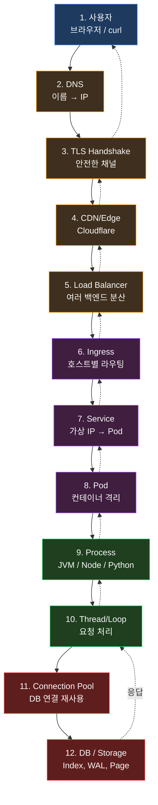
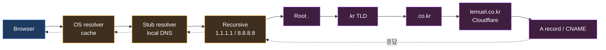
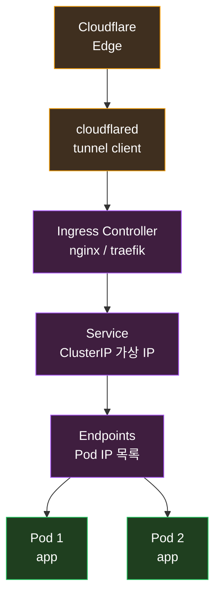
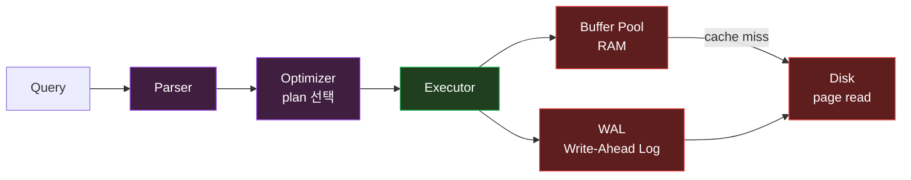

> *오늘 새벽 02:00 ~ 03:00*. *내 홈랩 클러스터* 에서 *연달아 사고* :
>
> 1. *KubeNodeNotReady* — *louise* 노드 24 시간 다운
> 2. *KubeContainerWaiting* — *jabis / logistic 의 GHCR 401*
> 3. *KubeAPIErrorBudgetBurn* — *컨트롤 플레인 503*
> 4. *xr.lemuel.co.kr* — *502 Bad Gateway*
> 5. *oms.lemuel.co.kr* — *Hikari Connection is not available*
>
> *이 5 가지 가 *우연히 같은 새벽 에 모인* 것이 아니다*. *서로 *서버 의 다른 layer 의 같은 기본기* 를 *건드린 것*. *DNS · TLS · Ingress · Pod · Connection Pool · Storage · 노드* — *어느 한 곳 이 무너지면 *상위 가 다 따라간다*.

이 글 은 *서버 의 기본기* 를 *한 요청 의 *여정* 의 형태 로 따라간다. *추상적 정의* 가 아니라 *오늘 새벽 의 *실제 사고들* 을 *각 layer 의 교재* 로*.

내 블로그 의 *[CPU 캐시](/2026/06/18/cpu-l1-l2-l3-cache-and-bottleneck-analysis.html)*, *[프로세스 추상화](/2026/06/18/process-abstraction.html)*, *[K8s Watch-Reconcile](/2026/06/20/kubernetes-control-loop-watch-reconcile-pattern-deep-dive.html)*, *[Outbox 패턴](/2026/06/15/transaction-outbox-pattern-async-integration-deep-dive.html)*, *[오프셋 과 어셈블리어](/2026/06/21/offset-and-assembly-language-relationship-deep-dive.html)* 의 *상위 추상* 으로 *전부 묶이는 글*.

---

## TL;DR — *한 줄 결론*

> *한 개의 요청* 이 *내 손가락 키 입력* 부터 *DB 의 디스크* 를 거쳐 *내 화면 으로 돌아오기까지* — *최소 *12 개의 layer*. *DNS · TLS · CDN · LB · Ingress · Service · Pod · Process · Thread · Pool · DB · Storage*. *각 layer 가 *자기 책임* 을 수행하면서 *옆 layer 의 *추상화 만* 신뢰*. *어느 한 곳* 의 *기본기* 가 무너지면 *상위 가 다 무너진다*. *서버 의 기본기 = *layer 별 *책임 의 시야**.

---

## 1. *기본 시야 *— *한 요청 의 *12 단계***



이 *12 단계 의 *어디서 든* * 사고 가 *발생 할 수 있다*. *오늘 새벽 의 *5 사고* 가 *각각 의 layer* :

| 사고 | layer |
|---|---|
| louise 다운 | 7~12 (Pod / DB 의 *하드웨어 기반*) |
| GHCR 401 | 8 (Pod 의 *이미지 풀*) |
| 컨트롤 플레인 503 | 7~8 (K8s 의 *오케스트레이션*) |
| xr 502 | 6~12 (Ingress → DB 의 *전 흐름*) |
| oms 500 | 11 (Connection Pool) |

---

## 2. *Layer 1 — *사용자 의 요청***

```
GET /api/users/me HTTP/2
Host: oms.lemuel.co.kr
Authorization: Bearer eyJhbGciOiJIUzI1...
```

*요청* 의 본질 — *4 가지*:
- **method** — *GET / POST / ...* (의도)
- **target** — *path + query* (대상)
- **headers** — *메타 정보*
- **body** — *데이터*

*HTTP/1.1* 은 *텍스트*, *HTTP/2* 는 *바이너리 프레임*, *HTTP/3* 는 *QUIC (UDP) 위*. 위 layer 로 갈수록 *추상* 은 같은데 *전송 효율* 이 다름.

*서버 개발자 의 *기본기* * — *"이 요청 이 어떤 HTTP 버전 인지", "어떤 헤더 가 *오는지/나가는지*", "Content-Type 이 무엇인지"* 가 *디버깅 의 절반*.

---

## 3. *Layer 2 — *DNS — 이름 의 해석***

`oms.lemuel.co.kr` 을 *내 브라우저 가 *어떻게 IP 로 바꾸는가* :



*내 lemuel.co.kr 의 *DNS pattern* * — 오늘 새벽 발견:
- *모든 도메인 이 *CNAME* → *`*.cfargotunnel.com`* (Cloudflare Tunnel)
- *클러스터 의 *공인 IP 를 노출 하지 않음*
- *staging-academy* 만 *A record 자체 가 없어서* — `dig` 응답 NULL → 사용자 *연결 불가*

*서버 개발자 의 *기본기* * :
- *`dig +short hostname`* — *이름 이 *IP 가 있는지*
- *`dig +trace hostname`* — *권위 응답 까지 의 경로*
- *DNS TTL* — *변경 후 *전파 시간*
- *클러스터 안 의 *kube-dns / CoreDNS* — *Pod 안에서 의 *서비스 이름 해석*

---

## 4. *Layer 3 — *TLS — *안전한 채널***

DNS 로 IP 받은 후 *443 포트 로 TLS handshake*:

```
1. Client Hello — 지원 cipher suites + SNI (hostname)
2. Server Hello — 선택 cipher + 인증서 체인
3. 키 교환 (ECDHE) — 양쪽 이 *공통 비밀* 산출
4. 인증서 검증 — 신뢰 체인 + 만료 / 호스트명 일치
5. Finished — *암호화 된 채널* 시작
```

*TLS 1.3* 은 *1-RTT*. *0-RTT resume* 도 가능.

*서버 개발자 의 기본기* :
- *내 *cert 가 *어디서 발급* 되는지* (Let's Encrypt / cert-manager)
- *renewal 자동화* — *만료 전 자동 갱신*
- *SNI* — *한 IP 에 *여러 호스트* 의 *각자 cert*
- *mTLS* — *클라이언트 도 인증서 제시*

*내 클러스터* 의 *cert-manager 가 *모든 도메인 의 cert 자동 발급/갱신*. *내가 신경 안 써도 *Let's Encrypt 의 *3 개월 갱신* 이 자동*.

---

## 5. *Layer 4 — *CDN / Edge — *Cloudflare***

*Cloudflare 가 *내 요청* 을 *제일 먼저 받는 곳*.

오늘 새벽 *xr 의 502* 의 진실 :
- *Cloudflare → cloudflared tunnel → 클러스터 backend*
- *backend (Pod) 가 DB 연결 실패 → Spring Boot 가 500*
- *Cloudflare 가 *origin 의 5xx 를 그대로 전달*
- *사용자에게 *Cloudflare 502 Bad Gateway*

*CDN 의 *진짜 역할* * — *3 가지*:
1. *정적 자산 *캐싱* — *내 origin 부담 감소*
2. *DDoS 차단* — *공격 IP 의 *경계*
3. *Tunnel* — *내 origin 의 *공인 IP 을 *숨김*

*서버 개발자 의 기본기* :
- *Cache-Control / ETag / Vary* — *CDN 캐싱 의 *제어*
- *Origin Shield* — *CDN 내부 의 *중간 캐시*
- *Tunnel vs Public IP* — *보안 vs 단순성*

---

## 6. *Layer 5~7 — *Kubernetes 의 *오케스트레이션***

내 [*K8s Watch-Reconcile 글*](/2026/06/20/kubernetes-control-loop-watch-reconcile-pattern-deep-dive.html) 의 *바로 그 layer*.



### 6.1 *Ingress*

*HTTP 의 *호스트 헤더* 를 보고 *어느 Service 로 보낼지* 결정. *L7 라우터*.

```yaml
spec:
  rules:
  - host: oms.lemuel.co.kr
    http:
      paths:
      - backend:
          service:
            name: order-oms-prod-app
            port:
              number: 8080
```

### 6.2 *Service*

*가상 IP (ClusterIP)*. *kube-proxy 가 *iptables / IPVS* 로 *실제 Pod 로 *분산*. *L4 LB*.

### 6.3 *Pod*

*컨테이너 의 *최소 단위*. *공유 네트워크 + 볼륨* 의 *집합*. *이미지* 로 부터 *실행 가능*.

*Pod 가 동작 하려면* 4 가지:
1. *이미지 풀 성공* — *오늘 새벽 GHCR 401 의 이슈*
2. *컨테이너 시작 성공* — *코드 의 부팅*
3. *Readiness probe 통과* — *외부 트래픽 받을 준비*
4. *Liveness probe 통과* — *살아있음 의 증명*

*4 개 중 1 개 라도 실패 면 *외부 요청 못 받음*. *오늘 새벽 의 *대부분 의 사고* 가 *이 단계*.

---

## 7. *Layer 8~9 — *프로세스 와 *스레드***

Pod 안 의 *컨테이너 가 결국 *프로세스*. *[내 프로세스 글](/2026/06/18/process-abstraction.html)* 의 그 추상화.

### 7.1 *JVM 의 경우 — Spring Boot 의 *Threading 모델***

```
JVM 프로세스 (PID=1)
  ├── EDT — *없음* (서버 라서)
  ├── Tomcat Connector 스레드 (NIO)
  │     └── *epoll 의 *이벤트 루프* — *대량 connection 의 *낮은 비용 처리*
  ├── Tomcat Worker 스레드 풀 (200 개 기본)
  │     └── *각 요청 이 *한 스레드 점유* — *블로킹 처리*
  ├── Spring 의 *@Async 스레드 풀*
  ├── JIT C1/C2 컴파일러 스레드
  └── GC 스레드 (G1 / ZGC)
```

*Java 21+ 의 Virtual Thread* — *Tomcat 도 *Loom 기반* 변경 가능. *그러면 *스레드 비용 0* 에 가까움*.

### 7.2 *Node.js 의 경우*

*Event Loop 1 개 + libuv worker pool*. *단일 스레드 이지만 *비동기 I/O* 로 *수만 요청 동시 처리*.

### 7.3 *Python 의 경우*

*GIL* 때문에 *진짜 병렬 처리* 가 제한 — *Uvicorn / gunicorn 의 *프로세스 multi-worker* * 로 우회.

*서버 개발자 의 기본기* :
- *요청 1 개 가 *스레드 1 개* 인지 *이벤트 루프* 인지
- *블로킹 IO 가 *스레드 풀 을 *고갈* 시킬 위험
- *Thread dump (`jstack`) 의 *읽는 법*
- *N+1 query 가 *왜 *스레드 풀 점유* 문제 도 되는지

---

## 8. *Layer 10~11 — *Connection Pool***

오늘 새벽 *oms.lemuel.co.kr* 의 *진짜 사고* :

```
Caused by: HikariPool-1 - Connection is not available, 
           request timed out after 30010ms 
           (total=9, active=0, idle=9, waiting=0)
Caused by: org.postgresql.util.PSQLException: 
           This connection has been closed.
```

*분석* :
- *total = 9* — *풀 에 9 개 connection 보유*
- *active = 0* — *지금 사용 중 0*
- *idle = 9* — *유휴 9 개*
- *그러나 *모두 *closed 상태* — *DB 가 *연결 끊었거나*, *idle timeout* 으로 *서버 가 끊음*
- *application 이 *그걸 모르고 *idle 풀 에서 꺼냄 → 사용 시점 에 *예외*

*해결 방법 — *Hikari 의 *3 줄 설정* * :
```properties
spring.datasource.hikari.connection-test-query=SELECT 1
spring.datasource.hikari.keepalive-time=60000           # 1분 마다 ping
spring.datasource.hikari.max-lifetime=1800000          # 30분 마다 강제 재생성
```

*기본기* :
- *Connection Pool 이 *왜 필요한가* — *DB 연결 의 *비용* (TCP + TLS + auth)
- *풀 크기 의 *적정값* — *DB 의 max_connections* / (앱 수 × 1.5) 정도
- *idle / leak / lifetime 의 *3 가지 timeout*
- *connection 의 *서버측 종료* (Postgres 의 `tcp_keepalives_idle`) 와 *클라이언트* 의 합의

내 *oms 의 rollout restart* — *풀 초기화 → *모든 connection 새로 생성* → *즉시 회복*. *물리적 으로 *해결됨*.

---

## 9. *Layer 12 — *DB / Storage*



DB 의 *모든 쓰기* 가 *WAL 먼저 → page 는 나중* (write-ahead). *crash 시 *WAL 로 *재구성*.

*[내 DB 배치 글](/2026/06/21/db-batch-performance-covering-index-and-chunking.html)* 의 *모든 내용* 이 *이 layer 의 *기본기*.

*서버 개발자 의 기본기* :
- *EXPLAIN ANALYZE* 의 *읽는 법*
- *Index 가 *언제 안 타는지*
- *MVCC 의 *vacuum 필요성*
- *Replication 의 *lag 측정*

---

## 10. *Layer 의 *역방향 — 응답***

위 *12 단계 를 *역순으로* 가는 *응답* :

```
DB → Connection Pool → Thread → Process → Pod → Service → Ingress → cloudflared → Cloudflare → 브라우저
```

*각 layer 가 *자신의 응답* 을 *상위 에 넘김*. *어느 한 곳 이 *지연 되면 *전체 latency 가 누적*.

*p99 응답 시간 = *각 layer 의 *최악 응답 의 합** 이 아니라 *조합 의 *worst case*.

---

## 11. *관측 (Observability) — *3 기둥***

| 기둥 | 무엇 | 도구 |
|---|---|---|
| **Logs** | *어떤 일* 이 일어났는지 | Fluent-bit + Loki / ELK |
| **Metrics** | *얼마나 자주 / 얼마나 빨리* | Prometheus + Grafana |
| **Traces** | *요청 의 *layer 간 *흐름* | Jaeger / Tempo + OpenTelemetry |

내 *오늘 새벽 의 사고* 가 *이 3 가지 의 *각각 이 진단* 한 결과 :
- *Logs* — *Spring Boot 의 *HikariCP 예외* 가 *진짜 원인* 알려줌
- *Metrics* — *Prometheus 알람 (KubeContainerWaiting / KubeNodeNotReady)* 이 *최초 신호*
- *Traces* — *아직 운영 안 함*. 다음 단계 의 *나의 *기본기 강화 영역*

---

## 12. *실패 의 *기본기 — *어떻게 죽고 *어떻게 부활* 하는가***

오늘 새벽 의 *5 가지 사고* 가 *각 layer 의 *실패 패턴* 을 가르쳐줌:

### 12.1 *노드 (Layer 8 의 기반) 의 죽음 — louise*

- *모든 포트 *refused* — TCP stack 은 살아있지만 *모든 service 죽음*
- *24 시간 동안 *kubelet heartbeat 없음* — k8s 가 *NotReady* 처리
- *해결 — *물리 적 재부팅*
- *복구 후 *30 초 안에 *Pod 의 Postgres 까지 살아남*

### 12.2 *Pod (Layer 8) 의 *이미지 풀 실패* — jabis / logistic*

- *Kubelet 의 *15 시간 4,053 회 재시도* — *Watch-Reconcile 의 자기 치유*
- *해결 — *Secret 갱신 + rollout restart*
- *backoff timer 의 *반본 적 재시도 의 *복원 력*

### 12.3 *컨트롤 플레인 (Layer 7) 의 *503*

- *apiserver not ready* — *etcd 응답 지연 또는 *내부 컴포넌트 부팅 중*
- *데이터 플레인 은 *영향 없음* (이미 실행 중인 Pod)
- *해결 — *기다림* (자체 복구)

### 12.4 *Connection Pool (Layer 11) 의 *고갈* — oms*

- *idle 9 개 가 *모두 *closed* — DB 의 *idle timeout* 또는 *Postgres restart*
- *해결 — *rollout restart* — *풀 의 *clean start*
- *예방 — *connection-test-query + keepalive-time*

### 12.5 *Storage (Layer 12 의 PVC) 의 *노드 의존 — xr postgres*

- *local-path PV* 가 *louise 노드 의 디스크* 에 *물리 적 묶임*
- *louise 부활 없이는 *데이터 접근 불가*
- *해결 — *노드 부활 (가장 빠름) 또는 *백업 으로 다른 노드 복원*

---

## 13. *서버 개발자 의 *기본기 체크리스트* — *15 가지***

내 *오늘 새벽 점검* 의 결론 — *이 15 가지* 가 *서버 의 *진짜 기본기*:

- [ ] *DNS 의 *dig / nslookup* 사용 가능
- [ ] *TLS 의 *handshake + cert chain* 이해
- [ ] *HTTP 의 *상태 코드 의 *진짜 의미* (2xx/3xx/4xx/5xx)
- [ ] *CDN 의 *cache hit / miss* 의 진단
- [ ] *Kubernetes 의 *Ingress / Service / Pod* 관계
- [ ] *컨테이너 의 *이미지 / 레이어 / 풀 *흐름*
- [ ] *프로세스 와 *스레드 의 차이*
- [ ] *동기 / 비동기 IO 의 *체감 적 차이*
- [ ] *Connection Pool 의 *3 가지 timeout*
- [ ] *DB Index 의 *언제 안 타는지*
- [ ] *MVCC 의 *vacuum 의 *필요성*
- [ ] *Log 의 *level 분리* 와 *집중적 분석*
- [ ] *Metrics 의 *4 가지 황금 신호* (latency / traffic / errors / saturation)
- [ ] *Trace 의 *layer 간 흐름* 의 시각화
- [ ] *재시도 / 멱등 / 백오프* 의 *3 가지 *분산 시스템 기본기*

*절반 이상* 이 *체크 안 된다면* — *내가 *기본기 의 한 layer 에 *깊지 못함*. *오늘 새벽 의 *5 사고* 같은 *연쇄 가 *재발*.

---

## 14. *맺음 *— *기본기 의 *시야***

*"서버 의 기본기"* 는 *각 *layer 의 *모든 세부* 를 외우는 것* 이 아니다.

*층 의 *시야* * 다. *내 요청 이 *어디 부터 *어디 까지* *어떤 순서로 흐르는가* 의 *전체 그림*. 그 그림 위 에서 *각 layer 의 *대표 *원리 만 *알면 *어디서 든 *디버깅 가능*.

오늘 새벽 의 *내 점검* — *5 사고* 가 *5 분 안에 정확 한 원인 으로 좁혀진* 이유 가 *layer 의 시야* 때문. *"이건 *Connection Pool 의 *idle 끊김*", *"이건 *Pod 의 *이미지 풀*", *"이건 *노드 의 *물리 다운*"* — *각각 의 *layer 추정 + *증거 수집*.

*기본기 의 시야 가 없으면* — *"왜 안 되지" 만 *반복*. *기본기 의 시야 가 있으면* — *"어디 부터 *층 별 분리 검사*" 가 *반사*.

*내일 *내 시스템 이 *느려지거나 *죽으면* — *위 12 단계 의 *어디 인가* 의 *문제*. *시야 가 *해답 의 길*.

---

## 부록 — *오늘 *내가 *실전 으로 쓰는 *진단 5 줄***

```sh
# 1. DNS — 이름 살아있나
dig +short oms.lemuel.co.kr

# 2. TLS + HTTP — *전 layer 통합 응답*
curl -sI --max-time 5 https://oms.lemuel.co.kr/actuator/health

# 3. K8s — *Pod 까지 이름 닿는가*
kubectl -n order-oms-prod get pods -o wide

# 4. App — *Pod 이 *실제 *에러 토하는가*
kubectl -n order-oms-prod logs deploy/order-oms-prod-app --tail=50 | grep -iE 'error|exception'

# 5. DB — *연결 가능 하고 query 빠른가*
kubectl -n order-oms-prod exec -it order-oms-prod-postgres-0 -- \
  psql -U postgres -c 'SELECT 1' -c 'SELECT pg_database_size(current_database())'
```

*5 분 안에 *어느 layer 의 문제 인지* * 판단 가능. *오늘 새벽 의 *모든 사고* 가 *이 5 줄* 의 조합 으로 *5 ~ 30 분 안에* 진단.

이 *5 줄 이 익숙해 지면* — *서버 의 *기본기 가 *체화 됨*. *어떤 시스템 이든 *진단 가능*.

---

*관련 글*

- [*CPU 의 *L1/L2/L3 캐시 와 *병목 분석*](/2026/06/18/cpu-l1-l2-l3-cache-and-bottleneck-analysis.html) — *Layer 12 의 *물리*
- [*프로세스 라는 *추상화*](/2026/06/18/process-abstraction.html) — *Layer 8~9 의 *기반*
- [*kubectl run 의 *뒷 이야기 — Watch-Reconcile*](/2026/06/20/kubernetes-control-loop-watch-reconcile-pattern-deep-dive.html) — *Layer 7 의 *제어*
- [*Transactional Outbox 패턴 과 비동기 통합*](/2026/06/15/transaction-outbox-pattern-async-integration-deep-dive.html) — *Layer 11~12 의 *분산 통합*
- [*DB 배치 처리 의 성능 향상 *2 축*](/2026/06/21/db-batch-performance-covering-index-and-chunking.html) — *Layer 12 의 *최적화*
- [*오프셋 과 *어셈블리어 의 관계*](/2026/06/21/offset-and-assembly-language-relationship-deep-dive.html) — *Layer 의 *바닥 의 바닥*
- [*8 가지 체크리스트 로 settlement 자가 검수*](/2026/06/18/eight-checklist-self-audit-of-my-settlement-system.html) — *Layer 11~12 의 *내 시스템 검수*
- [*2026 보안 사태 3 건 분석*](/2026/06/19/korean-security-breaches-2026-coupang-fastcampus-modu-startup.html) — *Layer 의 *각 단계 의 *보안 의 시야*
