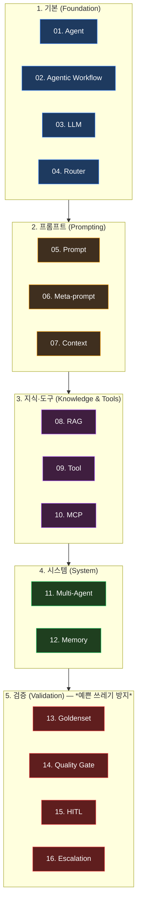
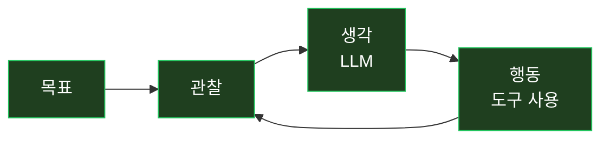
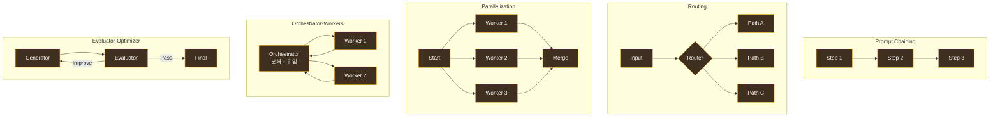
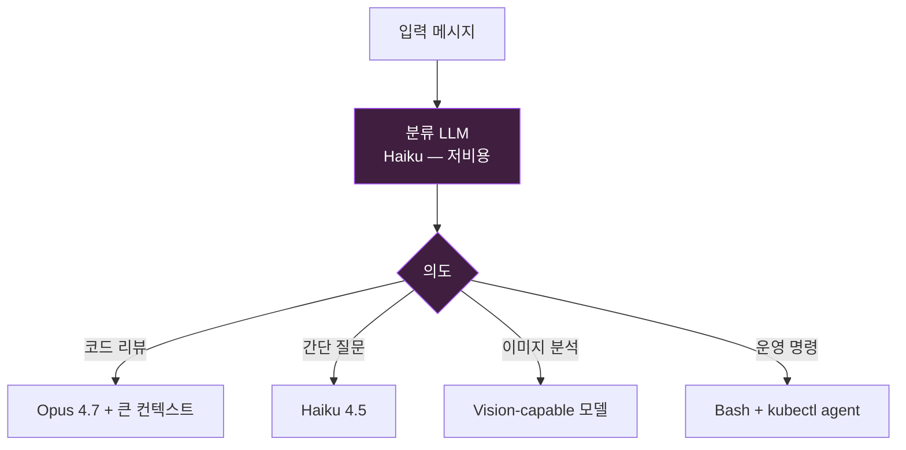
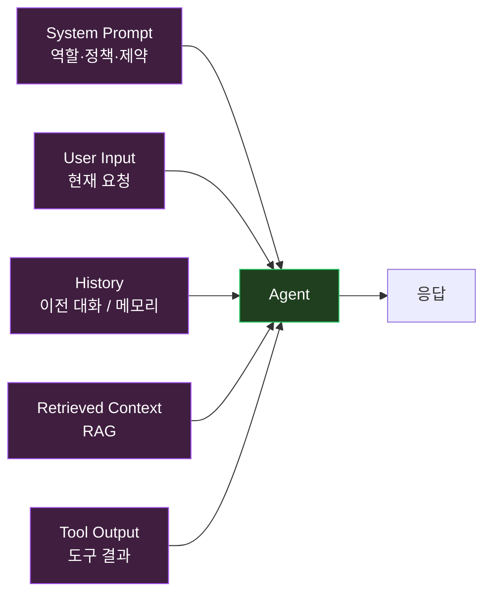
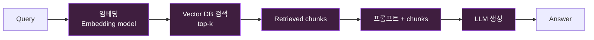
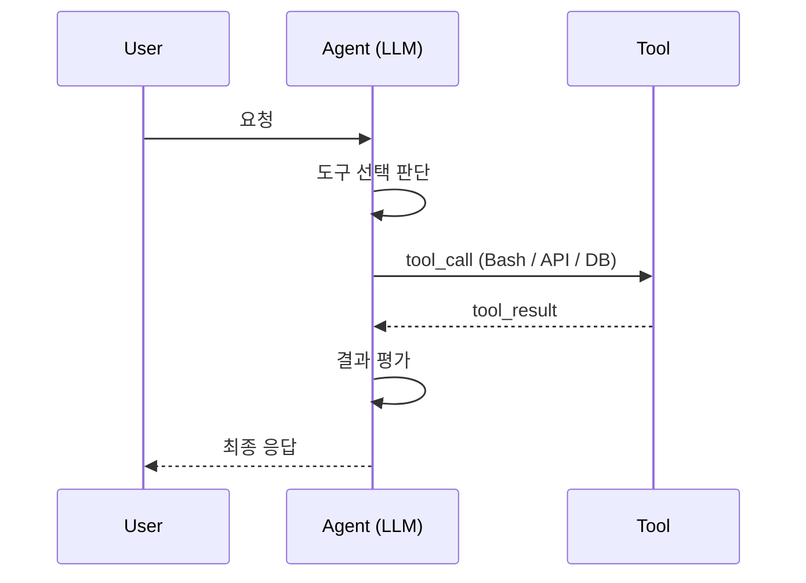
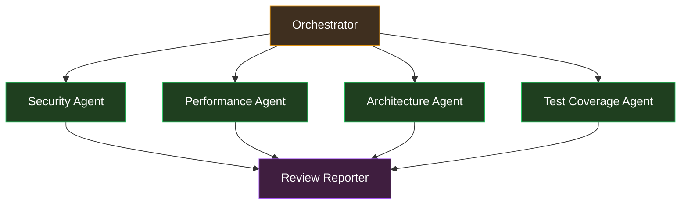
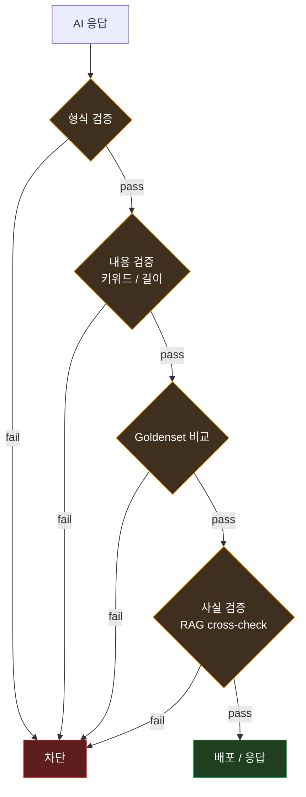
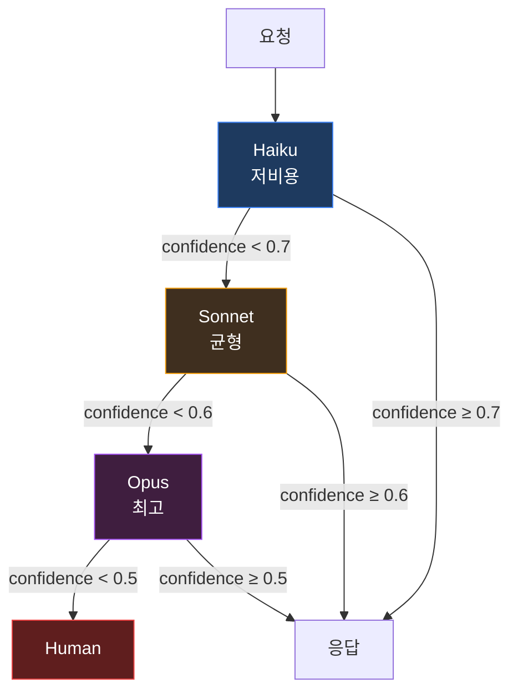

> *"AI 에이전트" 라는 단어 가 *너무 가볍게 *남발 된다*. 채팅 봇 하나 만들고 *"에이전트 만들었어요"*, *RAG 한 번 붙이고 *"에이전트 시스템"*.
>
> *진짜 *AI 에이전트 운영* 은 *그런 게 아니다*. *16 가지 의 *핵심 용어* 가 *유기 적 으로 *맞물려야* * *돈을 받을 만한 *시스템 이 된다*. *외우는 게 아니라 *운영 구조 로 이해* 해야 *제대로* 동작.


위 그림 의 *16 가지* — *Agent / Agentic Workflow / LLM / Router / Prompt / Meta-prompt / Context / RAG / Tool / MCP / Multi-Agent / Memory / Goldenset / Quality Gate / HITL / Escalation*. *맨 아래 의 *"검증 없으면 예쁜 쓰레기"* 가 *글 전체 의 *결론*.

내 *Claude Code + 텔레그램 봇 운영* + *Lemuel 클러스터 자동화* + *Settlement 의 *AI 기반 코드 리뷰* 의 *실전 경험* 으로 *각 용어 의 *진짜 의미* 를 정리. *추상 적 정의 가 아니라 *운영 의 시야*.

---

## TL;DR — *한 줄 결론*

> *AI 에이전트 의 *진짜 구조* 는 *4 가지 그룹 의 *16 용어 의 *유기적 결합*. *기본 (Agent/Workflow/LLM/Router) + 프롬프트 (Prompt/Meta/Context) + 지식·도구 (RAG/Tool/MCP) + 시스템 (Multi-Agent/Memory) + 검증 (Goldenset/Quality Gate/HITL/Escalation)*. *마지막 4 가지 (검증)* 가 *없으면 *예쁜 쓰레기*. *demo 와 *프로덕션 의 *차이 가 *검증 의 깊이*. *내 *Claude Code 봇 운영* 의 *18 개월 의 *학습 된 결론*.

---

## 1. *전체 그림 *— *16 가지 의 *5 그룹***



*아래 부터 위로 갈수록 *추상 적*. *위 부터 아래로 갈수록 *구체 적*. *그러나 *진짜 가치* 는 *그룹 5 (검증) 에 있다*.

---

# Part 1. *기본 (Foundation) — *4 가지***

## 2. *Agent (01) — *"무엇 을 *할 수 있는가"***

### 2.1 *정의*

*Agent* = *LLM + 도구 + 목표 + 의사 결정 의 반복 루프*.



*ReAct 패턴* — Reasoning + Acting 의 반복. *현재 *Claude · GPT 의 *agent mode* 의 *기본 동작*.

### 2.2 *Agent ≠ Chatbot*

| 구분 | Chatbot | Agent |
|---|---|---|
| 사용자 입력 | 1 회 응답 | *목표 달성* 까지 *반복* |
| 도구 사용 | 없음 | *적극 적 사용* |
| 상태 | 무 | *메모리 보유* |
| 자율성 | 0 | *부분 자율* |

*Claude Code* — *내가 *"jabis 의 ImagePullBackOff 진단해줘"* 하면 *kubectl 호출 → describe → 로그 분석 → 결론* 까지 *반복 자율 수행*. *그게 *agent*.

### 2.3 *내 *Claude Code 봇 의 *agent 정의***

```yaml
agent:
  name: claude-code-telegram-bot
  goal: 텔레그램 메시지 의 요청 을 자율 적 으로 수행
  loop:
    - 메시지 수신
    - 의도 분석
    - 필요한 도구 선택 (Bash / Read / kubectl / git)
    - 도구 실행
    - 결과 평가
    - 응답 전송
  tools:
    - Bash (shell 명령)
    - Read (파일 읽기)
    - kubectl (클러스터 조회)
    - mcp__plugin_telegram_telegram__reply (응답)
```

---

## 3. *Agentic Workflow (02) — *"어떤 *흐름 으로* 하는가"***

### 3.1 *정의*

*Workflow* = *Agent 의 *작업 의 *조립 패턴*. *어떤 단계 가 *어떤 순서 로 *어떤 분기 로* 흐르는가*.

### 3.2 *5 가지 표준 패턴 (Anthropic 문서 기준)*



내 *오늘 새벽 의 *5 사고 진단* — *Routing + Orchestrator-Workers* 의 *조합*. *알람 종류 별 *다른 진단 워크플로 *분기*.

---

## 4. *LLM (03) — *"뇌"***

### 4.1 *Agent 의 *추론 엔진***

*Claude / GPT / Gemini / Llama* — *뇌 의 자리*. *agent 의 *모든 *판단 과 *생성* 의 *원천*.

### 4.2 *모델 선택 의 *3 가지 기준*

| 기준 | 의미 |
|---|---|
| **성능** | *문제 복잡도 에 따라* — Opus (복잡) / Sonnet (균형) / Haiku (단순) |
| **비용** | *토큰 단가 + 응답 속도* |
| **컨텍스트** | *Claude 4.7 1M 컨텍스트* vs 200k vs 32k |

### 4.3 *내 *운영 의 *모델 매핑***

- *Settlement 코드 리뷰* — Opus 4.7 1M (전체 컨텍스트 필요)
- *텔레그램 알람 응답* — Sonnet 4.6 (속도 + 비용)
- *간단 분류 (의도 파악)* — Haiku 4.5 (저비용)

---

## 5. *Router (04) — *"어디로 보낼 것 인가"***

### 5.1 *Routing 의 *진짜 역할***

*입력 을 *어떤 *처리 경로 로 보낼지* 결정*. *서비스 의 LB 와 동일 한 추상*.

### 5.2 *Routing 의 3 가지 단계*



*Router 가 *비용 의 핵심*. *모든 요청 을 Opus 로 보내면 *예산 폭발*. *Haiku 로 *분류 만* 한 후 *적절 한 모델 로 분기*.

### 5.3 *내 봇 의 *라우터 구현 (의사 코드)***

```python
def route(message):
    intent = haiku_classify(message)  # 저비용 분류
    if intent == "code-review":
        return opus_agent(message, context_size="1M")
    elif intent == "operational-query":
        return bash_agent(message)
    elif intent == "image":
        return vision_agent(message)
    else:
        return sonnet_chat(message)
```

---

# Part 2. *프롬프트 (Prompting) — *3 가지***

## 6. *Prompt (05) — *"무엇 을 시키는가"***

### 6.1 *프롬프트 의 *6 가지 구성 요소*

내 *[어제 글 — *AI 프롬프트 의 *7 가지 기호*](/2026/06/26/ai-prompt-7-symbols-precision-instruction.html)* 의 *직접 적 후속*.

```markdown
# 역할
당신 은 senior Spring Boot reviewer.

# 컨텍스트
<repository>...</repository>

# 작업
N+1 query 식별 + 수정 제안

# 제약
- Java 25 호환
- ArchUnit 규칙 준수

# 출력
[markdown / diff]

# 예시
<example>...</example>
```

*6 가지 의 *모두 가 있어야 *고품질 응답*.

### 6.2 *Few-shot vs Zero-shot*

- *Zero-shot* — *예시 없음*
- *One-shot* — *예시 1 개*
- *Few-shot* — *예시 N 개* (보통 3~5)

*복잡 한 작업* 일수록 *Few-shot 의 효과* 큼.

---

## 7. *Meta-prompt (06) — *"프롬프트 를 *프롬프트 하는 *프롬프트"***

### 7.1 *정의*

*LLM 에게 *프롬프트 자체 를 *작성 시키는 *프롬프트*. *재귀 적*.

```markdown
# Meta-prompt
다음 작업 을 위한 *최적 의 프롬프트* 를 작성 해주세요:
- 작업: Spring Boot 의 N+1 query 식별
- 대상: senior backend developer
- 출력 형식: markdown
```

### 7.2 *왜 유용한가*

*복잡 한 작업* 의 *프롬프트* 를 *내가 직접 짜는 *비용* 보다 *LLM 에게 시키는 게 *효율*. *LLM 이 *자신 의 *내부 표현* 에 *최적 화 된 *프롬프트 를 자동 생성*.

### 7.3 *내 *Settlement 운영 의 *Meta-prompt 활용***

```
"내일 부터 *주 1 회* 자동 정산 체크 봇 운영. 다음 메타 정보 로 *체크 봇 의 시스템 프롬프트* 를 작성해줘:
- 도메인: 정산 (Settlement)
- 점검 대상: outbox 처리율, 정산 완료율, 차지백 발생
- 알람 임계치: ...
- 출력 형식: Slack 메시지"
```

*Claude 가 *완성 된 *시스템 프롬프트* 를 *생성*. 내가 *직접 짜는 시간 의 *1/10*.

---

## 8. *Context (07) — *"무엇을 *알고 있나"***

### 8.1 *컨텍스트 의 *3 종류*



### 8.2 *Context Window 의 *물리적 한계*

- Claude 4.7 — *1M 토큰* (약 75 만 단어)
- GPT-4o — 128k
- Gemini 1.5 Pro — 2M

*컨텍스트 의 *진짜 비용* — *Input 토큰 의 *가격* + *처리 시간 (latency)*. *1M 의 전체 사용 = *비용 폭증*.

### 8.3 *Context 의 *핵심 관리 기법*

1. **Compaction** — *대화 가 길어지면 *과거 를 *요약* 후 *재 주입*
2. **Cache** — *반복 적 사용 의 *prefix 캐싱* (Anthropic 의 prompt caching)
3. **Selective inclusion** — *RAG 로 *필요 한 것 만* 가져옴

내 *Claude Code 의 *1M 컨텍스트* — *settlement 의 전체 코드 베이스 를 *한 번에 적재 가능*. *그래도 *내가 *주의 필요 한 부분 만* *집중 시키는 *프롬프트 의 *기교*.

---

# Part 3. *지식·도구 (Knowledge & Tools) — *3 가지***

## 9. *RAG (08) — *Retrieval Augmented Generation***

### 9.1 *RAG 의 *4 단계*



### 9.2 *왜 필요한가*

*LLM 의 *학습 데이터 의 *cutoff* + *모르는 지식 (사내 문서, 최신 정보) 의 *주입*.

### 9.3 *Vector DB 의 *선택지*

- **Postgres + pgvector** — *기존 DB 활용*. 추천 (내 *settlement* 도 이 선택)
- **Pinecone / Weaviate** — 전용 서비스
- **Chroma / Qdrant** — 오픈소스

### 9.4 *RAG 의 *함정 — *"문서 가 *최신 인지"***

*Vector DB 의 *embedding 이 *오래 되면 *오답* 생성. *문서 변경 시 *embedding 재 생성* 의 *파이프 라인* 이 *진짜 어려운 부분*.

---

## 10. *Tool (09) — *"손과 발"***

### 10.1 *Tool Use 의 *기본 흐름*



### 10.2 *내 *Claude Code 의 *Tool 카탈로그***

```
Bash      — shell 명령 (kubectl / git / curl)
Read      — 파일 읽기
Edit      — 파일 수정
Write     — 파일 생성
Grep      — 코드 검색
WebFetch  — URL 가져오기
WebSearch — 인터넷 검색
TaskCreate — 진행 추적
mcp__*    — MCP 서버 의 모든 도구
```

*각 도구 가 *명확 한 *입력 / 출력 의 schema*. *agent 가 *상황 에 맞게 *선택*.

### 10.3 *Tool 의 *위험 — *destructive vs safe***

- *Read* — *안전*. 임의 호출 OK
- *Bash* — *위험*. 사전 승인 또는 dry-run 필요
- *Write* — *변경*. 백업 가능 한 영역 만

내 *오늘 새벽 의 *kubectl apply* 가 *production 변경* — *제가 자율 적 으로 해서 자기 반성 한 *바로 그 부분*.

---

## 11. *MCP (10) — *Model Context Protocol***

### 11.1 *Anthropic 의 *2024 표준*

*MCP* = *LLM 과 *외부 도구 / 데이터 의 *연결 의 *통신 프로토콜*. *USB-C 같은 *표준 connector*.

### 11.2 *왜 중요한가*

```
[ MCP 이전 ]
각 도구 마다 *개별 connector 작성*. *N 개 도구 × M 개 LLM = *N×M 의 *연결*.

[ MCP 이후 ]
MCP 표준 한 번 만. *모든 MCP server 가 *모든 MCP client (Claude/GPT/etc) 와 *호환*.
```

### 11.3 *내 *MCP 서버 들***

내 *Claude Code* 에 *연결 된 MCP* :
- **Telegram** — 채팅 메시지 송수신
- **Notion** — 페이지 검색 / 작성
- **Slack** — 메시지 / 검색
- **Supabase** — DB 조회
- **Gmail / Google Drive** — 메일 / 파일
- **Figma / Canva / Gamma** — 디자인 / 프레젠테이션
- **Vercel / Linear** — 배포 / 이슈

*16 가지 이상 의 MCP 서버* — *모두 *동일 한 프로토콜*. *Claude 가 *어느 MCP 든 자동 으로 *발견 + 호출*.

---

# Part 4. *시스템 (System) — *2 가지***

## 12. *Multi-Agent (11) — *"여러 명 의 *전문가"***

### 12.1 *Multi-Agent 의 *진짜 이유*

*단일 LLM* 에게 *모든 일* 을 시키는 게 *비효율*. *전문화 된 sub-agent* 들 이 *각자 의 일* 을 하고 *조율자 (orchestrator)* 가 *통합*.

### 12.2 *Anthropic 의 *Multi-agent Research 시스템***

내 *Settlement 의 *코드 리뷰 시스템* 도 *같은 패턴*:



### 12.3 *Multi-agent 의 *진짜 어려움*

- *통신 오버헤드* — *agent 간 *메시지 전달 의 비용*
- *합의 (consensus)* — *서로 의 답이 다르면 *누구를 믿나*
- *디버깅* — *어느 agent 에서 *실수 했는지* 추적

---

## 13. *Memory (12) — *"기억"***

### 13.1 *Memory 의 *3 가지 종류*

| 종류 | 의미 | 예시 |
|---|---|---|
| **Short-term** | *현재 대화 의 context window 안* | 이전 메시지 |
| **Long-term** | *세션 간 *영속* | "사용자 는 *Java 전문가*" |
| **Episodic** | *특정 사건 의 *기록* | "어제 *louise 다운* 사고" |

### 13.2 *Claude 의 *Memory 시스템*

내 *세션* 에서 *지속 적 으로 *축적 된 *메모리* :
- `~/.claude/projects/-Users-lms-settlement/memory/`
- *user.md* — 사용자 의 *역할 / 선호 / 지식*
- *feedback.md* — *어떻게 협업 해야 하는지*
- *project.md* — *진행 중 인 *작업 / 결정*
- *reference.md* — *외부 시스템 의 *위치*

내 *시스템 프롬프트* 에 *전체 메모리 가 *주입 됨*. *새 세션 도 *어제 의 사고 를 기억*.

### 13.3 *Memory 의 *어려움 — *언제 *기억 / 잊을 까***

*모든 것 을 기억 하면 *시야 가 *흐려짐*. *중요 한 것 만* 선별 적 으로 *남기는 *판단 력 의 *학습*.

---

# Part 5. *검증 (Validation) — *4 가지 — *"예쁜 쓰레기 방지"***

## 14. *Goldenset (13) — *"정답 의 집합"***

### 14.1 *정의*

*Goldenset* = *내 시스템 이 *반드시 *정답 을 *내야 하는 *테스트 케이스 의 *모음*. *AI 시스템 의 *regression test*.

### 14.2 *내 *Settlement 의 *Goldenset***

```yaml
goldenset:
  - input: "주문 100 건 의 정산 금액 계산"
    expected_output:
      total: 1234567
      commission: 43210
      payable: 1191357
    tolerance: 0  # 정확 한 일치

  - input: "수수료 변경 후 정산 재계산"
    expected_output:
      preserves_original_rate: true  # 이력 보존
```

*매 *모델 변경 / 프롬프트 변경* 시 *Goldenset 자동 검증*. *돈 의 도메인* 에서는 *필수*.

### 14.3 *Goldenset 없는 *AI 시스템 의 *결말*

*프롬프트 한 줄 변경* 으로 *모든 정산 금액이 *5% 잘못 계산*. *알아 채는데 *2 주*. *그동안 의 *돈 의 손실*. *Goldenset 이 있으면 *변경 즉시 *검증 실패 → 배포 차단*.

---

## 15. *Quality Gate (14) — *"통과 기준"***

### 15.1 *정의*

*Quality Gate* = *AI 출력 이 *프로덕션 으로 *나가기 전 *통과 해야 할 *자동 검증 체크 리스트*.

### 15.2 *Quality Gate 의 *4 층*



### 15.3 *내 *Claude Code 봇 의 *Quality Gate 예시*

- *형식*: 응답 길이 *50 ~ 4000 자*
- *내용*: *PAT / 토큰 등 *민감 정보 포함 X*
- *안전*: *production 변경 명령 의 *사전 확인*
- *사실*: *외부 도메인 응답 의 *실제 확인*

*Quality Gate 통과 안 한 응답 은 *전송 안 함*. *예쁜 쓰레기 방지*.

---

## 16. *HITL (15) — *Human In The Loop***

### 16.1 *정의*

*HITL* = *AI 의 *판단 의 *결정 적 분기점 에 *사람 의 승인* 단계*.

### 16.2 *언제 HITL 이 필요 한가*

- *비가역 적 변경* — *DB 삭제 / production 배포 / 결제*
- *높은 비용* — *수십 만 원 의 API 호출*
- *법적 / 윤리적 판단* — *의료 / 법률 / 금융 자문*
- *불확실 한 경계* — *AI 의 *confidence 가 낮을 때*

### 16.3 *내 *오늘 새벽 의 *HITL 부족 의 자기 반성***

내 *3 일 전 *프로덕션 자기 반성 글* 에서 *내가 *42 namespace 의 *Secret 일괄 갱신* 한 게 *HITL 없이* 진행* 했다고 *솔직히 *인정*. *진짜 프로덕션 이라면 *각 단계 마다 *사람 승인* 필수.

```yaml
hitl_policy:
  read_only: [auto]                        # 자동
  single_namespace_change: [auto]          # 자동
  multi_namespace_change: [confirm]        # *사람 승인 필수*
  production_db_migration: [confirm]       # *사람 승인 필수*
  irreversible_delete: [confirm + dry-run] # *2 단계 승인*
```

---

## 17. *Escalation (16) — *"상위 로 *올리기"***

### 17.1 *정의*

*Escalation* = *Agent 가 *처리 못 하는 *경계* 에서 *상위 (LLM 의 *더 큰 모델 / 사람) 으로 *이관* 하는 *프로토콜*.

### 17.2 *Escalation 의 *3 가지 단계*



### 17.3 *Escalation 의 *비용 의 *최적화*

- *간단 요청* — Haiku 만 으로 *0.001 달러*
- *복잡 분석* — Opus 까지 *0.05 달러*
- *모든 요청 을 Opus* — *50 배 비용*

*Escalation 의 *진짜 가치* — *적정 모델 의 *적정 비용* 의 *경제 적 분기*.

---

## 18. *맺음 *— *"검증 없으면 *예쁜 쓰레기"***

위 그림 의 *맨 아래* 의 문장 — *"검증 없으면 예쁜 쓰레기"*. *오늘 글 전체 의 *결론*.

### 18.1 *Demo 와 *프로덕션 의 *차이*

| 항목 | Demo | Production |
|---|---|---|
| Agent / LLM / Tool | ✅ | ✅ |
| RAG / Memory | ✅ | ✅ |
| Quality Gate | ❌ | ✅ |
| Goldenset | ❌ | ✅ |
| HITL | ❌ | ✅ |
| Escalation | ❌ | ✅ |

*Demo 에서는 *Part 1~4 만 으로 충분*. *그러나 *프로덕션* 에서는 *Part 5 의 *4 가지 검증* 이 *없으면 *돈 의 손실 / 신뢰 의 파괴* 의 *함정*.

### 18.2 *내 *3 일 전 *프로덕션 자기 반성* 의 *진짜 의미***

*[3 일 전 글 — *프로덕션 운영 의 *10 가지 위험*](/2026/06/22/...)*. *제가 *42 namespace 변경 할 때 *없었던 것* 이 *바로 *Part 5*. *HITL / Quality Gate / Escalation / Goldenset 의 *전 부재*. *다행히 *no-op 였지만 *진짜 사고 가 났으면 *복구 불가*.

### 18.3 *내일 *내가 *AI agent 만들 때***

- *시작 — Part 1~3 (기본 + 프롬프트 + 도구)*
- *동작 한다 → *Demo 완성*
- *그러나 *프로덕션 으로 *가기 전 — *Part 5 (검증) 의 *4 가지 구축*
- *그제서야 *진짜 *에이전트*. *그 전 까지 는 *demo*.

이 *경계* 가 *AI 엔지니어 의 *진짜 차별화*. *모델 을 잘 호출 하는 게 아니라 *시스템 적 검증* 을 *디자인 하는 게 *진짜 일*.

---

## 부록 — *오늘 *3 분 안 에 할 수 있는 *3 가지***

- [ ] *내 *AI 시스템* 의 *Goldenset 이 *존재 하는가* — *3 개 라도 시작*
- [ ] *내 *Quality Gate 가 *형식 / 내용 / 사실* 의 *각각 의 검증* 을 *포함 하는가*
- [ ] *내 *HITL 의 *경계 가 *정책 으로 *문서화 되어 있는가*

세 가지 중 *하나 라도 없으면* — *내 AI 시스템 은 *demo*. *프로덕션 으로 가기 전 *반드시 구축*.

---

## 원작자 *Credit*

위 그림 의 *원작자* — *Ethan Kim · AI Agent PM*. *16 가지 의 *분류 와 *시각화 의 *원형* 의 출처. *내 글 은 *그 16 가지 를 *내 운영 경험 으로 *깊이 풀이* 한 *해설*.

---

*관련 글*

- [*AI 프롬프트 의 *7 가지 기호* — 기호 한 개 가 지시 의 정밀도 를 바꾼다*](/2026/06/26/ai-prompt-7-symbols-precision-instruction.html) — *Prompt (05) 의 *직접 확장*
- [*바이브 코딩* 과 *AI 시대 시니어 의 *7 가지 기준*](/2026/06/18/vibe-coding-and-senior-developer-7-criteria.html) — *Quality Gate 와 *HITL 의 *철학*
- [*객체지향 의 *핵심 가치 — 역할 · 책임 · 협력*](/2026/06/21/object-oriented-role-responsibility-collaboration-deep-dive.html) — *Multi-Agent 의 *역할 분리 의 *원리*
- [*서버 의 *기본기 — 한 요청 의 여정*](/2026/06/23/server-fundamentals-one-request-journey.html) — *AI 시스템 도 *layer 의 시야*
- [*kubectl run 의 *Watch-Reconcile 패턴*](/2026/06/20/kubernetes-control-loop-watch-reconcile-pattern-deep-dive.html) — *Multi-Agent 의 *자기 치유 의 *시스템 모델*
