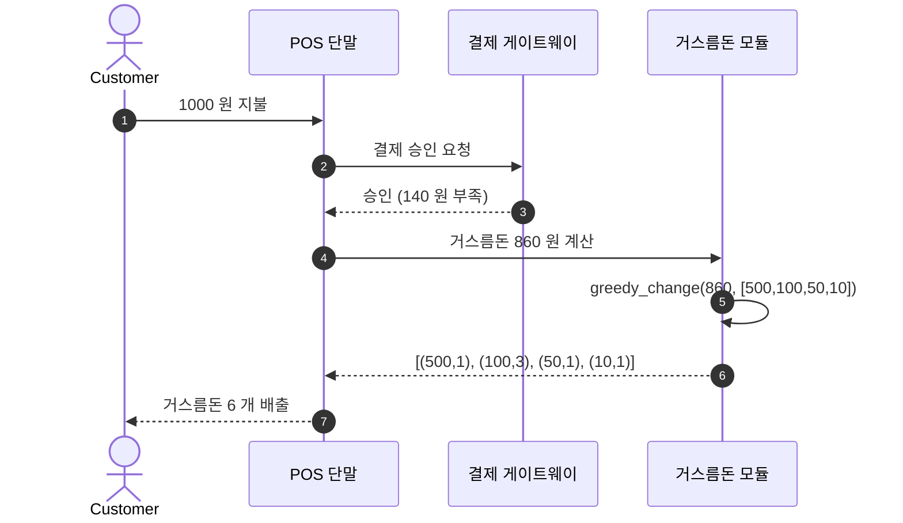
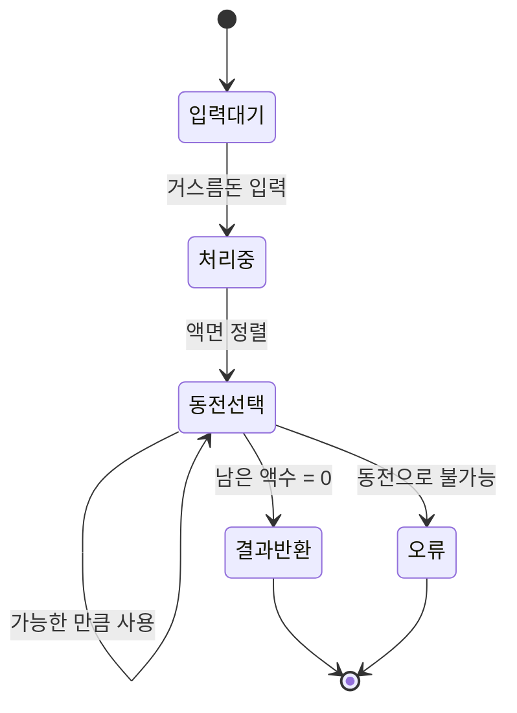
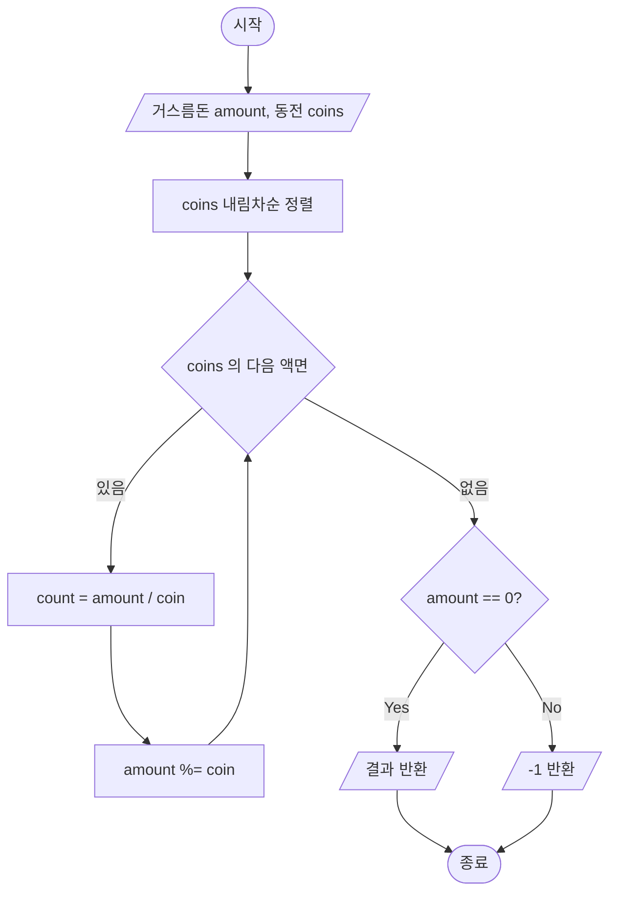

*위쪽 — *거스름돈 860 원 (500/100/50/10) 의 *그리디 알고리즘* 을 *순서도 로 표현*. 아래쪽 — *순서도 의 *10 개 *표준 기호* (터미널 / 판단 / 처리 / 입출력 / 흐름선 / 연결점 / 준비 / 서류 / 수동입력 / 천공카드). 이 한 장 이 *알고리즘 학습 의 *첫 페이지* 에 *왜 *놓이는지*, 그리고 *왜 *현대 *코드 베이스 에서는 *덜 보이는지* 를 *함께 *분해* 한다.*

> *"알고리즘 = 코드"* 라고 *말하는 사람과 *"알고리즘 = *언어 독립 적 *해법 *그 자체* 이고 *코드 는 *그 표현 의 *한 가지"* 라고 *말하는 사람은 *문제 해결 의 *추상도* 가 *다르다*.
>
> 알고리즘 을 *표현 하는 *기법* 은 *최소 4 개* — *자연어 / 순서도 (flowchart) / 의사코드 (pseudocode) / 실제 코드*. 그 위에 *현대 가 추가 한 *시각화 보조 기법* — *시퀀스 다이어그램 / 상태 머신 / 데이터 흐름 그래프 / Mermaid* — 가 *얹힌다*. *4 + α 개 가 *각자 *무엇을 *잘 표현 하고 *무엇을 *못 *표현 하는지* 를 *모르면 *문서화 가 *항상 *과하거나 모자란다*.
>
> 이 글은 *순서도 를 *중심* 으로 — *왜 *순서도 가 *알고리즘 학습 의 *첫 페이지* 인지, *왜 *대형 시스템 에서는 *덜 보이는지*, *대체 표현 기법 들은 *순서도 의 *어떤 약점* 을 *메우는지* — 를 *거스름돈 (그리디)* 예제 를 *공통 화 폐* 로 *분해* 한다.

---

## TL;DR

> 알고리즘 을 *표현 하는 *기법* 은 *추상도 의 *사다리*.
>
> 1. **자연어** — *"가장 큰 동전 부터 차례로 뺀다"*. *사람 에게 *가장 빠르지만 *모호*. *프로토타입 / 회의록 / RFC* 에서 *주로 사용*.
> 2. **순서도 (Flowchart)** — *기호 + 흐름선 으로 *제어 흐름 을 *시각화*. *터미널 / 처리 / 판단 / 입출력 / 흐름선* 등 *10 개 의 *표준 기호*. *입문 단계 의 *제어 구조 학습* + *비개발자 와 의 *공유 문서* 에 *강력*.
> 3. **의사코드 (Pseudocode)** — *자연어 와 *코드 의 *중간*. *문법 무관 + 의도 명확*. *논문 / 알고리즘 책 (CLRS, 알고리즘 트레이닝 등) 의 *표준 표기*.
> 4. **실제 코드** — *Java / Python / C 등 *실행 가능 한 표현*. *컴파일러 가 *검증* 하지만, *읽는 사람 은 *언어 문법 의 *노이즈* 와 *알고리즘 의 *본질* 을 *분리* 해야 함.
>
> 위 *4 개 가 *어떤 알고리즘 에도 *반드시 *존재 하는 *기본 사다리*. *순서도 는 *그 사다리 의 *2 번째 가로대* — *제어 흐름 (분기 + 반복)* 을 *시각화* 하는 *최고 의 도구* 이지만 *재귀 / 자료 구조 / 비동기 / 분산* 같은 *현대 의 *주요 알고리즘 차원* 에 *대해 서는 *약하다*. 그래서 *현대 가 추가 한 *대체 표현 기법* — *시퀀스 다이어그램 (객체 간 메시지), 상태 머신 (상태 전이), 클래스 다이어그램 (자료 구조), 데이터 흐름 그래프 (병렬/스트리밍), Mermaid (텍스트 → 그림 자동화)* — 가 *각자 의 *틈* 을 *메운다*.
>
> 거스름돈 (860 원, 500/100/50/10) 의 *그리디* 가 *순서도 예제 의 *고전* 인 이유 는 *4 가지 가 *맞물려서* — *제어 흐름 이 *깔끔한 *루프 + 판단 + 종료* 의 *교과서 적 *3 박자*, *그리디 의 *직관성*, *상태 가 *(남은 액수, 사용한 동전) 의 *2 변수* 로 *단순*, 그리고 *결정적 으로 *동전 액면 이 *"운 좋게" *항상 그리디 가 *최적 인 *조합* 이라는 *함정*. *동일한 거스름돈 문제 에 *동전 액면 을 *1, 6, 10* 으로 *바꾸기만 해도 *그리디 가 *틀린 답* 을 *내놓는다 (12 원 = 10 + 1 + 1 vs 6 + 6, 4 개 vs 2 개)*. *그 함정 이 *순서도 → 의사코드 → 코드 → DP* 로 *왜 *올라가야 *하는지 의 *동기* 다.

---

## 0. *왜 *표현 기법* 을 *알아야 *하나*

### 0.1 *"알고리즘 = 코드" 라는 *흔한 *오해*

대학교 *알고리즘 수업* 의 *첫 시간* 에 자주 나오는 *오해*:

> *"알고리즘 은 *코드 다. *Python 을 *배우면 *알고리즘 을 *배운 거 다*."*

알고리즘 은 *코드 가 *아니다*. *Knuth (TAOCP)* 의 *고전적 *정의*:

> *알고리즘 (Algorithm)* 은 *유한* 한 *단계* 의 *명확* 하고 *수행 가능* 한 *명령 의 *집합* 으로, *유한 한 시간 안 에 *정의된 입력* 에 대해 *정의된 출력* 을 *생성 한다*. *언어 / 매체 와 *무관 하다*.

이 *정의* 에 *어디 에도 *"Python", "Java", "C"* 가 *없다*. *알고리즘 은 *언어 독립적 인 *해법 그 자체*. *코드 는 *알고리즘 을 *기계 가 *실행 가능 한 *형태 로 *표현 한 *한 가지*. *순서도 는 *알고리즘 을 *사람 이 *시각적 으로 *읽기 위해 *표현 한 *또 한 가지*. *둘 다 *표현 기법* (Notation) 이지 *알고리즘 그 자체* 가 *아니다*.

### 0.2 *왜 *여러 *표현 기법* 이 *필요 한가*

같은 *알고리즘* 을 *다른 *형태 로 *표현* 해야 하는 이유:

| 청자 | 적합한 표현 | 이유 |
|---|---|---|
| 신입 개발자 / 학생 | 순서도 + 자연어 | *제어 흐름 의 *시각적 이해 가 *우선* |
| 동료 시니어 개발자 | 의사코드 + 다이어그램 | *언어 무관 의도 *전달* 이 *효율적* |
| QA / PM / 비개발자 | 시퀀스 다이어그램 / 상태 머신 | *시스템 의 *동작 시나리오* 가 *직관적* |
| 면접관 / 논문 심사자 | 의사코드 + 복잡도 분석 | *언어 노이즈 *없이 *알고리즘 본질* 평가 |
| 컴파일러 / 실행 환경 | 실제 코드 | *문법 검증 + 실행 가능* |
| 머신 (성능) | 어셈블리 / 기계어 | *CPU 가 *직접 이해* |

*같은 알고리즘* 을 *6 가지 *형태 로 *표현* 해야 *상황 마다 *맞는 청자* 에게 *전달* 된다. *코드 한 가지 만 *고집* 하면 *팀 회의실 의 *반은 *못 알아 듣는다*.

### 0.3 *이 글 의 *지도*

```
┌─────────────────────────────────────────────┐
│ 0. 자연어                                    │  ← 사람 → 사람
└─────────────────────────────────────────────┘
                    ↓ 모호성 ↓
┌─────────────────────────────────────────────┐
│ 1. 순서도 (Flowchart)                        │  ← 시각화 + 제어 흐름
└─────────────────────────────────────────────┘
                    ↓ 시각 한계 ↓
┌─────────────────────────────────────────────┐
│ 2. 의사코드 (Pseudocode)                     │  ← 문법 무관 + 표현 풍부
└─────────────────────────────────────────────┘
                    ↓ 실행 불가 ↓
┌─────────────────────────────────────────────┐
│ 3. 실제 코드 (Java)                          │  ← 컴파일러 검증
└─────────────────────────────────────────────┘
                    ↓ 차원 부족 ↓
┌─────────────────────────────────────────────┐
│ 4. 대체 / 보조 표현                          │  ← 시퀀스 / 상태 / Mermaid
│    - 시퀀스 다이어그램                       │
│    - 상태 머신                               │
│    - 데이터 흐름 그래프                      │
│    - Mermaid / PlantUML                      │
└─────────────────────────────────────────────┘
```

각 *층* 은 *위 층 의 *약점* 을 *메운다*. *어느 한 층 만 *고집* 하면 *전체 그림 이 *조각* 난다.

---

## 1. *자연어 (Natural Language) — *가장 빠른 *프로토타입 + 가장 모호한 *명세*

### 1.1 *예제 — 거스름돈 (그리디)*

> *"손님 에게 *지불 해야 할 거스름돈 *총액 이 *주어 진다. *동전 의 *액면 (500/100/50/10) 이 *있다. *동전 의 *총 *개수 가 *최소* 가 되도록 *동전 을 *선택* 하라. *가장 큰 *액면* 부터 *차례로 *가능한 만큼 *사용* 한다. *남은 액수 가 *0* 이 되면 *종료* 한다."*

이 *5 줄 의 *자연어* 가 *알고리즘 의 *모든 본질* 을 *전달* 한다. *프로그래밍 언어 를 *모르는 사람 도 *이해* 한다.

### 1.2 *자연어 의 *강점 / 약점*

**강점**:
- 청자 가 *문법 / 기호 를 *몰라도 됨
- *프로토타입 단계 의 *빠른 *공유*
- *제품 요구 사항 명세 (PRD) / Notion 문서* 에 *자연스럽게 *섞임*

**약점**:
- *"가능한 만큼"* 같은 *모호 한 단어 가 *해석 가능*
- *반복 조건 / 종료 조건* 이 *정확히 *어디서 *체크 되는지* 가 *불명확*
- *경계 조건 (edge case)* 이 *암묵* 적
  - *"음수 거스름돈" 이면 어떻게 되는가*?
  - *"동전 으로 정확히 만들 수 없는 액수" 이면 (예: 동전 이 50/100 인데 거스름돈 30)?*
- *시간 복잡도 / 공간 복잡도* 가 *전혀 *드러나지 않음*

### 1.3 *자연어 가 *살아남는 *이유*

자연어 가 *모호 함에도 *살아남는 이유* 는 *"가장 빠른 *공유 단위"* 이기 때문. *RFC, ADR, Slack 의 #algorithm 채널 의 한 줄* — 이 모두 가 *자연어 로 시작*. 그 후 *순서도 / 의사코드 / 코드 로 *내려간다*.

---

## 2. *순서도 (Flowchart) — *제어 흐름 의 *시각화*

### 2.1 *역사 와 *위치*

순서도 는 *1921 년 *Frank Gilbreth* (산업공학) 의 *공정 차트 (Process Chart)* 에서 *기원*. 1947 년 *Goldstine + von Neumann* 이 *컴퓨터 프로그램* 의 *제어 흐름 *문서화* 에 *적용*. 1970 년 *ANSI / ISO 5807* 표준 으로 *10 개 의 *공식 기호* 가 *고정*.

오늘날 *순서도 는 *알고리즘 입문* 의 *첫 페이지* 에 *놓이는 *고전 적 *표현 기법*. *제어 흐름 (control flow)* 의 *시각화 에서 *60 년 이 *지나도 *대체불가 한 *영역* 을 *지킨다*.

### 2.2 *10 개 *표준 기호* — *위 이미지 의 *범례*

| 기호 | 이름 | 역할 |
|---|---|---|
| 둥근 사각형 | **터미널** (Terminal) | *시작 / 종료* 의 *한 점* |
| 사각형 | **처리** (Process) | *대입 / 계산 / 호출* 등 *한 단계 의 작업* |
| 마름모 | **판단** (Decision) | *조건 분기* (보통 *Yes/No* 의 *2-out*) |
| 평행 사변형 | **입출력** (I/O) | *데이터 읽기 / 쓰기* |
| 화살표 | **흐름선** (Flow Line) | *제어 의 *순서* 표시 |
| 원 | **연결점** (Connector) | *흐름이 끊긴 곳* 을 *같은 라벨 로 *재연결* |
| 사다리꼴 (육각형) | **준비** (Preparation) | *반복 변수 / 초기화* (FOR 루프 의 *준비*) |
| 물결 사각형 | **서류** (Document) | *문서 / 보고서 출력* |
| 사다리꼴 (아래 좁음) | **수동 입력** (Manual Input) | *콘솔 / 키보드 입력* |
| 직사각형 (좌측 꺾임) | **천공카드** (Punched Card) | *천공카드 입출력* (*역사적*, 현대 에는 *거의 안 씀*) |

### 2.3 *위 이미지 의 *거스름돈 순서도 *분해*

```
[시작]
  ↓
[문제 정의 (동전의 액면)]              ← 처리 (Process)
   목표: 860원 거스름돈 최소 동전 수
   선택: 500/100/50/10
  ↓
┌─────────────────────────────────┐
│ [해 선택]                        │  ← 처리
│  현재 가장 큰 금액의 동전 선택    │
└─────────────────────────────────┘
  ↓
┌─ ─ ─ ─ ─ ─ ─ ─ ─ ─ ─ ─ ─ ─ ─ ─ ─┐
< [적합성 확인]                     >  ← 판단 (Decision)
< 목표 (860원) 초과 시 미적합        >
└─ ─ ─ ─ ─ ─ ─ ─ ─ ─ ─ ─ ─ ─ ─ ─ ─┘
  ↓ 적합                  ↘ 미적합 → (해 선택으로 되돌아감)
┌─ ─ ─ ─ ─ ─ ─ ─ ─ ─ ─ ─ ─ ─ ─ ─ ─┐
< [해 검증]                         >  ← 판단
< 현재 까지 거스름돈 이 860 원 인가? >
└─ ─ ─ ─ ─ ─ ─ ─ ─ ─ ─ ─ ─ ─ ─ ─ ─┘
  ↓ 최종해               ↘ 해 아님 → (해 선택으로 되돌아감)
[해 도출]                            ← 처리
  ↓
[종료]
```

이 *한 장 의 *순서도* 가 *반복 + 분기 + 누적 + 종료 의 *4 가지 *제어 흐름 의 *원초적 *구조* 를 *동시에 *보여 준다*. *입문자 가 *알고리즘 의 *"흐름"* 이라는 *개념* 을 *처음 *시각적 으로 *잡는 *순간*.

### 2.4 *순서도 의 *강점*

- **시각적 직관**: 화살표 의 *방향* 이 *시간 의 *방향*. 분기 가 *눈 에 *보인다*.
- **언어 무관**: Python / Java / Lisp / Haskell 어느 언어 로 구현 해도 *순서도 는 *동일*.
- **비개발자 와 의 *공유*: PM / QA / 디자이너 도 *읽을 수 있다*.
- **추적 가능 (Traceability)**: *각 박스* 에 *요구 사항 ID* 를 *매칭* 가능. *항공 / 의료 / 금융 의 *규제 문서* 에 *법적 *근거* 로 *남아 있는 이유*.

### 2.5 *순서도 의 *약점 — *현대 코드 베이스 에서 *왜 *덜 보이는가*

1. **재귀 (Recursion)**: 순서도 는 *반복 (Loop)* 의 *시각화 에 *최적화*. *재귀 함수 의 *호출 스택* 은 *순서도 로 *그리기 어렵다*. *Mergesort, Quicksort, DFS 의 *재귀* 를 *순서도 로 표현 하면 *원본 함수 + 호출 그래프* 의 *2 개 다이어그램* 이 *필요 해 진다*.
2. **자료 구조 의 *모양***: *그래프 / 트리 / 해시 테이블* 의 *모양* 은 *순서도 에 *나타나지 않는다*. *알고리즘 의 *공간 측 *직관* 이 *사라진다*.
3. **추상화 / 캡슐화**: *함수 호출* 의 *세부* 는 *블랙 박스 처리 박스* 1 개 가 *되어 *내부 의 *알고리즘 이 *숨겨진다*. *현대 의 *알고리즘 은 *수십 개 *함수 의 *조합* 이라 *순서도 1 장 이 *책 한 권 이 *된다*.
4. **유지보수 비용**: *코드 가 *바뀌면 *순서도 가 *항상 *함께 *바뀌어야 *한다*. *현대 의 *agile* + *주 단위 *리팩토링* 환경 에서 *순서도 가 *항상 *과거*. *Stale 다이어그램* 은 *없는 다이어그램* 보다 *위험*.
5. **동시성 / 분산 / 비동기**: *여러 *흐름 이 *동시에 *흐르는 *현대 의 시스템 을 *단일 *제어 흐름 그래프* 로 *표현 불가능*. *시퀀스 다이어그램 / Petri Net / TLA+ 의 *영역*.
6. **시각 적 *복잡도***: *분기 가 *3 개 이상* 인 *판단 박스 가 *연속 되면 *순서도 가 *순식간 에 *읽기 불가능 한 *스파게티*. *cyclomatic complexity 가 *7 을 넘는 *코드* 는 *순서도 로 *그리는 *순간 *읽는 사람 의 *눈* 이 *흐릿* 해진다.

### 2.6 *그래서 *순서도 가 *살아남는 *영역*

- **알고리즘 입문 교육** — *제어 흐름 의 *최초 시각 화*
- **단순 비즈니스 워크플로** (가입 / 결제 승인 / 환불 처리) — *분기 가 *명확 한 *결정 트리*
- **규제 산업 의 *공식 문서* (항공 ATC / FDA / ISO) — *법적 *추적 가능성* 의 *요구사항*
- **운영 가이드** — *온콜 / 사고 대응 의 *결정 트리*

---

## 3. *의사코드 (Pseudocode) — *순서도 의 *2 차원 시각* 을 *1 차원 텍스트* 로 *압축*

### 3.1 *형태*

```
ALGORITHM greedy_change(amount, coins)
    INPUT  : amount (양의 정수), coins (내림차순 정렬된 액면 리스트)
    OUTPUT : 사용된 동전 의 개수 의 최소값 (불가능 시 -1)

    result ← []
    FOR each coin IN coins DO
        count ← amount / coin    // 정수 나눗셈
        IF count > 0 THEN
            APPEND (coin, count) TO result
            amount ← amount MOD coin
        END IF
    END FOR

    IF amount > 0 THEN
        RETURN -1                // 동전 으로 만들 수 없음
    ELSE
        RETURN result
    END IF
END ALGORITHM
```

### 3.2 *순서도 vs 의사코드 의 *비교*

| 측면 | 순서도 | 의사코드 |
|---|---|---|
| 청자 | 비전공자 도 가능 | *루프 / 조건문 의 *기초 *이해 필요* |
| 표현 력 | *제어 흐름 *직관적* | *복잡 한 자료 구조 / 재귀* 도 *표현 가능* |
| 유지 비용 | *그림 그리기 도구 필요* | *텍스트 — git 관리 가능* |
| 검색 / Diff | *불가능* | *grep / git diff 가능* |
| 인쇄 / 종이 친화 | *공간 차지* | *조밀 함* |
| 변경 추적 | *어려움* | *git blame 가능* |

### 3.3 *의사코드 의 *표준 *컨벤션*

알고리즘 책마다 *조금 씩 다르지만 *대체로*:

- **CLRS (Cormen 외, *Introduction to Algorithms*)**: `←` 대입, *들여쓰기 로 블록*, *대문자 키워드 (FOR, IF, RETURN)*
- **Sedgewick**: Java 와 *거의 동일 한 표기*
- **TAOCP (Knuth)**: *고유 한 MIX 어셈블리* 와 *섞임* (현대 적 의사코드 와 *조금 다름*)
- **백준 / 알고리즘 트레이닝** 등 *국내 자료*: *C/C++/Python 스타일*

> *의사코드 는 *표준 이 *느슨* 해서 *팀 / 책 마다 *다르게 *쓴다*. *그래도 *읽는 사람 이 *대충 *이해 가능 한 이유* 는 *공통 의 *제어 구조 어휘 (FOR, IF, WHILE, RETURN)* 가 *60 년 간 *고착* 되었기 때문.

---

## 4. *실제 코드 (Java) — *알고리즘 의 *실행 가능 한 *형태*

### 4.1 *그리디 거스름돈 — Java*

```java
import java.util.*;

public class GreedyChange {

    record CoinUsage(int coin, int count) {}

    public static List<CoinUsage> change(int amount, int[] coins) {
        if (amount < 0) {
            throw new IllegalArgumentException("거스름돈 은 음수 일 수 없음");
        }
        // coins 는 내림차순 정렬 가정 (호출자 책임)
        List<CoinUsage> result = new ArrayList<>();
        for (int coin : coins) {
            int count = amount / coin;
            if (count > 0) {
                result.add(new CoinUsage(coin, count));
                amount %= coin;
            }
        }
        if (amount > 0) {
            return List.of();  // 동전 으로 만들 수 없음
        }
        return result;
    }

    public static void main(String[] args) {
        int[] coins = {500, 100, 50, 10};
        var result = change(860, coins);
        for (var u : result) {
            System.out.printf("%d 원 × %d 개%n", u.coin(), u.count());
        }
        // 500 원 × 1 개
        // 100 원 × 3 개
        // 50 원 × 1 개
        // 10 원 × 1 개
        // 총 6 개
    }
}
```

### 4.2 *순서도 → 의사코드 → Java — *같은 알고리즘, *3 가지 *표현*

| 추상도 | 표현 |
|---|---|
| 자연어 | "가장 큰 동전 부터 가능한 만큼 사용, 남은 액수 로 다음 동전 진행" |
| 순서도 | (위 이미지) 5 개 박스 + 2 개 판단 + 흐름선 |
| 의사코드 | 10 줄 의 `FOR ... IF ... RETURN` |
| Java | 30 줄 의 *컴파일 가능 한 코드* (record + List + 예외 처리 포함) |

> *위 → 아래* 로 *추상도 가 *낮아지고 *세부 (예외 처리 / 자료 구조 선택 / 입력 검증) 가 *추가* 된다. *알고리즘 의 *본질* 은 *4 개 *층 에서 *동일* 하다.

### 4.3 *코드 의 *강점 / 약점*

**강점**:
- *컴파일러 가 *문법 검증*
- *테스트 가능*
- *실행 가능 (성능 측정 가능)*

**약점**:
- *언어 노이즈 (`import`, `public`, `static`, 예외 처리) 가 *알고리즘 본질 을 *흐림*
- *언어 마다 *표현 이 *다름* (Python 의 *for-else, * 의 *unpacking, dict comprehension* 등)
- *읽는 사람 이 *언어 를 *알아야 함*
- *세부 (자료 구조 선택, 메모리 할당, 박싱) 에 *대한 *결정 이 *코드 에 *함께 *섞임* — *알고리즘 의 *순수 *본질* 과 *분리* 가 *어려움*

---

## 5. *거스름돈 의 *함정 — *그리디 가 *항상 *옳지 *않다*

### 5.1 *함정 의 *공식 명*

거스름돈 알고리즘 (Change-Making Problem) 은 *그리디 알고리즘 의 *대표 예제* 이지만, *그리디 가 *최적 해* 를 *보장 하지 않는 *대표 반례* 이기도 하다.

### 5.2 *반례 — *동전 {1, 6, 10} 으로 *12 원 만들기*

```
그리디:
  10 사용 → 2 남음 → 1 × 2 → 총 3 개

DP (최적):
  6 × 2 → 총 2 개

그리디 의 결과 (3 개) ≠ DP 의 결과 (2 개). 그리디 가 1 개 더 사용.
```

> *그리디 가 *항상 *옳다는 *직관 은 *동전 액면 이 *"좋은" 조합 (예: 한국 은행권 1/5/10/50/100/500 처럼 *상위 액면 이 *하위 의 *배수)* 일 때만 *성립*. *수학 적 으로는 *"Canonical Coin System"* 이라는 *조건* 이 *그리디 의 *옳음* 을 *보장*.

### 5.3 *DP 해법 — *순서도 로 *못 그리는 *영역*

```java
public static int dpChange(int amount, int[] coins) {
    // dp[i] = i 원 을 만드는 *최소 동전 개수*
    int[] dp = new int[amount + 1];
    Arrays.fill(dp, amount + 1);  // 불가능 의 sentinel
    dp[0] = 0;
    for (int i = 1; i <= amount; i++) {
        for (int coin : coins) {
            if (i >= coin) {
                dp[i] = Math.min(dp[i], dp[i - coin] + 1);
            }
        }
    }
    return dp[amount] > amount ? -1 : dp[amount];
}
```

이 *알고리즘 의 *구조* 를 *순서도 로 *그려 보면*:

```
[dp 배열 초기화]
  ↓
[i = 1]
  ↓
< i ≤ amount? >  → No → [dp[amount] 반환]
  ↓ Yes
[coin = coins[0]]
  ↓
< coin 인덱스 < coins.length? >  → No → [i ← i+1, 위로]
  ↓ Yes
< i ≥ coin? >  → No → [coin 인덱스 ← +1, 위로]
  ↓ Yes
[dp[i] = min(dp[i], dp[i-coin] + 1)]
  ↓
[coin 인덱스 ← +1, 위로]
```

순서도 가 *2 중 *루프* 의 *시각화* 에서 *이미 *복잡* 해진다. *3 중 / 4 중 루프* 면 *순서도 가 *불가능 에 가깝다*. 이게 *순서도 가 *복잡한 알고리즘 에 *약한 *이유*.

### 5.4 *DP 의 *진짜 표현 — *점화식 + 표*

DP 의 *알고리즘 본질* 은 *순서도 가 *아니라 *점화식 + 표 (Table)*:

```
dp[i] = min(dp[i - coin] + 1) for all coin in coins

dp[0] = 0
dp[1] = 1 + dp[0]   = 1   (coin=1)
dp[2] = 1 + dp[1]   = 2   (coin=1)
...
dp[6] = 1 + dp[0]   = 1   (coin=6)  ← 새 최적
...
dp[12] = 1 + dp[6]  = 2   (coin=6)  ← 또 새 최적
```

이 *표* 가 *DP 의 *진짜 시각화 도구*. *순서도 가 *흐름* 을 *보여 주지만 *DP 는 *상태 공간 의 *값 *분포* 를 *보여 줘야 한다*. *다른 표현 기법* 이 *필요*.

> 알고리즘 마다 *최적 *시각화 도구* 가 *다르다*. *순서도 가 *전부 가 *아니다*. *알고리즘 책 의 *목차* 가 *제어 흐름 (정렬, 탐색)* 에서 *상태 공간 (DP, 그래프)* 으로 *넘어 가는 *순간 *순서도 가 *물러나고 *다른 도구 가 *들어 온다*.

---

## 6. *대체 / 보조 표현* — *순서도 가 *못 *그리는 *차원*

### 6.1 *시퀀스 다이어그램 (Sequence Diagram) — *객체 간 *시간 순 *상호작용*

순서도 는 *제어 흐름* (한 객체 의 *내부 처리)* 을 *그린다*. *여러 객체 간 의 *메시지 *교환* 은 *시퀀스 다이어그램* 의 *영역*.



순서도 가 *Cash 모듈 안 의 *greedy_change* 의 *제어 흐름* 을 *그린다면, *시퀀스 다이어그램 은 *POS / Bank / Cash / Customer 의 *4 객체 가 *시간 순 으로 *어떻게 *대화* 하는지* 를 *그린다*. *상호 보완*.

### 6.2 *상태 머신 (State Machine) — *상태 의 *전이*

알고리즘 의 *상태 가 *유한 개* 이고 *상태 간 의 *전이 가 *명확* 한 *경우 (UI, 게임, 결제, 워크플로) — *상태 머신*.



상태 머신 은 *순서도 와 *유사 해 보이지만 *결정적 *차이*:
- *순서도 = *제어 의 *흐름 (시간 축 한 방향)*
- *상태 머신 = *상태 의 *전이 (시간 축 + 외부 이벤트)*

### 6.3 *데이터 흐름 그래프 (Dataflow Graph) — *병렬 / 스트리밍 알고리즘*

```
입력 → [동전 액면 분배] → [500 처리 스레드] ┐
                       → [100 처리 스레드] ┼ → [결과 병합] → 출력
                       → [50 처리 스레드]  ┘
                       → [10 처리 스레드]  ┘
```

*Apache Flink / Beam / Storm / Kafka Streams* 의 *DAG* 가 *이 형태*. *순서도 가 *그릴 수 없는 *동시에 *실행 되는 *여러 흐름*.

### 6.4 *Mermaid / PlantUML — *텍스트 → 다이어그램 *자동화*

위 *시퀀스 다이어그램, 상태 머신, 클래스 다이어그램* 의 *공통 단점* — *그리는 도구 가 *필요하고 *git 추적 어려움*.

*Mermaid (CommonMark 친화)*, *PlantUML (Java 기반)* — *텍스트 로 *작성* 하면 *자동 으로 *그림 생성*. *GitHub 마크다운, GitLab MR, Confluence, Notion* 모두 *Mermaid 지원*. *현대 의 *기본 *표현 방식*.



> *이 한 블록 의 *Mermaid 코드* 가 *순서도 와 *동일* 한 *그림* 을 *생성*. *git 으로 *추적 가능*, *PR 리뷰 에서 *diff* 가능, *코드 변경 시 *함께 *수정* 가능. *60 년 된 *순서도 의 *재탄생*.

### 6.5 *복잡도 표기 (Big-O) — *알고리즘 의 *최후 의 *공통 언어*

```
그리디 거스름돈 (정렬된 coins): O(n)              n = coins 개수
DP 거스름돈:                      O(amount × n)
정렬:                              O(n log n)
이진 탐색:                         O(log n)
해시 테이블 평균 조회:             O(1) amortized
```

*어떤 표현 기법 으로 *알고리즘 을 *적던* — *복잡도 표기* 만은 *공통*. 알고리즘 의 *성능 측 *본질* 을 *표기 와 *언어 와 *무관 하게 *표현* 한다.

---

## 7. *언제 *어떤 *기법 을 *쓸 것인가*

### 7.1 *결정 매트릭스*

| 상황 | 추천 표현 |
|---|---|
| 알고리즘 *처음 이해* (학생/신입) | 자연어 → 순서도 |
| 회의실 화이트보드 의 *빠른 공유* | 자연어 + Mermaid (스마트보드) |
| 책 / 논문 / 면접 | 의사코드 |
| 비개발자 와 의 *워크플로 공유* | 순서도 또는 Mermaid flowchart |
| 마이크로서비스 간 *API 흐름* | 시퀀스 다이어그램 (Mermaid) |
| 결제 / 가입 / 상태 변경 | 상태 머신 |
| Spring Batch / 데이터 파이프라인 | 데이터 흐름 그래프 |
| 코드 리뷰 / 프로덕션 구현 | 실제 코드 + 테스트 + 복잡도 주석 |
| 사고 대응 / 운영 룩북 | 결정 트리 (순서도 형 Mermaid) |

### 7.2 *피해야 할 *반(反) 패턴*

- **순서도 1 장 으로 *수백 줄 *코드 의 *전체 흐름* 을 *그리려 한다**: *cyclomatic complexity 가 *10 을 *넘는 순간 *순서도 가 *읽기 불가능 한 *스파게티*. *함수 단위 로 *쪼개서 *5~7 박스 *이내 의 *순서도 여러 개* 로 *나누어야 한다*.
- **Mermaid 만 *고집*: 문법 의 *학습 곡선 + 일부 *복잡 한 다이어그램 의 *표현 한계*. *복잡 한 경우 는 *draw.io / Excalidraw 가 *낫다*.
- **자연어 만 *남기고 *코드 *없이 *PR 머지*: *모호한 자연어 의 *해석 차이* 가 *프로덕션 버그 의 *원천*. *최소 의사코드 까지* 는 *내려가야 한다*.
- **코드 만 *남기고 *문서 *없음*: *6 개월 후 *본인 도 *못 알아본다*. *알고리즘 의 *본질 의 *최소 1 줄 의 *주석* 은 *필수*.

### 7.3 *시니어 가 *PR 리뷰 시 *질문 하는 *3 가지*

1. **"이 알고리즘 의 *시간 / 공간 복잡도 는?"** — 의사코드 / 코드 만 *읽지 않고 *복잡도 표기 에서 *본질 적 *부담* 을 *판단*
2. **"이 알고리즘 이 *그리디 / DP / 분할정복 / 그래프 탐색 *중 어느 *패러다임 인가?"** — 패러다임 을 *말 *못 하면 *반례 가 *없는지* 가 *불확실*
3. **"이 흐름 도 가 *3 개월 후 *유지보수 시 *얼마나 *살아 남을 것 인가?"** — *문서 와 *코드 의 *동기화 비용* 의 *예측*

---

## 8. *정리

### 8.1 *4 + α 개 *기법 의 *한 줄 *정의*

| 기법 | 한 줄 |
|---|---|
| **자연어** | *가장 빠른 *공유, *가장 *모호 한 *명세* |
| **순서도** | *제어 흐름 의 *시각화 — *기초 학습 의 *최강 *입문* |
| **의사코드** | *문법 무관 + 표현 풍부 — *논문 / 면접 의 *표준* |
| **실제 코드** | *컴파일러 검증 + 실행 가능 — *프로덕션 의 *최종* |
| 시퀀스 다이어그램 | *객체 간 *시간 순 *상호작용 의 *시각화* |
| 상태 머신 | *상태 + 전이 의 *유한 상태 시스템* |
| 데이터 흐름 그래프 | *병렬 / 스트리밍 의 *DAG* |
| Mermaid / PlantUML | *텍스트 → 그림 자동화 — *git 친화 적 *현대 표준* |
| 복잡도 표기 (Big-O) | *알고리즘 의 *성능 본질 의 *공통 언어* |

### 8.2 *거스름돈 의 *교훈*

> *거스름돈 (그리디)* 이 *순서도 예제 의 *고전* 인 이유 는 *제어 흐름 의 *3 박자 (입력 → 루프 + 분기 → 출력) 가 *완벽* 하기 때문. *그리고 *그 완벽 함 자체* 가 *함정* — *동전 액면 만 *바꿔도 *그리디 가 *틀린다 (12 원 = 10+1+1 vs 6+6). *순서도 → 의사코드 → 코드* 의 *사다리* 를 *올라 가야 *DP / 백트래킹 / 그래프* 같은 *더 강한 알고리즘 패러다임 으로 *넘어 갈 수 *있다*. *순서도 는 *첫 페이지* 이지 *마지막 페이지* 가 *아니다*.

### 8.3 *마지막 한 마디

> *알고리즘 은 *언어 가 *아니다*. *해법 그 자체* 다. *Python 을 *익혀도 *알고리즘 을 *익힌 것 이 *아니고*, *순서도 를 *그릴 줄 알아도 *알고리즘 을 *해결 하는 *것 이 *아니다*. *4 + α 개 의 *표현 기법* 중 *상황 마다 *맞는 도구* 를 *고르는 *판단력* — *그게 *알고리즘 의 *실력*.
>
> *입문 자 의 *순서도 한 장 의 *깨달음* 이 *시니어 의 *Mermaid 시퀀스 다이어그램 + 복잡도 주석 + 자료 구조 선택의 *근거* 로 *이어 진다*. *기법 은 *바뀌 어도 *알고리즘 의 *본질 — *"명확 한 단계, *유한 한 시간 안 에 정의된 출력"* — 은 *60 년 동안 *변하지 않았다*. *기법 의 *역사 가 *그 본질* 을 *얼마나 *잘 *표현* 할지 의 *경쟁사* 다.
