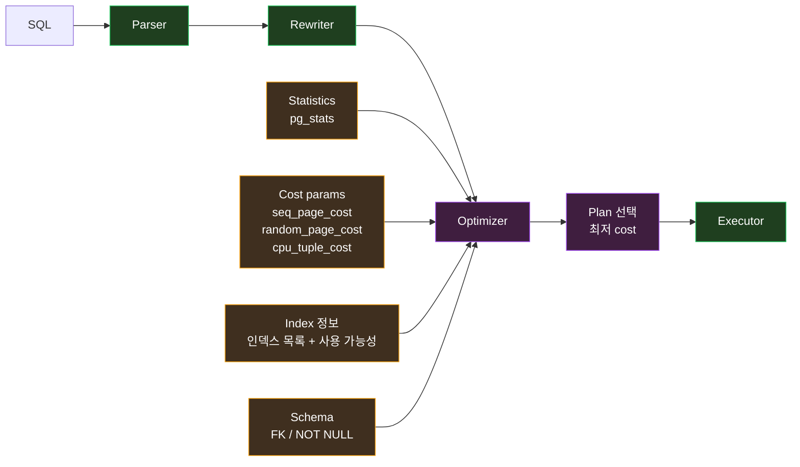
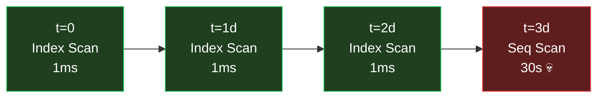
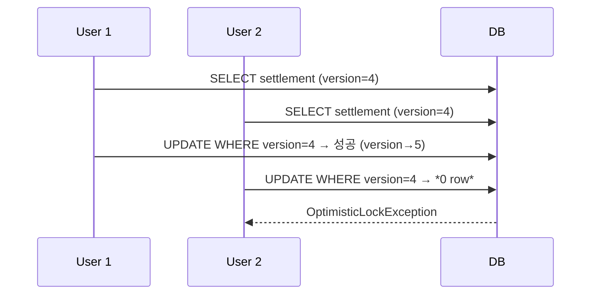

> *내 settlement 의 *오늘 의 두 가지 알람*:
>
> 1. *EXPLAIN 의 *plan 이 어제 *Index Scan* 이었는데 *오늘 Seq Scan* 으로 바뀜* → *p99 가 *20 배 폭증*
> 2. *Settlement.confirm() 의 *OptimisticLockException 폭증* → *retry 3 회 다 실패 → 사용자에게 *500 응답*
>
> *두 문제 가 *같은 시각 에 *함께 발생*. *우연 이 아니다*. *DB 옵티마이저* 와 *JPA 낙관적 락* 은 *같은 *동시성 의 두 얼굴*. *옵티마이저 의 *plan 의 *불안정* 이 *락 retry 의 *deterministic execution* 의 *기반 을 흔든다*.

이 글 은 *DB 옵티마이저 의 *동작 원리* 와 *JPA 낙관적 락 의 *실패 방어 패턴* 을 *연결 적 시야* 로 다룬다. *각각 의 *기본기* + *둘 의 *상호 작용* 의 *실전 적 함의*.

내 *[DB 배치 글](/2026/06/21/db-batch-performance-covering-index-and-chunking.html)* 의 *후속 + 동시성 의 영역 추가*. *settlement 의 *실제 retry 패턴* 과 *옵티마이저 함정 사례* 로 *살아있게*.

---

## TL;DR — *한 줄 결론*

> *DB 옵티마이저* 는 *비용 기반 (cost-based) plan 선택*. *통계 가 곧 plan* — *통계 가 *흔들리면 *plan 이 흔들리고 *성능 이 흔들린다*. *JPA 낙관적 락* 은 *충돌 을 *전제 하지 않고* *발생 시 retry*. *retry 의 *deterministic 동작* 의 *기반 이 *옵티마이저 의 *plan stability*. *둘 의 연결 의 *체감* — *VACUUM ANALYZE 가 *오래 안 돌면 *plan 이 *Seq Scan 으로 떨어지고 → *retry 의 *각 시도 가 *수십 초 → *deadlock 가능*. *내 settlement 의 *Settlement.confirm 의 *3 회 retry + idempotency + Outbox saga* 가 *3 단 방어* 의 *교과서*.

---

# Part 1. *DB 옵티마이저 — *Postgres 의 *쿼리 계획자***

## 1. *왜 옵티마이저 가 필요 한가*

같은 SQL 의 *실행 방식 이 *수십 가지*:

```sql
SELECT s.id, s.amount, p.captured_at
  FROM settlements s
  JOIN payments p ON s.payment_id = p.id
 WHERE s.seller_id = 'S-12345'
   AND p.captured_at BETWEEN '2026-05-01' AND '2026-05-31';
```

가능 한 *plan*:
1. *settlements 풀스캔 → payments 의 *각 row 마다 *Index lookup*
2. *payments 의 *(captured_at) 인덱스 → *각 row 의 settlement 의 *Index lookup*
3. *Hash Join* — *두 테이블 모두 *해시 화*
4. *Merge Join* — *두 테이블 모두 *정렬 후 *순차 매칭*
5. *Bitmap Index Scan* — *작은 결과* 의 효율 적 결합

*어느 게 가장 빠른가* — *데이터 분포 / 통계 에 따라 *다름*. *옵티마이저* 가 *그 결정* 을 한다.

---

## 2. *Cost-Based Optimizer (CBO) 의 *4 가지 입력***



### 2.1 *Statistics — *통계 가 *plan 의 *심장***

Postgres 의 `pg_stats` :
- *컬럼 별 *most common values (MCV)*
- *히스토그램 (n_distinct, histogram_bounds)*
- *null fraction*
- *correlation* (물리 적 정렬 도)

*VACUUM ANALYZE* 가 *위 통계 의 *갱신*. *통계 가 *오래 되면 *plan 이 *틀린다*.

### 2.2 *Cost parameters*

```sql
SHOW seq_page_cost;        -- 1.0  (순차 페이지 읽기)
SHOW random_page_cost;     -- 4.0  (랜덤 페이지 읽기 — SSD 면 1.1 권장)
SHOW cpu_tuple_cost;       -- 0.01 (CPU 의 row 처리)
```

*SSD 환경 인데 *random_page_cost = 4.0* 이면 *옵티마이저 가 *Index Scan 을 *과도 하게 비싸게 평가* → *Seq Scan 선택* → *I/O 폭증*.

내 *settlement* 의 *postgresql.conf*:
```
random_page_cost = 1.1   -- SSD 기준
effective_cache_size = 8GB  -- OS 의 page cache 크기 힌트
```

### 2.3 *Index 의 *사용 가능성*

옵티마이저 가 *사용 할 수 있는 인덱스 의 *목록*. *조건절 의 컬럼 과 일치 하면 *후보*.

*함정* — *함수 적용 시 인덱스 안 탐*:
```sql
-- ❌ 인덱스 안 탐
WHERE LOWER(email) = 'foo@bar.com'

-- ✅ 함수 인덱스 또는 컬럼 자체 lowercase
CREATE INDEX idx_email_lower ON users (LOWER(email));
```

---

## 3. *EXPLAIN ANALYZE 의 *읽는 법***

### 3.1 *기본 형식*

```sql
EXPLAIN (ANALYZE, BUFFERS, VERBOSE, FORMAT TEXT)
SELECT ... ;
```

옵션 :
- *ANALYZE* — *실제 실행* + *time / row 추정* vs *실측 비교*
- *BUFFERS* — *page 의 *읽기 비용*
- *VERBOSE* — *모든 컬럼 / 함수 표현*
- *FORMAT JSON* — *프로그래밍 적 파싱 용*

### 3.2 *읽는 순서 — *안 에서 밖 으로***

```
Hash Join  (cost=1234..5678 rows=10000 width=64)
                  (actual time=5.2..123.4 rows=8500 loops=1)
  ->  Seq Scan on payments  (cost=0..3000 rows=100000)
                            (actual time=0.05..50.1 rows=98000)
  ->  Hash  (cost=400..400 rows=5000)
        Buckets: 8192  Memory Usage: 234kB
        ->  Index Scan on settlements_seller_idx
                (cost=0.15..400 rows=5000)
```

*가장 안 쪽 부터 *실행*. 위로 갈수록 *조합*.

### 3.3 *예상 vs 실측 — *틀리면 통계 갱신 필요***

```
rows=10000 (예상)  →  actual rows=8500 (실측)  — *15% 오차 — 정상*
rows=100 (예상)    →  actual rows=85000 (실측) — *850 배 오차 — 통계 stale*
```

*통계 stale* 의 신호:
- *옵티마이저 가 *Nested Loop* 선택 → *실제는 큰 데이터 → 폭증*
- *Hash 가 spill to disk*
- *Index 선택 안 함*

대응 — `VACUUM ANALYZE payments;`.

### 3.4 *Plan 의 *주요 노드*

| 노드 | 의미 | 효율 |
|---|---|---|
| Seq Scan | 전체 테이블 풀스캔 | *작은 테이블 / 대부분 row* |
| Index Scan | 인덱스 + 테이블 fetch | 선택도 < 10% |
| Index Only Scan | 인덱스 만 (heap 0) | *커버링 인덱스 + visibility* |
| Bitmap Index Scan | 여러 인덱스 결합 | OR / IN 의 결합 |
| Nested Loop | row 마다 inner 반복 | 작은 outer + 인덱스 inner |
| Hash Join | hash table 생성 | 큰 데이터 + equi-join |
| Merge Join | 정렬 + 순차 매칭 | 정렬 된 입력 |

내 *[커버링 인덱스 글](/2026/06/21/db-batch-performance-covering-index-and-chunking.html)* 의 *Index Only Scan 의 *Heap Fetches : 0* 이 *옵티마이저 의 *최선*.

---

## 4. *옵티마이저 가 *틀릴 때 — *4 가지 원인***

### 4.1 *통계 stale*

VACUUM ANALYZE 미실행 + 데이터 폭증 → *카디널리티 추정 *오차 100 배*.

```sql
-- 매일 새벽 자동 분석
ALTER TABLE payments SET (
  autovacuum_vacuum_scale_factor = 0.05,
  autovacuum_analyze_scale_factor = 0.02
);
```

### 4.2 *Skewed Distribution — *편향 데이터***

`seller_id` 중 1 명 이 *50% 의 거래*. *Generic plan 이 *그 1 명 에 *비효율*.

해결 — `pg_stats` 의 *MCV* 가 *그 셀러* 의 cardinality 를 *정확 히 안다* 면 *옵티마이저 가 *plan 적응*. *통계 컬럼 수 증가*:

```sql
ALTER TABLE payments ALTER COLUMN seller_id SET STATISTICS 1000;
ANALYZE payments;
```

### 4.3 *Parameter Sniffing — *Prepared Statement 의 *함정***

JPA / Spring 의 *Prepared Statement 가 *처음 한 번 *plan 결정 → 캐시*. *그 후 *모든 호출 에 *같은 plan*. *어떤 파라미터 의 *plan 이 *다른 파라미터 에 *부적합*.

해결 :
```sql
-- Postgres 12+ 의 *Generic vs Custom Plan 자동 선택*
SET plan_cache_mode = 'auto';  -- 기본
SET plan_cache_mode = 'force_custom_plan';  -- 매번 새 plan
```

### 4.4 *Join 순서 의 *옵티마이저 의 *한계***

*테이블 6 개 이상 의 조인* → *옵티마이저 가 *모든 순서 탐색 불가* → *서브 옵티멀 선택*.

해결 — `join_collapse_limit` (기본 8) 의 조정 또는 *서브쿼리 의 명시 적 순서*.

---

## 5. *Plan Stability — *왜 중요 한가***

*같은 쿼리 가 *같은 plan 을 *지속 적 으로 *선택* 하는 게 *plan stability*.



*어느 날 갑자기 *Plan 이 *바뀜* — *통계 변화 / autovacuum 결과* 등. *p99 가 갑자기 폭증*.

*해결* :
- *VACUUM ANALYZE 정기*
- *pg_stat_statements* 의 *지속 적 *모니터링*
- *plan stability extension (pg_hint_plan)*

이 *Plan Stability* 가 *Part 2 의 *낙관적 락 retry 의 *기반*.

---

# Part 2. *JPA 낙관적 락 의 *실패 방어***

## 6. *낙관적 락 의 *기본 동작***

### 6.1 *@Version 의 마법*

```kotlin
@Entity
class Settlement(
    @Id val id: SettlementId,
    var status: SettlementStatus,
    var amount: BigDecimal,
    
    @Version
    var version: Long = 0,
)
```

JPA 가 *자동 으로*:
- *UPDATE 시 *WHERE version = ?* 추가
- *반환 row 가 0 이면 *OptimisticLockException 발생*

### 6.2 *SQL 의 실제*

```sql
-- JPA 가 생성
UPDATE settlements
   SET status = 'CONFIRMED',
       amount = 1500000,
       version = 5            -- *기존 4 → 5*
 WHERE id = 'st-123'
   AND version = 4;           -- *기존 version 검증*

-- 반환 0 row → 누군가 가 *이미 변경* → 예외
```

### 6.3 *왜 *낙관적* 인가*

```
[ 비관적 락 (Pessimistic) ]
SELECT ... FOR UPDATE
→ *읽는 즉시 *row 잠금*
→ *동시 읽기 도 *대기*
→ *경합 적은 시스템 에는 *불필요 한 오버헤드*

[ 낙관적 락 (Optimistic) ]
읽기 — *잠금 없음*
쓰기 — *version 검증* 만
→ *경합 적으면 *최고 효율*
→ *경합 많으면 *retry 폭증*
```

내 *settlement* — *대부분 의 도메인 이 *낙관적 락*. *경합 적음 + 단순*.

---

## 7. *OptimisticLockException 의 *발생 패턴***

### 7.1 *고전적 시나리오*



### 7.2 *어디서 발생 하나*

- *동시 사용자 의 *같은 entity 수정*
- *백그라운드 워커 + 사용자 의 충돌*
- *재시도 의 *자기 자신 과 충돌* (retry 의 race)
- *분산 시스템 의 *이벤트 처리* 의 *중복*

내 *settlement* — *2 번 (백그라운드 정산 워커 + 사용자 의 환불 요청)* 의 *빈번 한 경합*.

---

## 8. *방어 패턴 1 — *Retry*

### 8.1 *Spring Retry 의 *기본***

```kotlin
@Service
class SettlementService(
    private val repository: SettlementRepository,
) {
    @Retryable(
        value = [OptimisticLockException::class, OptimisticLockingFailureException::class],
        maxAttempts = 3,
        backoff = Backoff(delay = 100, multiplier = 2.0, random = true),
    )
    @Transactional
    fun confirm(id: SettlementId, command: ConfirmCommand) {
        val s = repository.findById(id) ?: throw NotFoundException()
        s.confirm(command)
        repository.save(s)
    }
    
    @Recover
    fun confirmFailed(e: OptimisticLockException, id: SettlementId, command: ConfirmCommand) {
        // *3 회 다 실패 후 의 *최종 처리*
        log.error("Settlement confirm 최종 실패: ${id}", e)
        eventPublisher.publish(SettlementConfirmFailed(id, command, e.message))
        throw SettlementConflictException(id)
    }
}
```

### 8.2 *Backoff 의 *중요성*

```
delay=100  multiplier=2.0  random=true
→ 1차: 100ms ± random
→ 2차: 200ms ± random
→ 3차: 400ms ± random
```

*Random jitter* 의 *역할* — *동시 retry 의 *thundering herd 방지*. *모든 client 가 *동일 한 100ms 후 동시 재시도 = *또 충돌*.

### 8.3 *Retry 의 *한계*

- *재시도 자체 의 *비용 (CPU + DB connection)*
- *3 회 모두 실패 시 *최종 *예외 처리 필요*
- *옵티마이저 의 *plan 이 불안정 하면 *retry 의 *각 시도 가 *예측 불가*

여기서 *Part 1 의 옵티마이저* 와 *연결*. *plan stability 가 *retry 의 *deterministic 동작* 의 *기반*.

---

## 9. *방어 패턴 2 — *Compare-And-Swap (CAS) — *원자 적 update***

### 9.1 *DB level 의 CAS*

```sql
-- *낙관적 락 의 *수동 구현*
UPDATE settlements
   SET status = 'CONFIRMED'
 WHERE id = 'st-123'
   AND status = 'REQUESTED';  -- *기존 상태 검증*

-- 반환 row 0 → *이미 다른 상태* → 처리 분기
```

```kotlin
fun confirm(id: SettlementId): Boolean {
    val updated = jdbc.update("""
        UPDATE settlements 
           SET status = 'CONFIRMED'
         WHERE id = ?
           AND status = 'REQUESTED'
    """, id)
    return updated == 1
}

// 호출 측
if (settlementService.confirm(id)) {
    // 정상
} else {
    // *이미 처리 됨* — 멱등 처리
    val current = repository.findById(id)
    return current.toResult()  // *기존 결과 그대로 반환*
}
```

*예외 가 아닌 *boolean 반환*. *분기 가 *명확*.

---

## 10. *방어 패턴 3 — *Idempotency Key — *클라이언트 차원 의 멱등***

### 10.1 *멱등 키 의 *역할*

```kotlin
@PostMapping("/settlements/{id}/confirm")
fun confirm(
    @PathVariable id: SettlementId,
    @RequestHeader("Idempotency-Key") key: String,
    @RequestBody body: ConfirmRequest,
): ResponseEntity<SettlementResult> {
    // *idempotency_keys 테이블* 에 *결과 캐싱*
    val cached = idempotencyService.find(key)
    if (cached != null) return ResponseEntity.ok(cached)
    
    val result = settlementService.confirm(id, body)
    idempotencyService.save(key, result, ttl = Duration.ofHours(24))
    
    return ResponseEntity.ok(result)
}
```

*같은 키 의 *재시도 가 *기존 결과 반환*. *DB 의 *추가 변경 없음*. *낙관적 락 충돌 0*.

### 10.2 *Stripe / Toss 등 *결제 게이트웨이 의 표준***

*결제 API 의 모든 호출* 에 *Idempotency-Key 헤더 강제*. *네트워크 일시 적 끊김 시 *재시도 안전*.

---

## 11. *방어 패턴 4 — *Outbox + Saga — *분산 영역 의 *멱등***

### 11.1 *내 settlement 의 Outbox*

```kotlin
@Transactional
fun confirm(id: SettlementId, command: ConfirmCommand) {
    val s = repository.findById(id) ?: throw NotFoundException()
    s.confirm(command)
    repository.save(s)
    
    // 같은 트랜잭션 — *멱등 키 가진 outbox event*
    outboxRepository.save(OutboxEvent(
        eventId = command.idempotencyKey,  // *멱등 키*
        topic = "settlement.confirmed",
        payload = SettlementConfirmed(s.id, s.amount).toJson(),
    ))
}
```

*consumer 측 의 *멱등 처리* :
```kotlin
@KafkaListener(topics = ["settlement.confirmed"])
fun on(event: SettlementConfirmed) {
    if (processedEventRepository.exists(event.eventId)) return  // *이미 처리*
    
    // *처리 로직*
    notificationService.send(event)
    
    processedEventRepository.save(ProcessedEvent(event.eventId))
}
```

*Triple Idempotency* — *Outbox event_id UNIQUE + processed_events PK + 비즈니스 unique 제약*.

내 *[Outbox 글](/2026/06/15/transaction-outbox-pattern-async-integration-deep-dive.html)* 의 핵심.

### 11.2 *분산 시스템 의 *동시성 방어 의 *진정한 답***

*낙관적 락 의 retry* 는 *단일 DB 안 의 동시성*. *Saga 는 *서비스 간 분산 의 *동시성*. *둘 다 필요*.

---

## 12. *방어 패턴 5 — *Pessimistic Fallback*

### 12.1 *낙관적 → 비관적 전환*

*낙관적 락 의 *retry 가 *지속 적 으로 실패* 하는 entity → *비관적 락 으로 전환*:

```kotlin
@Retryable(value = [OptimisticLockException::class], maxAttempts = 3)
@Transactional
fun confirm(id: SettlementId) {
    val s = repository.findById(id) ?: throw NotFoundException()
    // ...
}

@Recover
@Transactional
fun confirmPessimistic(e: OptimisticLockException, id: SettlementId) {
    // *최종 fallback* — *비관적 락*
    val s = repository.findByIdForUpdate(id) ?: throw NotFoundException()
    s.confirm(command)
    repository.save(s)
}
```

### 12.2 *비관적 락 의 *함정 — *deadlock***

```
Tx1: SELECT ... FOR UPDATE settlements WHERE id = A
Tx2: SELECT ... FOR UPDATE settlements WHERE id = B
Tx1: SELECT ... FOR UPDATE settlements WHERE id = B  ← 대기
Tx2: SELECT ... FOR UPDATE settlements WHERE id = A  ← 대기
                                                      └── DEADLOCK
```

*해결* :
- *항상 *동일 한 순서* 로 락 획득 (id 순)
- *deadlock_timeout* 설정 → *Postgres 가 자동 한쪽 abort*
- *Spring 의 *DeadlockLoserDataAccessException 처리*

---

# Part 3. *둘의 연결 — *옵티마이저 와 *낙관적 락 의 *상호작용***

## 13. *Plan 의 *불안정 이 *retry 를 *어떻게 망치는가***

### 13.1 *시나리오*

```mermaid
sequenceDiagram
    participant App as App
    participant Opt as Optimizer
    participant DB as DB

    Note over App,DB: 정상 시
    App->>Opt: UPDATE ... WHERE id=? AND version=?
    Opt-->>App: Index Scan plan (5ms)
    App->>DB: 실행
    DB-->>App: 1 row updated (즉시)

    Note over App,DB: 통계 stale 후
    App->>Opt: 같은 UPDATE
    Opt-->>App: Seq Scan plan (30s) 💀
    App->>DB: 실행 (lock 30s 보유)
    Note over DB: *다른 트랜잭션 의 *대기 폭증*
    DB-->>App: 1 row updated (30s)
    Note over App: retry 의 *다음 시도* 도 *30s*
```

*Retry 의 *deterministic 동작 의 *전제 가 깨짐*. *각 시도 가 *수십 초 → 사용자 timeout 누적*.

### 13.2 *체감 의 *연결*

내 *settlement 의 *과거 사고*:
- *주간 의 *통계 가 *오래 됨* (autovacuum 의 scale_factor 너무 높음)
- *옵티마이저 가 *Seq Scan 선택*
- *Settlement.confirm 의 *update 가 *수십 초*
- *retry 의 *각 시도 가 *수십 초*
- *thread pool 고갈*
- *전체 서비스 *지연 폭증*

*해결 — *VACUUM ANALYZE 정기 + autovacuum_scale_factor 낮춤*. *옵티마이저 의 *plan 의 *안정성* 이 *낙관적 락 의 *전제 의 *복원*.

---

## 14. *체크리스트 — *오늘 *5 분 안 에 점검 할 *7 가지***

```sql
-- 1. 옵티마이저 의 *통계 갱신 여부*
SELECT relname, last_analyze, last_autoanalyze
  FROM pg_stat_user_tables
 WHERE schemaname = 'public'
   AND now() - last_analyze > interval '7 days'
 ORDER BY last_analyze NULLS FIRST;

-- 2. *오래 도는 update* 의 *대기 가 있는지*
SELECT pid, now()-xact_start AS dur, state, wait_event_type, wait_event, 
       LEFT(query, 80)
  FROM pg_stat_activity
 WHERE state != 'idle' AND now()-xact_start > interval '5 seconds';

-- 3. *deadlock 발생 통계*
SELECT * FROM pg_stat_database WHERE datname = current_database();
-- deadlocks 컬럼 의 *증가 추이*

-- 4. *내 entity 의 *@Version* 누락 여부 (코드 grep)
-- grep -r "@Entity" src/main | xargs grep -L "@Version"

-- 5. *retry 정책 의 *backoff 가 *random* 인지 (jitter)
-- grep "@Retryable" — backoff 의 random=true 확인

-- 6. *Idempotency Key 가 *민감 API 에 강제 인지
-- POST /settlements, /payments 등

-- 7. *Outbox 의 *event_id 가 UNIQUE 제약* 인지
-- SHOW CREATE TABLE outbox_events;
```

5 분 안에 *7 가지* — *내 시스템 의 *동시성 의 *건강 검진*.

---

## 15. *맺음 *— *동시성 의 *두 얼굴 의 *통합 시야***

| 영역 | 도구 | 핵심 |
|---|---|---|
| *Query 의 *효율* | 옵티마이저 + EXPLAIN + 통계 | *plan stability* |
| *동시 쓰기 의 *충돌 방어* | 낙관적 락 + retry + Saga | *멱등 + 결정 적 retry* |

*둘 의 연결* — *옵티마이저 의 *plan stability* 가 *낙관적 락 의 *retry 의 *deterministic 의 기반*.

*"DB 가 느려요" + "OptimisticLockException 폭증해요"* 의 *두 가지 가 *같은 시각 에 발생* 했다면 — *우연 이 아니라 *통계 stale + plan 불안정* 의 *공통 원인*. *해결 의 *방향* 도 *통합*.

내일 *내 시스템 의 *p99 가 *튀거나 *exception 이 *증가* 한다면 — *둘 의 *통합 적 점검*. *VACUUM ANALYZE + retry 정책 + 멱등 키 + Outbox 의 *4 가지 가 *동시성 의 기본기*.

이 *시야* 가 *시니어 의 *체감 의 차이*. *각각 의 *기본기* 가 *내 settlement 의 *18 개월 의 *운영 의 *학습*.

---

## 부록 — *오늘 *3 분 안 에 할 *3 가지***

- [ ] *내 시스템 의 *주요 entity 가 *@Version 을 가지는가*
- [ ] *내 *@Retryable 의 *backoff 가 *random jitter* 를 가지는가
- [ ] *내 *VACUUM ANALYZE 가 *지난 주 안에 실행 됐는가*

3 가지 중 *2 가지 이상 *NO* 면 — *동시성 의 *함정* 이 *기다리는 시스템*. *오늘 의 *3 분* 으로 *내일 의 *알람 폭증 차단*.

---

*관련 글*

- [*DB 배치 처리 의 *성능 향상 2 축 — 커버링 인덱스 + 청킹*](/2026/06/21/db-batch-performance-covering-index-and-chunking.html) — *옵티마이저 의 *Index Only Scan 의 *직접 적 후속*
- [*Transactional Outbox 패턴 과 비동기 통합*](/2026/06/15/transaction-outbox-pattern-async-integration-deep-dive.html) — *Section 11 의 *분산 멱등 의 *교과서*
- [*성능 과 *서버 구조 설계 패턴*](/2026/06/29/performance-and-server-architecture-patterns-deep-dive.html) — *동시성 의 *구조 적 시야*
- [*서버 의 *기본기 — 한 요청 의 여정*](/2026/06/23/server-fundamentals-one-request-journey.html) — *Layer 11 (Connection Pool) 의 *동시성 의 기반*
- [*SOLID 와 디자인 패턴 의 실무 적용*](/2026/06/26/solid-design-patterns-real-world-application-settlement.html) — *Command 패턴 + Idempotency Key 의 *코드 적용*
- [*8 가지 체크리스트 로 settlement 자가 검수*](/2026/06/18/eight-checklist-self-audit-of-my-settlement-system.html) — *동시성 / 트랜잭션 의 *항목*
