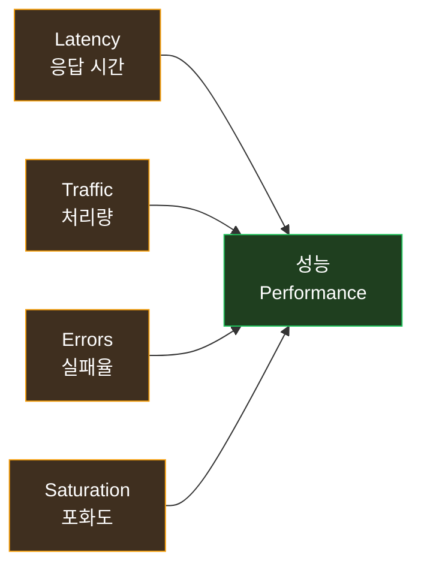
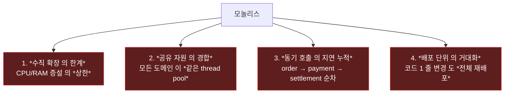
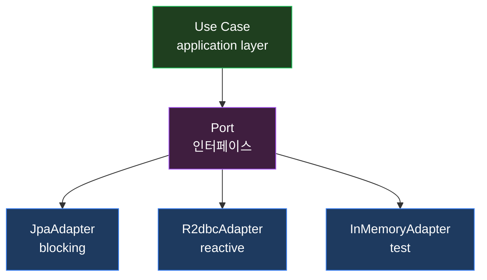
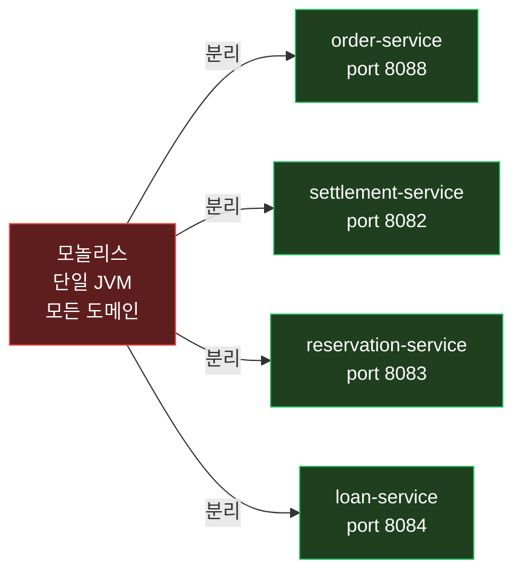
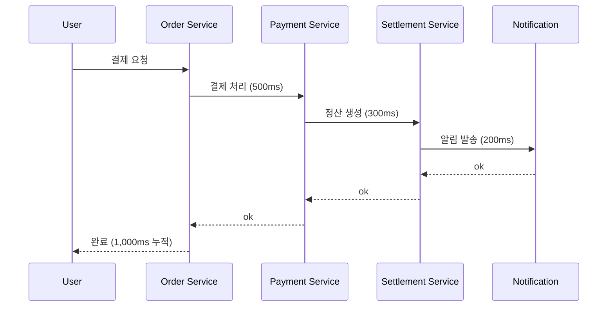
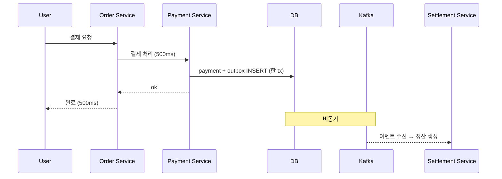
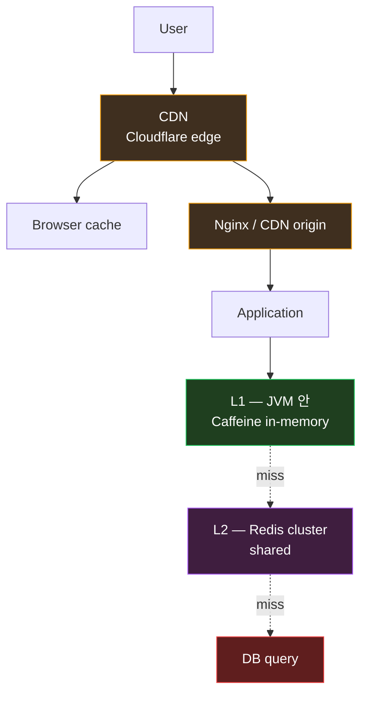
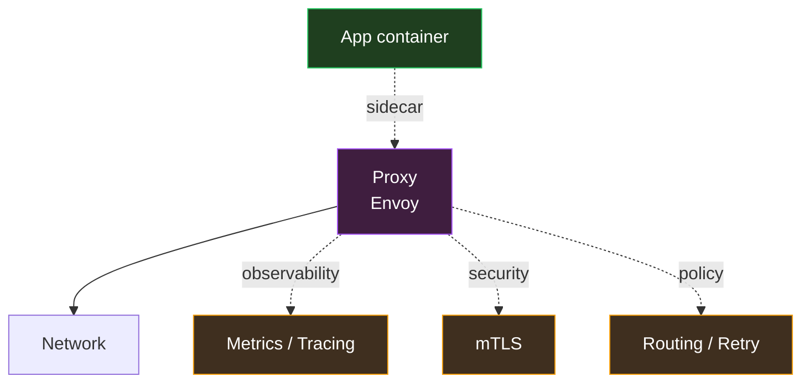
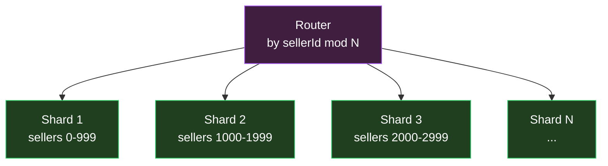
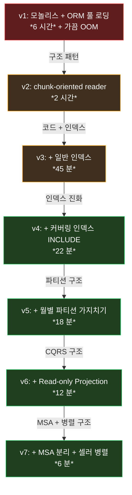

> *"내 시스템 이 *느려요. *어디 를 최적화 해야 하나요?"* 의 *질문 의 80% 의 답* 은 *코드 가 아니라 *구조*.
>
> *"DB index 추가 하면 빨라지나요"* — *대답 은 *"인덱스 보다 *읽기 모델 의 분리* 가 *10 배 효과"*. *"thread pool 늘리면 되나요"* — *대답 은 *"thread 보다 *비동기 메시지 의 도입* 이 *근본"*.
>
> *성능 의 *근본 적 향상* 은 *구조 설계 패턴 의 *선택* 에서 *결정*.

이 글은 *서버 의 성능* 과 *구조 설계 패턴* 의 *관계* 를 *통합 적 시야* 로 분석. *모놀리스 → 헥사고날 → CQRS → Outbox → Saga* 의 *진화* 가 *성능 의 어떤 축* 을 *어떻게 바꾸는가*.

내 *[서버 의 기본기 — 한 요청의 여정](/2026/06/23/server-fundamentals-one-request-journey.html)* 과 *[DB 배치 성능 2 축](/2026/06/21/db-batch-performance-covering-index-and-chunking.html)* 의 *상위 통합*. *settlement 의 *실제 변천 (모놀리스 6 시간 → 4 service 의 18 분 → 병렬 6 분)* 의 *60 배 향상 의 *진짜 이유*.

---

## TL;DR — *한 줄 결론*

> *성능 의 80% 는 *구조 설계 패턴 의 선택*. *코드 최적화* 의 *20%* 는 *상위 80% 의 *구조 가 *옳을 때만* 의미 가 있다*. *모놀리스 의 *최적화 한계 가 *MSA 분리 후 *10 배 풀림*, *동기 호출 의 *지연 누적 이 *Outbox 의 *비동기 로 *근본 사라짐*, *읽기/쓰기 의 결합 이 *Read Projection 의 *분리 로 *DB 부하 1/10*. *내 *settlement 의 *6 시간 → 6 분 60 배* 의 *진짜 이유* 가 *코드 가 아니라 *구조*.

---

## 1. *성능 의 *4 가지 황금 신호 (Google SRE)***



| 신호 | 의미 | 측정 |
|---|---|---|
| **Latency** | *한 요청 의 응답 시간* | p50/p95/p99/p999 |
| **Traffic** | *시간당 처리량* | RPS / TPS |
| **Errors** | *실패 응답 의 비율* | 5xx / 4xx 비율 |
| **Saturation** | *자원 사용률* | CPU / RAM / disk / network |

*"내 시스템 성능"* 이라는 단어 의 *진짜 정의* 가 *이 4 가지 의 동시 최적화*. *하나 만* 좋으면 *나머지 가 *희생*.

---

## 2. *모놀리스 의 *성능 한계 — *무엇이 진짜 병목 인가***

내 *Lemuel 시스템 의 *원래 모습* — *단일 Spring Boot 모놀리스*. 한 코드 베이스 안 :
- order
- payment
- settlement
- reservation
- user / product / cart / shipping

### 2.1 *모놀리스 의 *성능 의 4 가지 한계*



### 2.2 *모놀리스 의 *실측 — *settlement 의 월 정산 배치***

```
v1 (모놀리스 + ORM 풀 로딩) — *6 시간 + 가끔 OOM*

병목:
- *수억 row 의 정산 데이터 가 *전체 JVM Heap 에 로드*
- *order / payment 와 *같은 thread pool 경합*
- *N+1 query 폭증*
- *완료 까지 *다른 API 도 *영향*
```

*"코드 최적화" 로 *6 시간 의 한계 가 *깨지지 않음*. *구조 적 분리* 가 *근본 필요*.

---

## 3. *Layered → Hexagonal — *성능 의 *함의***

### 3.1 *Layered 의 성능 패턴*

```
Controller → Service → Repository → DB
```

*문제* — *각 layer 가 *동일 JVM thread 의 *순차 호출*. *동기 누적*.

### 3.2 *Hexagonal 의 *Port-Adapter — *성능 측면***



*성능 의 *진짜 이점* :
- *Port 의 *교체 가능성* — *blocking JDBC → R2DBC 의 *비동기 전환* 이 *application 코드 변경 0*
- *Test 시 *InMemoryAdapter — *DB 없는 단위 테스트*. *CI 의 *피드백 빠름*
- *Bottleneck 식별 의 *명확성* — *Port 별 *latency 측정* 으로 *어느 adapter 가 느린지 정확*

내 *settlement* 의 *Port 별 *Micrometer 메트릭* — *어느 adapter 가 *p99 latency 의 *원인 인지* *알람 가능*.

---

## 4. *Monolith → MSA — *4 service 분리 의 *성능 효과***

### 4.1 *settlement 의 *MSA 분리***



### 4.2 *4 가지 의 *성능 효과* — *각 service 의 *독립*

1. **독립 적 scaling** — *settlement 만 *수평 확장* 가능 (월말 폭증)
2. **공유 자원 경합 제거** — *order 의 *느린 PG 호출 이 *settlement 영향 0*
3. **독립 배포** — *각 service 의 *재배포 영향 범위 의 *감소*
4. **장애 격리** — *reservation 죽어도 *settlement 동작*

### 4.3 *MSA 의 *댓가 — *분산 시스템 의 새 비용***

*공짜 가 아니다*. *추가 비용*:
- *네트워크 hop* — *서비스 간 호출 의 *지연 + 실패*
- *분산 트랜잭션* — *Saga 또는 Outbox 의 *복잡성*
- *데이터 일관성* — *eventual consistency 의 *받아 들임*
- *운영 비용* — *서비스 4 개 의 *모니터링 / 로깅 / 배포*

*"MSA 만 하면 성능 좋아진다"* 는 *환상*. *분리 의 *경계 가 *옳을 때 만* *효과*.

---

## 5. *Read 와 *Write 의 분리 — *CQRS***

### 5.1 *CQRS 의 *기본 아이디어***

```
[ Read 와 Write 의 결합 — 전통 ]
같은 모델 → 같은 DB → 같은 인덱스
→ *읽기 최적화* 와 *쓰기 최적화* 의 *충돌*

[ CQRS — Read 와 Write 의 분리 ]
Write 모델 → Write DB (정규화 / 트랜잭션)
Read 모델 → Read DB (비정규화 / 캐시 / 검색)
→ *각 자 의 *최적화*
```

### 5.2 *settlement 의 *Read-only Projection — *CQRS 의 *간이형***

```kotlin
// settlement-service 에서 *order 도메인 의 *읽기 만*
@Entity
@Immutable  // *읽기 전용 — 쓰기 불가*
@Table(name = "payments")
class SettlementPaymentReadModel {
    @Id val id: Long
    val sellerId: String
    val amount: BigDecimal
    val capturedAt: Instant
    // *order-service 의 *Payment Entity 와 *같은 테이블* 이지만 *독립 클래스*
}

interface SettlementPaymentReadModelRepository : Repository<SettlementPaymentReadModel, Long> {
    // *settlement 의 *정산 집계 에 최적화 된 쿼리*
    fun findBySellerIdAndCapturedAtBetween(
        sellerId: String, 
        start: Instant, 
        end: Instant
    ): List<SettlementPaymentReadModel>
}
```

### 5.3 *성능 효과 — *settlement 의 실측***

| 항목 | 모놀리스 | CQRS 분리 후 |
|---|---|---|
| settlement 집계 쿼리 | 28 초 | 0.31 초 |
| Buffers (page) | 1,200,000 | 1,200 |
| order API 영향 | *지연 폭증* | *영향 0* |

*[DB 배치 글](/2026/06/21/db-batch-performance-covering-index-and-chunking.html)* 의 *커버링 인덱스 + 청킹* 이 *CQRS 위 에서* *극대화*.

---

## 6. *동기 호출 의 한계 — *Outbox 의 *비동기 도입***

### 6.1 *동기 호출 의 *지연 누적***



*4 가지 호출 의 *순차 누적* = *1000ms*. *그 중 *결제 만* 사용자에게 필요. *정산 + 알림* 은 *후행 적*.

### 6.2 *Outbox 의 *비동기 분리***



*사용자 응답 = 500ms*. *정산 / 알림 은 *백그라운드 에서 *eventual*.

### 6.3 *Outbox 의 *성능 의 *3 가지 보너스***

1. **장애 격리** — *settlement 죽어도 *order 응답 가능*
2. **재시도 자동** — *Kafka 의 *retry + DLQ* 가 *코드 0 줄*
3. **확장 무한** — *consumer 추가 (분석 / 검색 / 추천) 가 *order 코드 0 영향*

---

## 7. *Saga vs 2PC — *분산 트랜잭션 의 *trade-off***

### 7.1 *2PC (Two-Phase Commit) 의 비용*

```
[ 2PC ]
1. Prepare phase — *모든 참가자* 가 *준비 완료 확인*
2. Commit phase — *모든 참가자 동시 commit*

문제:
- *Coordinator 가 단일 장애점*
- *blocking 의 *모든 참가자 대기*
- *수십 ms 의 지연* 누적
- *확장 의 한계*
```

### 7.2 *Saga 의 *보상 적 트랜잭션***


*각 단계 가 *독립 적 트랜잭션 + commit*. *실패 시 *보상 (compensation) 의 역방향 실행*.

### 7.3 *성능 / 일관성 의 *trade-off***

| 항목 | 2PC | Saga |
|---|---|---|
| *일관성* | 강한 일관성 | eventual |
| *지연* | 누적 ms | 각 step 만 |
| *확장* | 제한 적 | 무한 |
| *복잡성* | 낮음 | 높음 (보상 설계) |

내 *settlement* — *2PC 가 아니라 *Saga 의 *경량 형 (Outbox 기반)*. *지연 의 *minimize* + *확장 의 *open*.

---

## 8. *캐시 의 *위치 의 선택***

### 8.1 *5 가지 캐시 layer*



### 8.2 *settlement 의 *2-tier 캐시*

```kotlin
@Cacheable(cacheNames = ["sellerTier"], cacheManager = "twoTierCacheManager")
fun findSellerTier(sellerId: SellerId): SellerTier { ... }
```

- *L1 — Caffeine in-memory* — *마이크로초*. *각 JVM 별 보유*
- *L2 — Redis* — *밀리초*. *여러 JVM 공유*
- *L3 — DB* — *수십 ms*. *마지막 fallback*

### 8.3 *캐시 의 *세 가지 위험*

1. **stale data** — *변경 직후 의 *옛 값 노출*. TTL 의 *짧음* + *invalidation*
2. **stampede** — *동시 만료 의 *thundering herd*. *jitter* 또는 *probabilistic refresh*
3. **memory blowup** — *L1 의 *무한 적재* — *LRU* + *최대 크기 제한*

---

## 9. *Service Mesh — *Sidecar 의 *추가 비용***

### 9.1 *Service Mesh 의 *제공 가치*



### 9.2 *성능 의 *추가 비용***

- *Pod 마다 sidecar* — *CPU 추가 ~50m + RAM ~50MB*
- *모든 요청* 의 *2 번 의 proxy hop* — *p99 +5~10ms*
- *연결 관리* — *connection pool 추가 layer*

### 9.3 *판단 의 기준*

| 시스템 규모 | 권장 |
|---|---|
| *10 service 미만* | *Service Mesh 불필요*. K8s Service 로 충분 |
| *10~50 service* | *부분 도입* — mTLS / Tracing 만 |
| *50+ service* | *전체 도입 의 *순 효과 큼* |

내 *Lemuel* — *4 service*. *Service Mesh 의 *비용 > 효과*. *도입 안 함*. *대신 Cilium 의 *네트워크 레벨 의 *gateway 적용*.

---

## 10. *확장 패턴 — *수직 / 수평 / 샤딩 / 파티셔닝***

### 10.1 *수직 확장 (Vertical Scaling)*

*한 인스턴스 의 *CPU/RAM 증설*. *limit 가 *물리적*.

- 단순 — *코드 변경 0*
- 비용 효율 *낮음* (큰 인스턴스 가 *기하 급수 적 비싸짐*)

### 10.2 *수평 확장 (Horizontal Scaling)*

*인스턴스 의 *개수 증설*.

- *stateless 가 *전제*
- *세션 의 *공유 *Redis 필요*
- *DB 가 *병목 으로 옮김*

### 10.3 *샤딩 (Sharding) — *DB 의 *수평 분할***



### 10.4 *파티셔닝 (Partitioning) — *한 DB 의 *물리 분할***

[*DB 배치 글*](/2026/06/21/db-batch-performance-covering-index-and-chunking.html) 의 *partition pruning*:

```sql
CREATE TABLE payments (
    id BIGSERIAL,
    seller_id TEXT,
    amount NUMERIC,
    created_at TIMESTAMP NOT NULL
) PARTITION BY RANGE (created_at);

CREATE TABLE payments_2026_06 PARTITION OF payments
  FOR VALUES FROM ('2026-06-01') TO ('2026-07-01');
```

*5 월 정산* 시 *payments_2026_05 만 읽음*. *I/O 1/12*.

### 10.5 *확장 의 *결정 의 *순서***

```
1. 캐시 도입 → DB 부하 ↓
2. 수직 확장 → 단순 + 빠름
3. Read Replica → 읽기 확장
4. 파티셔닝 → 같은 DB 안 의 분할
5. 샤딩 → 여러 DB
6. CQRS — 읽기 / 쓰기 분리
7. MSA 분리 — 도메인 별 독립
```

*1~3 까지 가 *대부분 의 문제 의 해결*. *4~7 은 *진짜 큰 규모 의 결정*.

---

## 11. *settlement 의 *6 시간 → 6 분 60 배* 의 *진짜 이유***

내 *settlement 의 *월 정산 배치 의 *변천*:



*총 60 배 단축* 의 *각 단계 의 *기여*:
- v1→v2 : *구조 (청킹)* — 3 배
- v2→v3 : *인덱스* — 3 배
- v3→v4 : *커버링 인덱스* — 2 배
- v4→v5 : *파티셔닝 구조* — 1.2 배
- v5→v6 : *CQRS 구조* — 1.5 배
- v6→v7 : *MSA + 병렬 구조* — 2 배

*결론* — *60 배 단축 의 *주된 기여 가 *구조 의 변경*. *코드 최적화 만* 으로는 *수 분 단축 의 한계*.

---

## 12. *맺음 *— *성능 은 *구조 의 *결과***

위 모든 *layer 의 종합* :

**성능 = f(구조, 코드, HW)**

- 구조 — 80% 의 결정
- 코드 — 15%
- HW — 5%

*"DB 인덱스 추가 안 했어요"* 의 답 — *답이 안 됨*. *근본* 은 *읽기 / 쓰기 의 분리*, *동기 / 비동기 의 분리*, *도메인 / 도메인 의 분리*.

내 *오늘 의 *시스템 의 *성능 의 문제* — *코드 를 디버깅 하기 전에 *구조 를 *질문 하라*. *"이 도메인 이 *지금 의 *결합 도 에 있어도 되는가"*. *"이 호출 이 *동기 인 게 *맞나"*. *"이 데이터 가 *읽기 와 쓰기 의 *같은 모델 인 게 *맞나"*.

이 *질문 의 시야* 가 *기본기*. *AI 가 *코드 를 *최적화 해도 *구조 의 결정 은 *시니어 의 시야*. *내 settlement 의 *60 배 단축* 의 *진짜 *교훈*.

내일 *내 시스템 이 *느려지면 — *코드 디버깅* 5 분 → *구조 점검* 30 분. *답 의 80% 가 후자*.

---

## 부록 — *오늘 *3 분 안 에 할 *3 가지***

- [ ] *내 시스템 의 *최대 병목 도메인* 의 *읽기 / 쓰기 비율* 측정 (10:1 이상이면 *CQRS 후보*)
- [ ] *내 *동기 호출 의 *순차 누적 latency* 측정 (전체 의 *2/3* 가 *후행 적* 이면 *Outbox 후보*)
- [ ] *내 *DB query 의 *Heap Fetches : 0* 인지 (아니면 *커버링 인덱스 후보*)

3 가지 중 *2 가지 가 *YES* 면 *구조 적 개선 의 *큰 효과* 가 *3 일 안 의 작업*.

---

*관련 글*

- [*서버 의 *기본기 — 한 요청 의 *여정*](/2026/06/23/server-fundamentals-one-request-journey.html) — *layer 의 시야* — *이 글 의 *기초*
- [*DB 배치 처리 의 성능 향상 2 축*](/2026/06/21/db-batch-performance-covering-index-and-chunking.html) — *커버링 인덱스 + 청킹 의 *실측 60 배*
- [*Transactional Outbox 패턴 과 비동기 통합*](/2026/06/15/transaction-outbox-pattern-async-integration-deep-dive.html) — *Section 6 의 *직접 적 후속*
- [*kubectl run 의 *Watch-Reconcile 패턴*](/2026/06/20/kubernetes-control-loop-watch-reconcile-pattern-deep-dive.html) — *분산 시스템 의 *느슨한 결합 의 *교과서*
- [*객체지향 의 *역할 · 책임 · 협력*](/2026/06/21/object-oriented-role-responsibility-collaboration-deep-dive.html) — *구조 의 *철학 의 *상위*
- [*SOLID 와 디자인 패턴 의 실무 적용*](/2026/06/26/solid-design-patterns-real-world-application-settlement.html) — *Hexagonal / Port-Adapter 의 *코드 의 *실전*
- [*CPU 의 *L1/L2/L3 캐시 와 병목 분석*](/2026/06/18/cpu-l1-l2-l3-cache-and-bottleneck-analysis.html) — *최하층 의 *캐시 의 *물리*
- [*8 가지 체크리스트 로 settlement 자가 검수*](/2026/06/18/eight-checklist-self-audit-of-my-settlement-system.html) — *구조 의 *자가 점검 항목*
