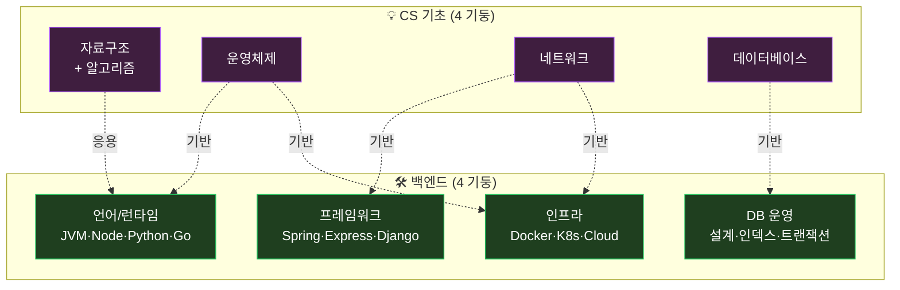
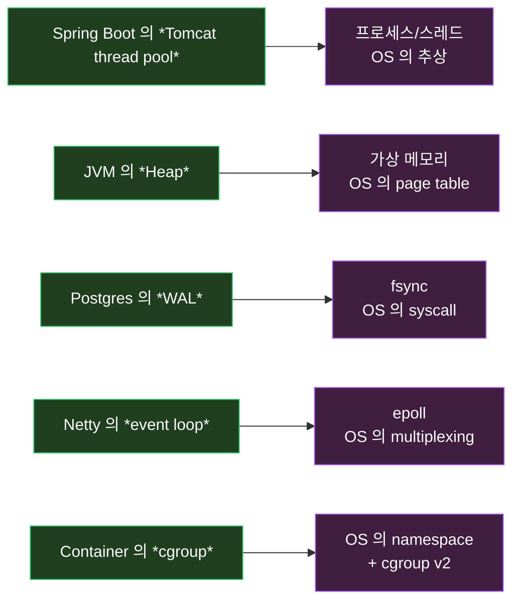
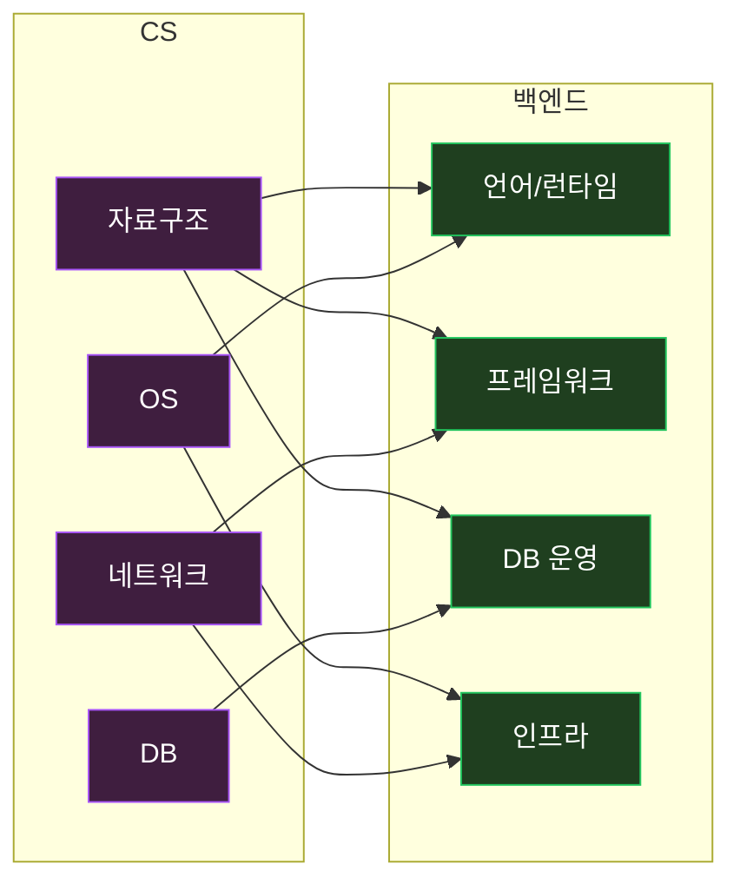

> *"백엔드 개발자 가 알아야 할 게 *너무 많다"* 라는 *흔한 푸념*.
>
> 진짜다. *그러나 *4 + 4 = 8 개 의 기둥* 으로 *정리 하면* — *기본기 의 지도* 가 *손 안 에 들어온다*. *각 기둥 의 *5 가지 핵심* 만 *깊이 체득* 하면 — *나머지 는 *그 위 의 *조합 의 응용*.
>
> 이 글은 *그 *지도* 의 *큰 그림* 이다.

이 글 은 *CS 기초 의 4 기둥 (자료구조/알고리즘 · OS · 네트워크 · DB) + 백엔드 의 4 기둥 (언어/런타임 · 프레임워크 · DB · 인프라)* 의 *통합 지도*. *내 *Settlement / Lemuel / Jabis* 운영 의 *18 개월 의 *실전 경험* 이 *각 기둥 에 *어떻게 닿는지* 를 살아있게 정리.

*[서버 의 기본기 — 한 요청 의 여정](/2026/06/23/server-fundamentals-one-request-journey.html)* 이 *layer 의 시야* 였다면, *이 글은 *지식 의 분야 별 *지도*. *두 글이 합쳐 지면 *백엔드 의 *전체 *입체* 가 *완성*.

---

## TL;DR — *한 줄 결론*

> *CS 기초 = *자료구조 · 알고리즘 · OS · 네트워크 · DB 의 *4 기둥*. *백엔드 = *언어/런타임 · 프레임워크 · DB · 인프라 의 *4 기둥*. *둘은 *겹치고 *위 / 아래 로 *연결*. *내 *Settlement 의 *Outbox 한 줄 코드* 가 *Queue 자료구조 + 트랜잭션 (DB) + 멀티스레드 (OS) + Kafka (네트워크) + Pod (인프라) 의 *조합*. *기본기 = *각 기둥 의 *5 가지 핵심 원리 * 의 *체득*. *입문 의 *지도* 가 *시니어 의 *평생 강화 의 *지도* 도 *동일*.

---

## 1. *전체 그림 *— *8 기둥 의 *지도***



*위 의 *4 기둥* 이 *학교 의 *4 학년 의 *기초*. *아래 의 *4 기둥* 이 *현장 의 *경험 의 결정체*. *둘 의 *연결 의 시야* 가 *기본기 의 *진짜 깊이*.

---

# Part 1. *CS 의 *4 기둥***

## 2. *자료구조 와 *알고리즘***

### 2.1 *알아야 할 *5 가지 자료구조*

| 자료구조 | 시간복잡도 | 백엔드 사용처 |
|---|---|---|
| **Array / List** | O(1) access / O(n) search | DB row, JSON array |
| **HashMap** | O(1) avg | 캐시, dedup, session |
| **Tree (B-Tree)** | O(log n) | *모든 DB 인덱스 의 *기반* |
| **Hash + LRU** | O(1) | Redis, Caffeine |
| **Queue / Heap** | O(1) / O(log n) | Kafka, 우선순위 처리 |

### 2.2 *알아야 할 *5 가지 알고리즘 카테고리*

- **정렬** — 비교 정렬 의 *O(n log n) 하한*
- **탐색** — 이진 탐색, BFS / DFS
- **그래프** — Dijkstra, 위상 정렬
- **DP** — 메모이제이션 / 점화식
- **그리디** — 교환 논증, 안티 패턴 (12원={1,6,10} 반례 → DP)

### 2.3 *내 settlement 의 *살아있는 적용***

- **B-Tree 인덱스** — *payments(seller_id, status, created_at) 의 *커버링 인덱스* (← *[배치 글](/2026/06/21/db-batch-performance-covering-index-and-chunking.html)*)
- **Queue** — *Outbox 의 *event 처리 의 *FIFO*
- **Heap** — *Spring Scheduler 의 *우선순위 큐*
- **DAG (방향 그래프)** — *Settlement → Payout → Ledger 의 *의존*

### 2.4 *체감 — *자료구조 모르면 *코드 가 *느려진다***

*"jabis 의 사용자 검색 이 5초"* → *Linear search 였음 (O(n))*. *HashSet 의 도입* (O(1)) → *0.005 초*.

*1000 배*. *자료구조 의 *체감*.

---

## 3. *운영체제 (OS)***

### 3.1 *알아야 할 *5 가지 핵심***

1. **프로세스 와 스레드** — *[내 글](/2026/06/18/process-abstraction.html)* 의 *PID, 가상 메모리, fork/exec*
2. **메모리 관리** — *page, 가상 주소, MMU, swap*
3. **파일 시스템** — *inode, mmap, fsync*
4. **I/O** — *blocking vs non-blocking, epoll / kqueue, AIO*
5. **시그널 / IPC** — *kill -TERM, pipe, shared memory*

### 3.2 *백엔드 와 의 연결*



### 3.3 *체감 — *OS 모르면 *디버깅 불가***

*"Spring Boot 가 *OOM 으로 죽음"* — *Heap 외 의 *Metaspace, Code Cache, mmap* 의 영역 도 OS 가 보는 *RSS*. *jstack / jmap / pmap 의 출력 의 읽는 법* 이 *OS 기초*.

---

## 4. *네트워크***

### 4.1 *알아야 할 *5 가지 핵심***

1. **OSI 7 계층** — Physical → Data Link → Network (IP) → Transport (TCP/UDP) → Session → Presentation → Application (HTTP)
2. **TCP** — 3-way handshake, congestion control, Nagle, keepalive
3. **HTTP** — 1.1 / 2 / 3 (QUIC), 상태 코드, 헤더
4. **DNS** — A / CNAME / NS, recursive, TTL
5. **TLS** — handshake, cert chain, SNI, mTLS

### 4.2 *백엔드 와 의 연결*

- *모든 HTTP 호출* — *TCP 위 의 *application protocol*
- *Connection Pool* — *TCP handshake 의 *비용 절감*
- *DNS 의 *TTL* — *서비스 검색 의 *전파 속도*
- *TLS 의 *cert renewal* — *cert-manager 의 *자동화*

### 4.3 *내 운영 사례*

*[3 일 전 *xr.lemuel.co.kr 502 사고](/2026/06/23/server-fundamentals-one-request-journey.html)* — *Cloudflare → cloudflared tunnel → Ingress → Pod 흐름* 의 *어느 한 곳 의 *DB 연결 실패* 가 *5xx 의 전 layer 전달*. *네트워크 의 *시야* 가 *진단 의 5 분 차이*.

---

## 5. *데이터베이스 (DB)***

### 5.1 *알아야 할 *5 가지 핵심***

1. **관계 모델** — 정규화, ER, FK
2. **트랜잭션 + ACID** — Isolation level, Phantom Read
3. **인덱스** — B-Tree, Hash, 커버링, 부분 인덱스
4. **MVCC** — Postgres 의 *snapshot isolation*
5. **쿼리 옵티마이저** — *[어제 글](/2026/06/29/db-optimizer-and-jpa-optimistic-lock-retry-defense.html)* 의 *통계 / plan*

### 5.2 *NoSQL 도 *기초***

- **KV** (Redis) — *캐시 / session*
- **Document** (MongoDB) — *유연 스키마*
- **Search** (Elasticsearch) — *역 인덱스 / TF-IDF*
- **Time Series** (InfluxDB / TimescaleDB) — *시계열 압축*

### 5.3 *내 settlement 의 *DB 적용*

- *Postgres 17 + 파티션* — *월별 정산 의 *physical 분할*
- *MVCC + 낙관적 락* — *Settlement.confirm 의 *@Version*
- *역 인덱스 (Elasticsearch)* — *정산 보고서 의 *검색*
- *Redis L2 캐시* — *셀러 등급 의 *조회 캐시*

---

# Part 2. *백엔드 의 *4 기둥***

## 6. *언어 / 런타임***

### 6.1 *주요 런타임 의 *특성*

| 런타임 | 모델 | 강점 | 약점 |
|---|---|---|---|
| **JVM** (Java/Kotlin) | thread-per-request, JIT | 성능, 생태계 | 메모리, warm-up |
| **Node.js** | event loop, V8 | I/O 효율 | CPU-bound 약함 |
| **Python** | GIL, interpreter | 학습/AI 통합 | 동시성 약함 |
| **Go** | goroutine, 컴파일 | 동시성, 단순 | 생태계 작음 |
| **Rust** | 컴파일, no GC | 성능 + 안전 | 학습 곡선 |

### 6.2 *알아야 할 *런타임 의 *5 가지***

1. *메모리 모델* — Heap / Stack / Off-heap / mmap
2. *GC* — G1 / ZGC / V8 의 generational
3. *Thread / Concurrency* — Java 21+ Virtual Thread, Goroutine
4. *JIT vs AOT*
5. *bytecode / source map / debugging*

### 6.3 *내 *Settlement 의 *Java 25 + Spring Boot 4.0* 의 선택*

- *Virtual Thread (Loom)* — *Tomcat connector 의 *동시 처리 *수만 connection*
- *ZGC* — *수십 GB heap 의 *pause < 1ms*
- *AOT (Spring Native + GraalVM)* — *fast startup 의 *옵션*

---

## 7. *프레임워크***

### 7.1 *선택 의 *5 가지 기준*

1. *DI / IoC 의 *성숙도*
2. *DB 통합* (ORM, transaction)
3. *생태계 / 커뮤니티*
4. *성능 / 메모리*
5. *학습 곡선 / 팀 친숙도*

### 7.2 *주요 프레임워크 의 *특성*

| 프레임워크 | 언어 | 모델 |
|---|---|---|
| **Spring Boot 4** | Java/Kotlin | DI + AOP + JPA |
| **Express** | Node | minimal + middleware |
| **NestJS** | Node | Spring 스타일 + DI |
| **Django** | Python | full-stack + ORM |
| **FastAPI** | Python | async + type hint |
| **Gin / Echo** | Go | minimal + 빠름 |

### 7.3 *내 *Spring Boot 4 의 *4 가지 선택 이유***

1. *생태계 의 *광범위* (보안 / 통신 / 배치 / 메시징)
2. *팀 친숙도*
3. *enterprise grade* — *Hibernate / Spring Data / Spring Security*
4. *AOT 지원* — *cold start 의 옵션*

---

## 8. *DB 운영***

### 8.1 *백엔드 의 *DB 의 *5 가지 책임*

1. *스키마 설계* — 정규화 + 의도적 비정규화
2. *마이그레이션* — Flyway / Liquibase, *backward compat*
3. *인덱스 운영* — *언제 추가 / 언제 제거*
4. *connection pool* — Hikari 의 *3 가지 timeout*
5. *백업 + 복구* — pg_dump, Velero + Kopia, PITR

### 8.2 *내 settlement 의 *DB 운영*

- *Flyway V1 ~ V50 + V{timestamp}__* — *마이그레이션 의 *consistent 명명*
- *settlement_immutability_trigger* — *DB level 의 *audit 보장*
- *Velero + Kopia* — *PVC 단위 의 *백업 자동화*
- *Hikari + connection-test-query* — *오늘 *oms 사고* 의 *예방*

---

## 9. *인프라***

### 9.1 *알아야 할 *5 가지 핵심***

1. *컨테이너* — Docker, image layer, multi-stage
2. *오케스트레이션* — K8s 의 *[Watch-Reconcile](/2026/06/20/kubernetes-control-loop-watch-reconcile-pattern-deep-dive.html)*
3. *GitOps* — ArgoCD, declarative state
4. *관측 (Observability)* — Prometheus / Grafana / Loki / Tempo
5. *시크릿 관리* — SOPS, Vault, ExternalSecrets

### 9.2 *내 *Lemuel K3s 클러스터 (5 node)*

```
lemuel  (control-plane + etcd)
ilwon   (control-plane + etcd)
solomon (control-plane + etcd)
david   (worker)
isagal  (worker)
louise  (worker)
```

- *6 노드 + 40+ namespace*
- *ArgoCD + Image Updater* — *GitOps*
- *SOPS + age* — *시크릿 36 namespace 통합 관리*
- *Fluent Bit + Loki + Grafana* — *통합 로그*

내 *[3 일 전 *프로덕션 자기 반성 글](/2026/06/22/...)* 의 *kubectl 직접 변경 의 위험* 의 *교훈*.

---

# Part 3. *CS ↔ 백엔드 의 *연결의 *통합 시야***

## 10. *연결 의 *매트릭스***



*8 개 의 기둥 이 *모두 *서로 연결*. *어느 하나 만 깊으면 *시야 의 *반쪽*.

---

## 11. *내 settlement 의 *Outbox 한 줄 코드 의 *8 기둥 결합***

```kotlin
@Transactional
fun capture(payment: Payment) {
    payment.status = CAPTURED
    paymentRepository.save(payment)
    
    outboxRepository.save(OutboxEvent(
        eventId = UUID.randomUUID(),
        topic = "payment.captured",
        payload = PaymentCaptured(payment.id, payment.amount).toJson(),
    ))
}
```

*위 한 메서드 안 에 *8 기둥 의 *모두 가 살아 숨쉰다* :

| 요소 | 기둥 |
|---|---|
| `@Transactional` — 트랜잭션 시작/commit | **DB** + **OS** (락 + WAL) |
| `payment.status = CAPTURED` — 메모리 변경 | **자료구조** (객체) + **언어/런타임** (Heap) |
| `paymentRepository.save` — DB INSERT | **DB 운영** + **네트워크** (TCP) + **OS** (epoll) |
| `outboxRepository.save` — 같은 tx 안 | **DB** (트랜잭션 atomicity) |
| `UUID.randomUUID()` — 난수 | **OS** (entropy) + **언어/런타임** |
| `.toJson()` — 직렬화 | **자료구조** (tree → text) + **언어/런타임** |
| 메서드 실행 자체 | **언어/런타임** (Spring DI) + **프레임워크** + **인프라** (Pod) |

*8 기둥 의 *어느 하나 가 *허전 하면 *코드 가 *돌아도 *시야 가 반쪽*. *기본기 의 *체득 의 *진짜 의미*.

---

## 12. *학습 로드맵 *— *0 ~ 36 개월***

### 12.1 *0 ~ 6 개월 — *신입***

```
□ 자료구조 4 가지 (Array / Map / Tree / Queue)
□ 알고리즘 3 가지 (정렬 / 탐색 / DP 기초)
□ HTTP / TCP 기초
□ SQL JOIN / 인덱스 의 의미
□ Spring Boot 의 @RestController / @Service / @Repository
□ Git / GitHub 의 PR 흐름
□ JVM 의 Heap / GC 의 *기본*
```

### 12.2 *6 ~ 18 개월 — *주니어***

```
□ B-Tree 인덱스 의 *EXPLAIN ANALYZE*
□ 트랜잭션 + ACID + Isolation level
□ JPA + 영속성 컨텍스트 + Lazy Loading
□ Spring Security 의 OAuth2 / JWT
□ Docker + 멀티스테이지 빌드
□ 단위 + 통합 테스트 의 분리
□ 로그 의 *level 분리* + 구조화
□ 모니터링 — Prometheus / Grafana 의 4 황금 신호
```

### 12.3 *18 ~ 36 개월 — *시니어 *직전***

```
□ K8s 의 Watch-Reconcile + Operator
□ Kafka / Outbox 의 분산 시스템 패턴
□ 헥사고날 + Port-Adapter + ArchUnit
□ CQRS + Event Sourcing 의 *적용 판단*
□ 옵티마이저 + plan stability + 동시성 패턴
□ Service Mesh / Multi-cluster 의 *규모 별 판단*
□ Observability + Tracing 의 *end-to-end*
□ AI agent + RAG + Quality Gate 의 *설계*
```

### 12.4 *36 개월 ~ — *시니어 의 *평생***

```
□ *시스템 의 *구조 의 *책임* (역할/책임/협력)
□ *AI 시대 의 *위임 못 하는 영역* 의 *명세*
□ *비즈니스 의 *번역 의 *시야*
□ *팀 / 조직 의 *기본기 의 *바닥 보장*
□ *문서 / 글 / 공유 의 *학습 의 *증폭*
```

---

## 13. *맺음 *— *지도 가 *없으면 *길 을 잃는다***

*"백엔드 가 너무 광범위 하다"* 는 *지도 가 *없을 때 의 *현상*.

*8 기둥 의 *지도 가 *손 안 에 들어 오면 — *어느 것 을 *언제 *배워야 할지 의 *순서 가 명확* 해진다*. *내 시스템 의 *문제 가 *어느 기둥 의 *어느 *원리 의 *적용 인가* 의 *진단* 도 *빠름*.

*기본기 의 *진짜 의미* — *암기 가 아니라 *지도 + 각 기둥 의 *핵심 5 가지 의 *체득*. *그게 *입문 의 *시작 점 도 이고 *시니어 의 *평생 강화 의 *지속 점* 이다*.

내 *Settlement 의 *18 개월 의 *모든 사고 / 모든 개선* 이 *위 8 기둥 의 *어느 한 곳 의 *깊이 의 *결과*. *8 기둥 의 *균형 적 성장* 이 *내 *시야 의 *지속 적 확장*.

내일 *내 가 *배우는 *모든 것* 이 *이 8 기둥 의 *어느 곳* 에 *위치 하는지* 의식*. *그게 *기본기 의 *살아있는 학습*.

---

## 부록 — *오늘 *3 분 안 에 할 *3 가지***

- [ ] *내 *최근 1 개월 의 *학습* 이 *8 기둥 의 *어느 곳에 *치우쳤는지* 자가 진단
- [ ] *내 *가장 약 한 기둥* (보통 *OS 또는 *네트워크) 의 *1 가지 책 / 글* 선택
- [ ] *내 *현재 코드 한 줄* 의 *8 기둥 의 *어느 것 에 *닿는지* 의식 한 채로 *작성*

3 가지 의 *지속 적 반복* 이 *기본기 의 *살아있는 *강화 의 *습관*.

---

## *추천 학습 자료* (개인 적 큐레이션)

### *CS 기초*
- *Computer Systems: A Programmer's Perspective* (Bryant & O'Hallaron) — *OS + 컴퓨터 구조 의 *교과서*
- *Database Internals* (Petrov) — *DB 의 *B-Tree / WAL / replication 의 *깊이*
- *Computer Networking: A Top-Down Approach* (Kurose & Ross) — *네트워크 의 *고전*
- *Introduction to Algorithms (CLRS)* — *알고리즘 의 *바이블*

### *백엔드*
- *Designing Data-Intensive Applications* (Kleppmann) — *분산 시스템 의 *최고 의 책*
- *Spring in Action* (최신판) — *Spring Boot 의 *체계*
- *Kubernetes in Action* (Lukša) — *K8s 의 *깊이*
- *Site Reliability Engineering* (Google) — *운영 의 *기준*

### *현장 의 *추가*
- *오브젝트* (조영호) — *객체지향 의 *한국어 의 *진짜 정의* (← *[내 글](/2026/06/21/object-oriented-role-responsibility-collaboration-deep-dive.html)*)
- *다시, 소프트웨어 엔지니어* (Schutta/Vega) — *시니어 의 *시야*

---

*관련 글 — *각 기둥 의 *깊이 의 진입***

### *CS 기초*
- [*프로세스 라는 *추상화*](/2026/06/18/process-abstraction.html) — *OS 의 *기둥*
- [*CPU 의 *L1/L2/L3 캐시 와 *병목 분석*](/2026/06/18/cpu-l1-l2-l3-cache-and-bottleneck-analysis.html) — *하드웨어 의 *최하층*
- [*오프셋 과 *어셈블리어 의 관계*](/2026/06/21/offset-and-assembly-language-relationship-deep-dive.html) — *언어 의 *바닥*
- [*DB 옵티마이저 와 *JPA 낙관적 락*](/2026/06/29/db-optimizer-and-jpa-optimistic-lock-retry-defense.html) — *DB + 동시성*

### *백엔드*
- [*IntelliJ 가 켜질 때 *무엇 이 *실행 되는가*](/2026/06/18/intellij-startup-processes-ssd-memory-cpu-deep-dive.html) — *JVM 의 *내부*
- [*kubectl run 의 *Watch-Reconcile 패턴*](/2026/06/20/kubernetes-control-loop-watch-reconcile-pattern-deep-dive.html) — *K8s 의 *추상*
- [*Transactional Outbox 패턴*](/2026/06/15/transaction-outbox-pattern-async-integration-deep-dive.html) — *분산 의 *교과서*
- [*성능 과 *서버 구조 설계 패턴*](/2026/06/29/performance-and-server-architecture-patterns-deep-dive.html) — *백엔드 의 *구조 적 시야*

### *통합*
- [*서버 의 *기본기 — 한 요청 의 *여정*](/2026/06/23/server-fundamentals-one-request-journey.html) — *layer 의 *시야* (이 글 과 *상호 보완*)
- [*객체지향 의 *역할 · 책임 · 협력*](/2026/06/21/object-oriented-role-responsibility-collaboration-deep-dive.html) — *철학*
- [*SOLID 와 디자인 패턴 의 실무 적용*](/2026/06/26/solid-design-patterns-real-world-application-settlement.html) — *코드 의 *문법*
- [*바이브 코딩 과 *시니어 의 *7 가지 기준*](/2026/06/18/vibe-coding-and-senior-developer-7-criteria.html) — *AI 시대 의 *시야*
